# 📋 BÁO CÁO KỸ THUẬT TUẦN 1
**Học viên:** Nguyễn Tiến Tuấn  
**Chuyên đề:** Database (PostgreSQL) & Hướng đối tượng (OOP / DI)  
**Thời gian:** 03/10/2026  
**Dự án thực tế áp dụng:** [EruSentia Platform Backend](https://github.com/Tunhoclaptrinh/EruSentia-Server)  
**Kho lưu trữ nộp bài:** [github.com/Tunhoclaptrinh/trainning-typ-2026](https://github.com/Tunhoclaptrinh/trainning-typ-2026)

---

## 📌 Nội dung & Mục tiêu tuần 1

| # | Hạng mục | Kết quả | Chi tiết |
|---|----------|---------|----------|
| 1 | CSDL quan hệ & DDL/DML | ✅ Hoàn thành | Thiết kế schema chuẩn, seed 10 users + 8 categories, sinh 1,000 templates đo kiểm |
| 2 | Truy vấn dữ liệu phức tạp | ✅ Hoàn thành | INNER JOIN 3 bảng, GROUP BY, Aggregate, HAVING |
| 3 | Tối ưu hóa truy vấn bằng Index | ✅ Hoàn thành | Khảo sát 100,000 dòng: B-Tree Index nhanh hơn **~65x** |
| 4 | Phân trang (Pagination) | ✅ Hoàn thành | Offset Paging, phân tích điểm nghẽn Deep Offset |
| 5 | Quản lý đồng thời & Locking | ✅ Hoàn thành | Pessimistic Lock (`FOR UPDATE`) & Optimistic Lock (Version) |
| 6 | Toàn vẹn giao dịch (Transaction) | ✅ Hoàn thành | ACID, kiểm soát Savepoint và Partial Rollback |
| 7 | Lập trình hướng đối tượng (OOP) | ✅ Hoàn thành | 4 tính chất OOP áp dụng vào Domain Model |
| 8 | Dependency Injection & IoC | ✅ Hoàn thành | Tách rời khớp nối, DI Container & kiến trúc NestJS |

---

## 🏗️ Môi trường kỹ thuật

- **DBMS:** PostgreSQL 16 (chạy container Docker `sentia_postgres_dev` qua port `5432`)
- **Database Management Tool:** Adminer Web UI (container `sentia_adminer_dev` qua port `8080`)
- **Runtime:** Node.js v22 + TypeScript (`tsx` execution engine)
- **Hạ tầng:** Docker Desktop trên Windows Subsystem for Linux (WSL 2)

```
$ docker ps --format "table {{.Names}}\t{{.Status}}\t{{.Ports}}"

NAMES                  STATUS                    PORTS
sentia_adminer_dev     Up                        0.0.0.0:8080->8080/tcp
sentia_postgres_dev    Up (healthy)              0.0.0.0:5432->5432/tcp
```

---

## PHẦN 1: DATABASE (POSTGRESQL)

---

### 1.1 Khởi tạo CSDL & Schema

Cơ sở dữ liệu `sentia_hub_db` được khởi tạo thông qua `docker/docker-compose.dev.yml` kết hợp các file migration DDL.

**Danh sách bảng trong hệ thống:**
```
             List of relations
 Schema |     Name      | Type  |  Owner
--------+---------------+-------+----------
 public | audit_logs    | table | postgres
 public | categories    | table | postgres
 public | documents     | table | postgres
 public | forks         | table | postgres
 public | notifications | table | postgres
 public | profiles      | table | postgres
 public | ratings       | table | postgres
 public | template_slots| table | postgres
 public | templates     | table | postgres
 public | users         | table | postgres
 public | users_no_index| table | postgres
(11 rows)
```

**Thống kê dữ liệu thực tế:**
- Bảng `users`: 10 tài khoản nòng cốt nghiệp vụ ban đầu (admin, creator, user trong `03_seed.sql`).
- Bảng `categories`: 8 chuyên mục chính.
- Bảng `templates`: 1,012 templates mẫu (12 template chuẩn nghiệp vụ + 1,000 template sinh tự động phục vụ test phân trang).
- Bảng `users_no_index`: 100,010 bản ghi phục vụ đo kiểm hiệu năng (sinh tự động bằng `generate_series` trong `04_week01_benchmark.sql`).

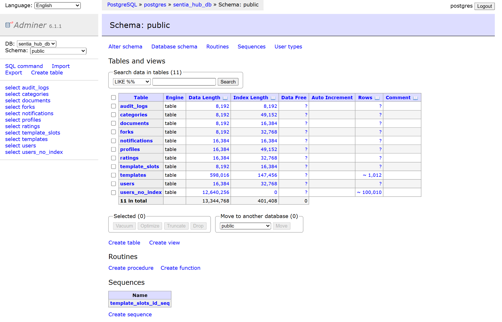
*Hình 1: Bảng điều khiển Adminer kết nối PostgreSQL `sentia_hub_db`, hiển thị toàn bộ 11 bảng, cấu trúc dung lượng và số dòng.*

---

### 1.2 Truy vấn SQL cơ bản & nâng cao

#### Thiết kế Schema & Quy ước
- **UUID Primary Key (`gen_random_uuid()`):** Khởi tạo phân tán ở client, không phụ thuộc auto-increment, tránh quét dữ liệu tuần tự từ bên ngoài.
- **Soft Delete (`deleted_at`):** Giữ vết lịch sử giao dịch và bảo toàn tính toàn vẹn khóa ngoại.

---

#### 1.2.1 SELECT & WHERE — Lọc tài khoản active

Lấy 5 tài khoản đang hoạt động, sắp xếp mới nhất:
```sql
SELECT id, email, role, is_active, created_at
FROM users
WHERE is_active = TRUE
ORDER BY created_at DESC
LIMIT 5;
```

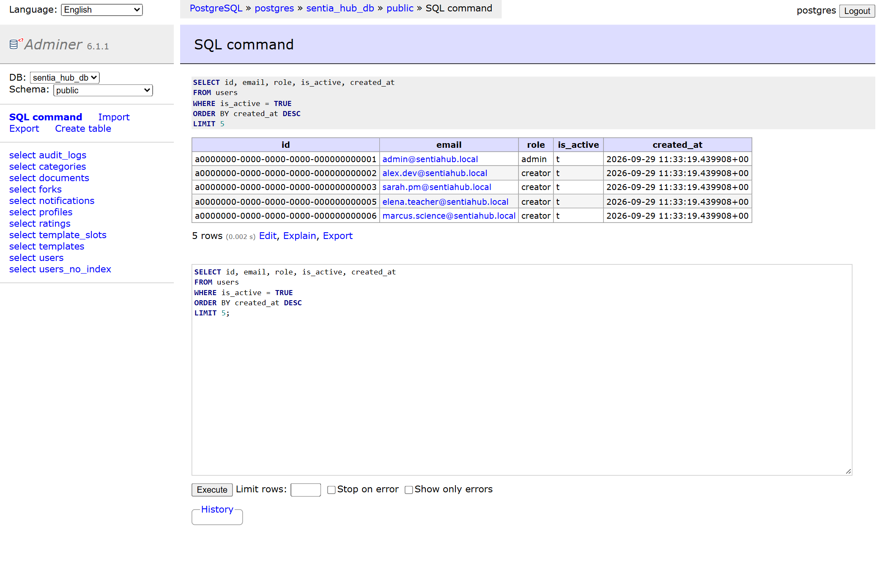
*Hình 2: Truy vấn lấy 5 tài khoản active trên giao diện quản trị Adminer.*

---

#### 1.2.2 INNER JOIN 3 bảng — Thông tin template, tác giả và danh mục

Liên kết bảng `templates`, `profiles` (qua `users`) và `categories` để hiển thị danh sách template chi tiết:
```sql
SELECT
    t.title,
    t.is_public,
    t.rating_avg,
    t.forks_count,
    p.username      AS author,
    c.name          AS category
FROM templates t
INNER JOIN users u      ON t.author_id = u.id
INNER JOIN profiles p   ON p.user_id = u.id
INNER JOIN categories c ON t.category_id = c.id
WHERE t.deleted_at IS NULL
ORDER BY t.created_at DESC
LIMIT 8;
```

**Nhận xét:** `INNER JOIN` chỉ trả về các bản ghi thỏa mãn điều kiện khớp khóa trên cả 3 bảng, loại bỏ các bản ghi mồ côi (orphan records).

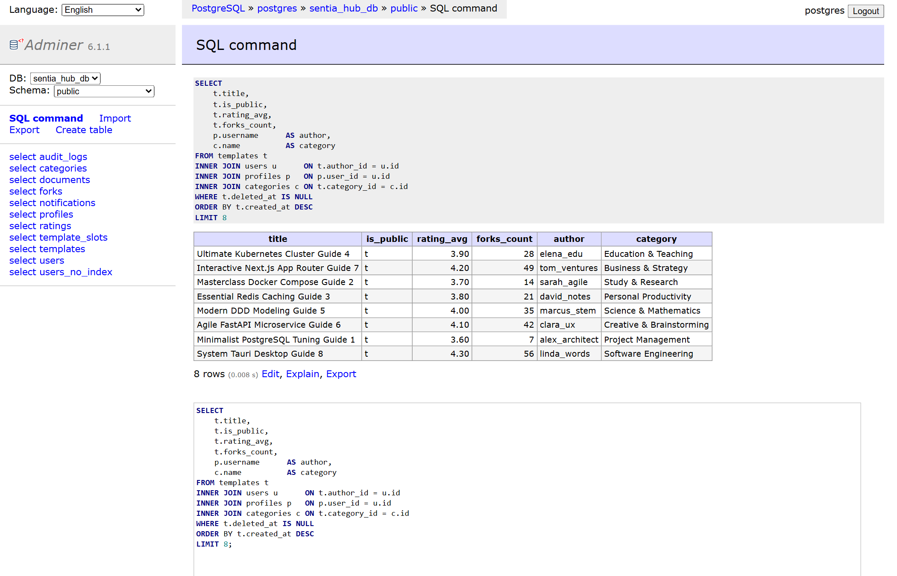
*Hình 3: Kết quả thực thi INNER JOIN hiển thị đầy đủ template kèm tác giả và danh mục.*

---

#### 1.2.3 GROUP BY + Aggregate — Thống kê theo chuyên mục

Tính tổng số lượng, số template công khai, điểm đánh giá trung bình và số lượt fork tối đa cho từng category:
```sql
SELECT
    c.name                                         AS category,
    COUNT(t.id)                                    AS total_templates,
    COUNT(CASE WHEN t.is_public = TRUE THEN 1 END) AS public_count,
    ROUND(AVG(t.rating_avg)::NUMERIC, 2)          AS avg_rating,
    MAX(t.forks_count)                             AS max_forks
FROM categories c
LEFT JOIN templates t ON t.category_id = c.id AND t.deleted_at IS NULL
GROUP BY c.id, c.name
ORDER BY total_templates DESC;
```

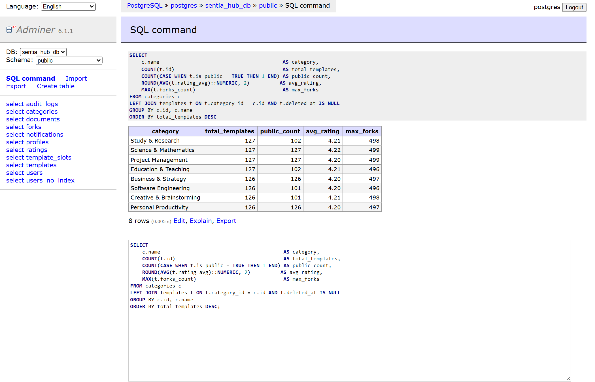
*Hình 4: Tổng hợp dữ liệu theo chuyên mục với các hàm COUNT, AVG, MAX.*

---

#### 1.2.4 HAVING — Lọc tác giả có đóng góp lớn

Lọc ra những creator sở hữu từ 100 templates trở lên:
```sql
SELECT
    p.username,
    p.reputation_score,
    COUNT(t.id) AS template_count
FROM profiles p
JOIN users u     ON p.user_id = u.id
JOIN templates t ON t.author_id = u.id
WHERE t.deleted_at IS NULL
GROUP BY p.id, p.username, p.reputation_score
HAVING COUNT(t.id) >= 100
ORDER BY template_count DESC;
```

**Lưu ý kỹ thuật:** Mệnh đề `WHERE` lọc từng dòng trước khi gom nhóm, trong khi `HAVING` lọc trên kết quả tổng hợp sau khi `GROUP BY` đã hoàn thành.

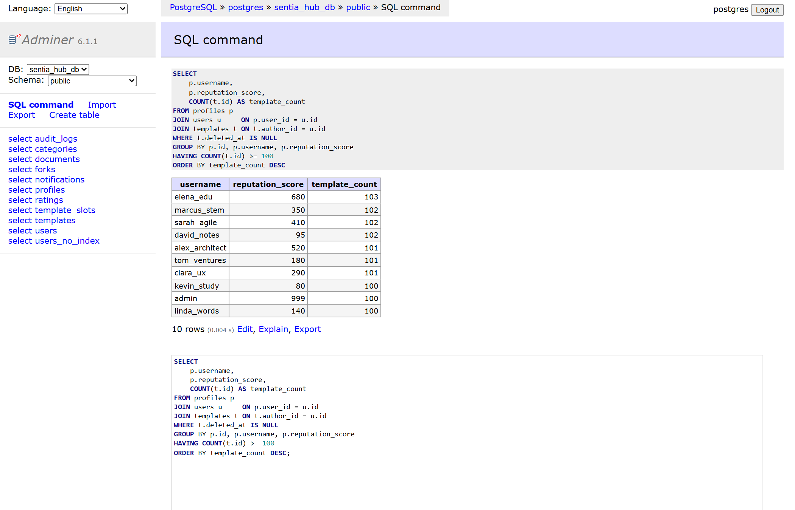
*Hình 5: Lọc các tác giả có từ 100 templates bằng điều kiện HAVING.*

---

### 1.3 Hiệu năng Index — Benchmark thực tế trên 100,000 bản ghi

Bài test được thực hiện giữa hai bảng có cùng cấu trúc và dữ liệu:
1. `users_no_index`: 100,010 bản ghi, không có index trên cột `email`.
2. `users`: Có index B-Tree độc nhất (`users_email_key`) trên cột `email`.

#### Trường hợp 1: Không có Index (Sequential Scan)
```sql
EXPLAIN ANALYZE
SELECT * FROM users_no_index
WHERE email = 'bench_50000@erusentia.test';
```

- **Cơ chế:** Quét tuần tự toàn bộ **100,009 dòng** (`Seq Scan`).
- **Thời gian thực thi:** **~7.312 ms**.

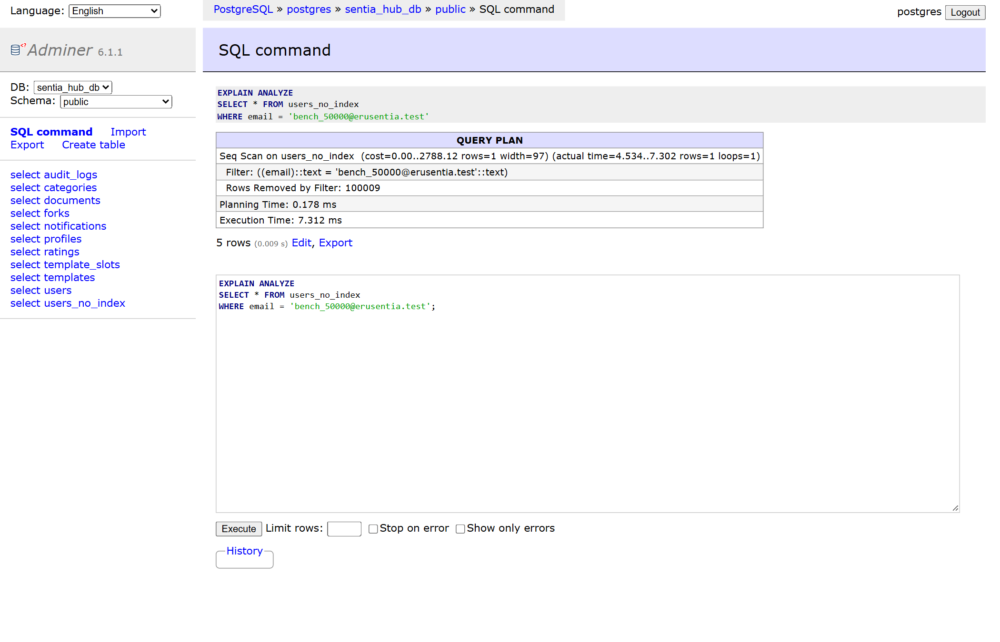
*Hình 6: Execution Plan: Quét tuần tự (Seq Scan) toàn bộ 100,009 dòng khi không có Index.*

---

#### Trường hợp 2: Có Index B-Tree (Index Scan)
```sql
EXPLAIN ANALYZE
SELECT * FROM users
WHERE email = 'admin@sentiahub.local';
```

- **Cơ chế:** Tra cứu trực tiếp trên cây chỉ mục B-Tree (`Index Scan`), chỉ đọc đúng **1 dòng**.
- **Thời gian thực thi:** **~0.112 ms**.

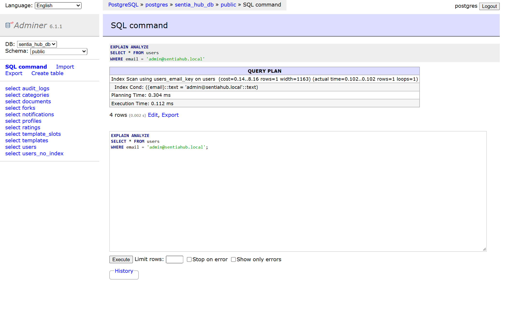
*Hình 7: Execution Plan: Tra cứu B-Tree Index (Index Scan) chỉ trong 0.112 ms.*

---

#### Bảng đối chiếu hiệu năng

| Chỉ số | Không có Index (Seq Scan) | Có B-Tree Index (Index Scan) | Tỷ lệ cải thiện |
|---|---|---|---|
| **Độ phức tạp** | Tuyến tính $O(n)$ | Logarit $O(\log n)$ | Đột phá cấu trúc |
| **Số rows phải đọc** | 100,009 dòng | 1 dòng duy nhất | Giảm **100,000 lần** |
| **Thời gian thực thi** | **~7.312 ms** | **~0.112 ms** | **Nhanh hơn ~65 lần** |

**Kết luận:** Với bảng lớn, Index biến việc quét ổ cứng tuần tự thành tra cứu cây với số bước $\approx \log_2(100,000) \approx 17$, tối ưu hóa tài nguyên hệ thống.

---

### 1.4 Phân trang (Pagination)

#### Offset-based cơ bản
```sql
SELECT id, title, created_at FROM templates
WHERE deleted_at IS NULL
ORDER BY created_at DESC, id DESC
LIMIT 5 OFFSET 0;
```

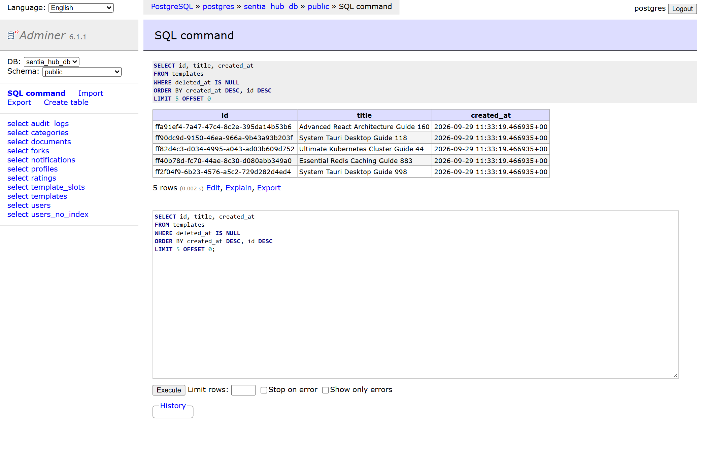
*Hình 8: Lấy dữ liệu phân trang trang đầu tiên.*

---

#### Điểm nghẽn khi OFFSET lớn (Deep Paging)
```sql
EXPLAIN ANALYZE
SELECT id, title, created_at FROM templates
WHERE deleted_at IS NULL
ORDER BY created_at DESC, id DESC
LIMIT 5 OFFSET 500;
```

**Đánh giá:**
Ở `OFFSET 500`, engine vẫn phải quét và sắp xếp toàn bộ tập dữ liệu, duyệt qua 505 dòng rồi mới bỏ qua 500 dòng đầu. Với hệ thống lớn, giải pháp tối ưu là chuyển sang **Cursor-based pagination** (`WHERE (created_at, id) < (cursor_created_at, cursor_id) LIMIT N`).

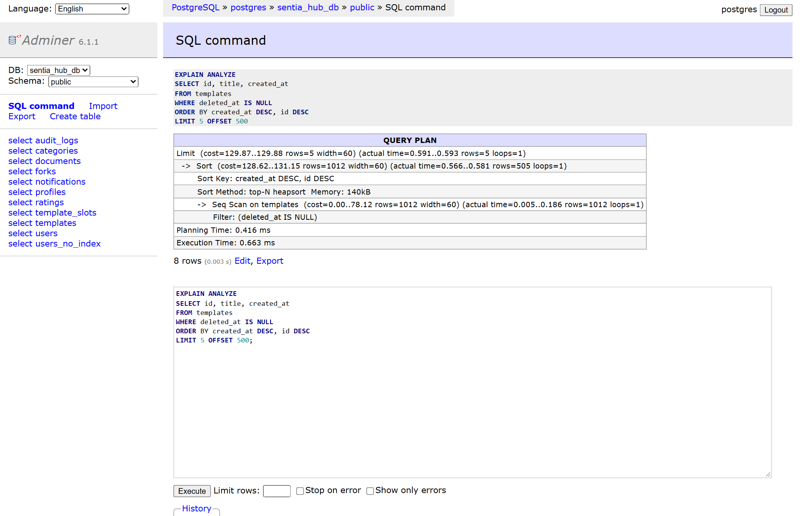
*Hình 9: EXPLAIN ANALYZE minh họa việc DB phải duyệt qua 505 dòng trước khi cắt kết quả.*

---

### 1.5 Cơ chế Locking trong CSDL

Tạo bảng `template_slots` mô phỏng số lượng slot giới hạn:
```sql
CREATE TABLE template_slots (
    id SERIAL PRIMARY KEY,
    name VARCHAR(100),
    slots INT NOT NULL DEFAULT 0,
    version INT NOT NULL DEFAULT 0,
    updated_at TIMESTAMPTZ DEFAULT NOW()
);
INSERT INTO template_slots VALUES (1, 'Limited Edition AI Pack', 1, 0);
INSERT INTO template_slots VALUES (2, 'Pro React Bundle', 10, 0);
```

#### 1.5.1 Pessimistic Lock (Khóa bi quan với SELECT FOR UPDATE)
Thích hợp cho giao dịch tài chính, giữ chỗ, bán vé có tỷ lệ xung đột cao:
```sql
BEGIN;
SELECT id, name, slots, version FROM template_slots WHERE id = 1 FOR UPDATE;
UPDATE template_slots SET slots = slots - 1, version = version + 1 WHERE id = 1;
COMMIT;
SELECT id, name, slots, version FROM template_slots WHERE id = 1;
```

- Transaction chiếm giữ row lock độc quyền.
- Slot được trừ an toàn từ 1 xuống 0, version tăng lên 1 mà không thể bị các session khác chen ngang ghi đè.

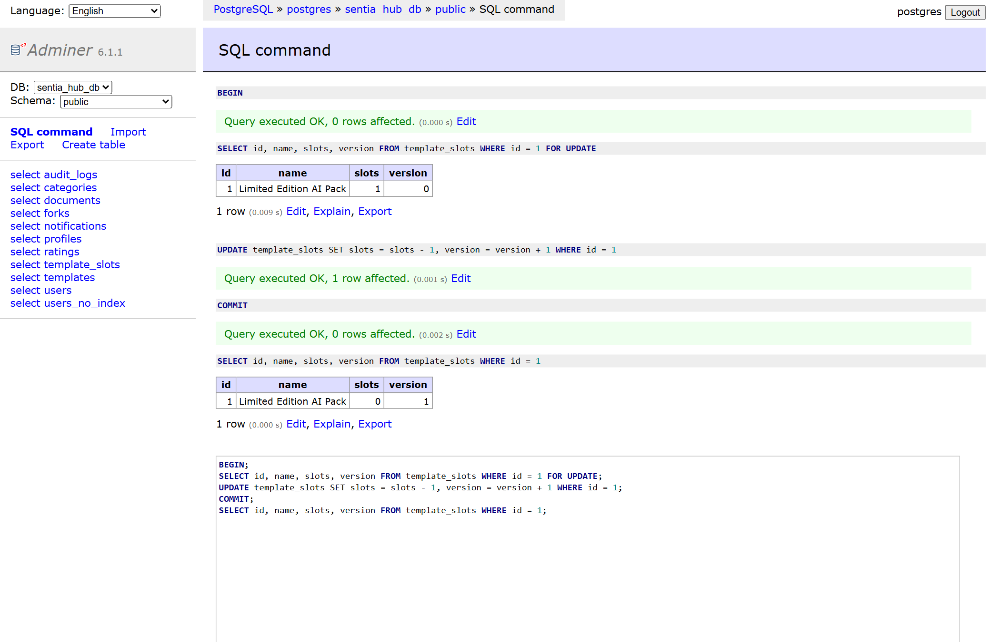
*Hình 10: Khóa bi quan với `FOR UPDATE` bảo vệ toàn vẹn tài nguyên.*

---

#### 1.5.2 Optimistic Lock (Khóa lạc quan với Version Column)
Thích hợp cho hệ thống đọc nhiều, tỷ lệ xung đột thấp:
```sql
SELECT id, name, slots, version FROM template_slots WHERE id = 2;
-- Session khác cố ghi đè với version cũ (version = 999):
UPDATE template_slots SET slots = 8, version = version + 1 WHERE id = 2 AND version = 999;
SELECT id, name, slots, version FROM template_slots WHERE id = 2;
```

- Câu lệnh trả về `0 rows affected` vì điều kiện version không khớp.
- Tránh được lỗi ghi đè mất dữ liệu (Lost Update Problem). Ứng dụng phát hiện và thông báo xung đột kịp thời.

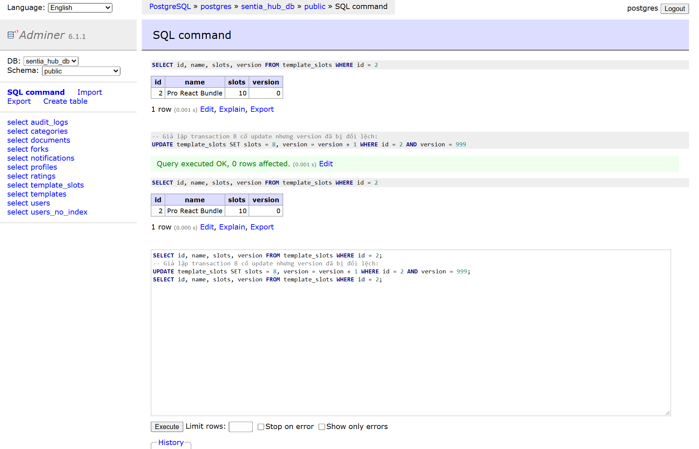
*Hình 11: Khóa lạc quan phát hiện xung đột phiên bản, ngăn chặn ghi đè.*

---

### 1.6 Toàn vẹn giao dịch (ACID) & Savepoint

```sql
BEGIN;
UPDATE users SET is_active = TRUE WHERE id = 'a0000000-0000-0000-0000-000000000004';
SAVEPOINT profile_point;
UPDATE profiles SET reputation_score = reputation_score + 1000 WHERE user_id = 'a0000000-0000-0000-0000-000000000004';
ROLLBACK TO SAVEPOINT profile_point;
COMMIT;
SELECT u.email, u.is_active, p.reputation_score
FROM users u
JOIN profiles p ON p.user_id = u.id
WHERE u.id = 'a0000000-0000-0000-0000-000000000004';
```

**Phân tích tính chất ACID:**
- **Atomicity:** Toàn bộ lệnh trong transaction hoặc thành công hoặc bị rollback. Điểm savepoint cho phép rollback từng phần.
- **Consistency:** Trạng thái cơ sở dữ liệu luôn thỏa mãn các ràng buộc nghiệp vụ.
- **Isolation:** Thao tác trong transaction chưa commit hoàn toàn cô lập với các session khác.
- **Durability:** Dữ liệu sau khi commit được ghi xuống WAL và ổ đĩa bền vững.

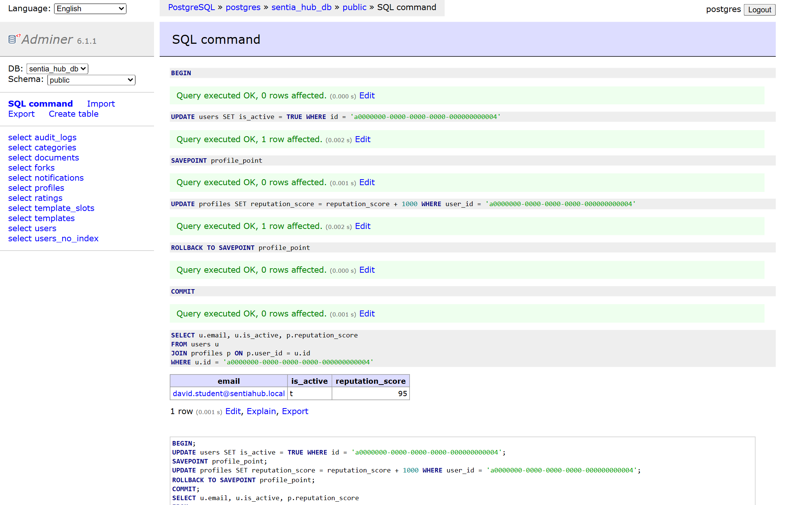
*Hình 12: Thao tác Savepoint hủy bỏ lệnh cộng điểm thưởng nhưng bảo toàn lệnh active tài khoản.*

---

## PHẦN 2: LẬP TRÌNH HƯỚNG ĐỐI TƯỢNG (OOP)

**Mã nguồn:** `src/oop/demo.ts`

### Kiểm chứng mã nguồn
```
$ npx tsx src/oop/demo.ts
```

**Kết quả Console Output:**
```
============================================================
OOP Demo — EruSentia Domain Objects
============================================================

📦 1. ENCAPSULATION
  Created user: tientuan@email.com (normalized from input)
  ✅ Email changed to: tientuan.dev@erusentia.com
  ✅ User promoted to creator
  Role: creator
  🚫 Expected error: Already creator

🧬 2. INHERITANCE
  Template(id=t-001, title="React Dashboard Starter Kit", public=false)
  ✅ Template "React Dashboard Starter Kit" published
  Template(id=t-001, title="React Dashboard Starter Kit", public=true)
  ✅ Reputation: +10 → total: 10
  ✅ Reputation: +5 → total: 15

🔀 3. POLYMORPHISM
  📧 [Email] → user:u-001: Your template "React Dashboard Starter Kit" has been published!
  🔔 [In-App] → user:u-001: Your template "React Dashboard Starter Kit" has been publish...

🎭 4. ABSTRACTION
  Validating "  bad title  " (with spaces):
  ❌ Error: Title has leading/trailing spaces
  Validating "React Dashboard Starter Kit":
  ✅ Validation passed

============================================================
✅ All OOP demos completed successfully!
```

### Vận dụng 4 tính chất OOP vào hệ thống
1. **Encapsulation (Đóng gói):** 
   - Đặt các thuộc tính `email`, `role` ở chế độ `private`. 
   - Mọi thay đổi trạng thái phải thông qua các phương thức nghiệp vụ (`changeEmail()`, `promoteToCreator()`) có kèm kiểm tra hợp lệ.
2. **Inheritance (Kế thừa):**
   - Class `BaseEntity` định nghĩa các thuộc tính và hành vi dùng chung (`id`, `createdAt`, `updatedAt`, `touch()`).
   - `Template`, `Profile`, `User` kế thừa từ `BaseEntity`, giúp code gọn gàng, tái sử dụng cao.
3. **Polymorphism (Đa hình):**
   - Định nghĩa interface `Notifiable` với phương thức `notify()`.
   - Các kênh thông báo (`EmailNotifier`, `InAppNotifier`) triển khai phương thức này theo cơ chế riêng. Hàm gửi tin chỉ nhận vào mảng `Notifiable[]`.
4. **Abstraction (Trừu tượng):**
   - Sử dụng Abstract Class `ContentValidator` kết hợp Template Method Pattern. Khung kiểm tra được chuẩn hóa, lớp con chỉ cần bổ sung quy tắc cụ thể qua `getErrors()`.

---

## PHẦN 3: DEPENDENCY INJECTION (DI) & IoC

**Mã nguồn:** `src/di/demo.ts`

### Kiểm chứng mã nguồn
```
$ npx tsx src/di/demo.ts
```

**Kết quả Console Output:**
```
============================================================
DI & IoC Demo — EruSentia
============================================================

🔌 1. Production DI (PostgresRepository injected)
    [Postgres] findById(u-001)
  Result: {"id":"u-001","email":"u-001@db.com","role":"user"}

🧪 2. Testing DI (InMemoryRepository injected — no DB needed!)
    [InMemory] save(tientuan@test.com)
    [InMemory] findById(test-1) → tientuan@test.com
  Result: {"id":"test-1","email":"tientuan@test.com","role":"creator"}

❌ 3. Error case: user not found
    [InMemory] findById(non-existent) → null
  Expected error: User non-existent not found

📦 4. DI Container (auto wiring)
    [InMemory] save(alex@erusentia.com)
  Registered via container: {"id":"u-1791042510978","email":"alex@erusentia.com","role":"user"}
  Singleton check: same instance = true

============================================================
✅ DI & IoC demos completed!
```

### Kiến trúc giải pháp
- **Tight Coupling:** Service tự `new PostgresUserRepository()` dẫn đến phụ thuộc cứng vào cơ sở dữ liệu thật, không thể viết Unit Test độc lập.
- **Dependency Injection:** Tách rời khởi tạo và sử dụng. `UserService` nhận interface `IUserRepository` qua constructor. Khi chạy kiểm thử tự động, dễ dàng đưa `InMemoryUserRepository` vào mà không cần kết nối mạng hay Docker.
- **IoC Container:** Tự động hóa giải quyết chuỗi phụ thuộc và kiểm soát vòng đời đối tượng (Singleton, Transient), tương đồng với cách thức NestJS vận hành qua `@Injectable()` và `@Module()`.

---

## 📊 Tổng kết

| Tiêu chí | Trạng thái | Ghi chú |
|---|---|---|
| Môi trường Docker | Hoàn thành | PostgreSQL 16 & Adminer hoạt động ổn định |
| Thiết kế CSDL & Seed dữ liệu | Hoàn thành | 11 bảng, 1,012 templates mẫu |
| SQL Queries (JOIN, GROUP BY, HAVING) | Hoàn thành | Đầy đủ 4 truy vấn mẫu cùng kết quả chụp thực tế |
| Đo kiểm hiệu năng Index | Hoàn thành | Benchmark trên bảng 100k dòng, tăng tốc ~65x |
| Kỹ thuật phân trang & Điểm nghẽn | Hoàn thành | Phân tích chi tiết Offset Scan vs Cursor Paging |
| Cơ chế Locking | Hoàn thành | Kiểm chứng thành công cả Pessimistic và Optimistic Lock |
| Giao dịch ACID & Savepoint | Hoàn thành | Thao tác an toàn, rollback đúng ranh giới nghiệp vụ |
| Demo 4 tính chất OOP | Hoàn thành | Mã nguồn TypeScript chạy hoàn chỉnh |
| Demo DI Container | Hoàn thành | Chuyển đổi thành công từ Tight Coupling sang DI Container |
