# SQL cơ bản

## Bài toán: Quản lý thư viện.
### Tập thực thể:
- Người mượn( mã người mượn, họ và tên, ngày sinh, giới tính, địa chỉ, số điện thoại, emal).
- Kho sách( mã kho sách). 
- Thủ thư( mã thủ thư, họ và tên, số điên thoại, email, ngày vào làm việc).
- Sách( mã sách, tên sách, tên tác giả, thể loại, thời gian xuất bản).
- Nhà xuất bản( mã nhà xuất bản, tên nhà xuất bản, địa chỉ, số điện thoại)
- Phiếu mượn( mã phiếu mượn, hạn trả, ngày trả).
- Phiếu phạt( mã phiếu phạt, lí do, ngày lập phiếu);

### Quan hệ:
- Người mượn có thể mượn một hoặc nhiều quyển sách thông qua phiếu mượn. 
- Người thủ thư có thể quản lý nhiều kho sách, tạo nhiều phiếu mượn và phiếu phạt.
- Phiếu đăng kí trở thành Phiếu phạt khi người mượn không trả đúng hạn.
- Nhà xuất bản có thể xuất bản nhiều quyển sách.

## DDL: Ngôn ngữ định nghĩa dữ liệu
### CREATE TABLE: Dùng để tạo bảng mới trong Database.
Cú pháp:
```sql
CREATE TABLE table_name (
  column1 datatype constraint,
  column2 datatype constraint,
  column3 datatype constraint,
  ....
);
```
vd:
```sql
CREATE TABLE nha_xuat_ban(
	ma_nxb INT AUTO_INCREMENT PRIMARY KEY,
    ten_nxb varchar(50) not null,
    dia_chi varchar(300),
    sdt varchar(20) 
);
Create table sach(
	ma_sach INT AUTO_INCREMENT PRIMARY KEY,
    ten_sach varchar(300) not null,
    ten_tac_gia varchar(300) not null,
    the_loai varchar(100), 
    ma_nxb int not null,
    ma_kho int not null,
    tg_xb datetime not null
);
```
###  ALTER TABLE: Dùng để thêm, xóa hoặc sửa đổi các cột có trong bảng và thêm và xóa các ràng buộc hiện có trong bảng.
Cú pháp:
```sql
--Thêm cột
ALTER TABLE table_name
ADD column_name datatype;
--Xóa cột
ALTER TABLE table_name
DROP COLUMN column_name;
--Sửa cột
ALTER TABLE table_name
ALTER COLUMN column_name new_datatype constraint;
--Thêm ràng buộc
ALTER TABLE table_name
ADD CONSTRAINT constraint_name constraint_definition;
```
vd:
```sql
-- Thêm cột
ALTER TABLE sach
ADD noi_sx varchar(255) not null
-- Xóa cột
ALTER TABLE sach
DROP noi_sx
-- Sưa cột
ALTER TABLE sach
MODIFY noi_sx int
--Thêm ràng buộc
ALTER TABLE sach
ADD CONSTRAINT ma_nxb foreign key (ma_nxb) references nha_xuat_ban(ma_nxb)
```
### DROP TABLE: Dùng để xóa 1 bảng Database
Cú pháp:
```sql
DROP TABLE table_name;
-- Để xóa tất cả các bản ghi trong 1 bảng: 
TRUNCATE TABLE table_name;
```

## DML: Ngôn ngữ thao tác dữ liệu
### SELECT: Dùng để liệt kê các thuộc tính mong muốn trong kết quả của truy vấn.
Cú pháp:
```sql
SELECT column1, column2, ...
FROM table_name;
```
vd:
```sql
select ma_nxb, ten_nxb
from nha_xuat_ban
```
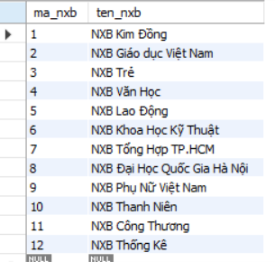
```sql
- select distinct: Liệt kê các bản ghi khác nhau.
- select *: Liệt kê tất cả các thuộc tính.
- select có thể chứa các biểu thức số học.
```
### INSERT INTO: Dùng để chèn các bản ghi mới vảo bảng.
Cú pháp:
```sql
INSERT INTO table_name (column1, column2, column3, ...)
VALUES (value1, value2, value3, ...);
```
vd:
```sql
INSERT INTO nha_xuat_ban( ten_nxb) 
VALUES ('Nguyen Van A')
```
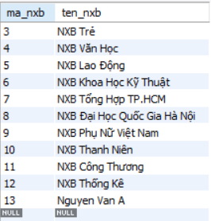

### UPDATE: Dùng để sửa các bản ghi hiện có trong một bảng

Cú pháp:
```sql
UPDATE table_name
SET column1 = value1, column2 = value2, ...
WHERE condition;
```
vd:
```sql
UPDATE sach
SET ten_tac_gia = 'Trần Anh Tuấn'
WHERE ma_sach < 5
```
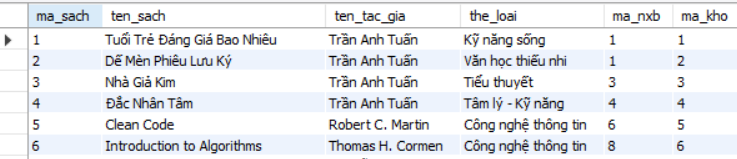
### DELETE: Dùng để xóa các bản ghi hiện có trong một bảng

Cú pháp:
```sql
DELETE FROM table_name WHERE condition;
```
vd:
```sql
DELETE FROM nha_xuat_ban WHERE ma_nxb > 50
```
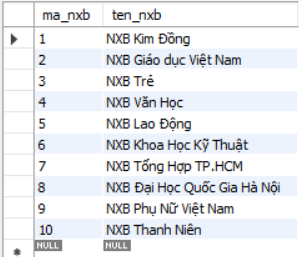
## QUERY

### WHERE: Dùng để lọc các bản ghi theo 1 điều kiện.
Cú pháp:
```sql
WHERE condition;
```
vd:
```sql
SELECT *
FROM sach
WHERE ten_tac_gia = 'Trần Anh Tuấn'
```
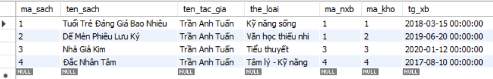
### JOIN: Dùng để kết hợp các hàng từ hai hoặc nhiều bảng, dựa trên một cột liên quan giữa chúng.
1. INNER JOIN: chỉ trả về các hàng có giá trị trùng khớp trong cả hai bảng

- Cú pháp:
```sql
SELECT column_name(s)
FROM table1
INNER JOIN table2
ON table1.column_name = table2.column_name;
```
- vd:
```sql
SELECT NN.ma_nguoi_muon , P.ma_nguoi_muon ,P.ma_phieu
FROM nguoi_muon as NN
INNER JOIN phieu_muon as P
ON NN.ma_nguoi_muon = P.ma_nguoi_muon
```
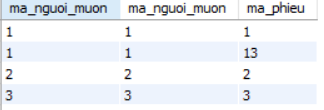

2. LEFT JOIN: trả về tất cả các hàng từ bảng bên trái (table1) và chỉ các hàng khớp từ bảng bên phải (table2). Nếu không có kết quả khớp trong bảng bên phải, kết quả cho các cột từ bảng bên phải sẽ là NULL.
- Cú pháp: 
```sql
SELECT column_name(s)
FROM table1
LEFT JOIN table2
ON table1.column_name = table2.column_name;
```
vd:
```sql
SELECT NN.ma_nguoi_muon , P.ma_nguoi_muon ,P.ma_phieu
FROM nguoi_muon as NN
LEFT JOIN phieu_muon as P
ON NN.ma_nguoi_muon = P.ma_nguoi_muon
```
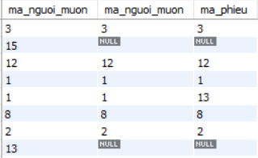

3. RIGHT JOIN:
trả về tất cả các hàng từ bảng bên phải (table2) và chỉ các hàng khớp từ bảng bên trái (table1). Nếu không có kết quả khớp trong bảng bên trái, kết quả cho các cột từ bảng bên trái sẽ là NULL.
- Cú pháp:
```sql
SELECT column_name(s)
FROM table1
RIGHT JOIN table2
ON table1.column_name = table2.column_name;
```
- vd:
```sql
SELECT P.ma_nguoi_muon, NN.ma_nguoi_muon
FROM phieu_muon as P
RIGHT JOIN nguoi_muon as NN
ON P.ma_nguoi_muon = NN.ma_nguoi_muon
```
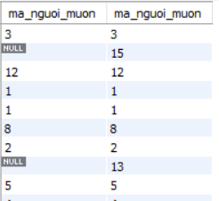
### ORDER BY: Dùng để sắp xếp tập hợp kết quả theo thứ tự tăng dần hoặc giảm dần
- Cú pháp:
```sql
SELECT column1, column2, ...
FROM table_name
ORDER BY column1, column2, ... ASC|DESC;
```

- vd:
```sql
SELECT ma_nxb, ten_nxb
FROM nha_xuat_ban
ORDER BY ma_nxb desc
```
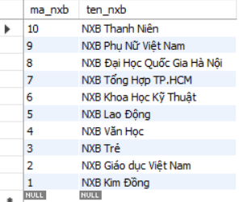


### GROUP BY: Dùng để nhóm các hàng có cùng giá trị của cột nào đó, Tất cả các cột trong SELECT phải được nhóm (GROUP BY) hoặc sử dụng trongmột hàm tổng hợp (SUM, COUNT, AVG, MIN, MAX...), nếu không sẽ bị lỗi.
- Cú pháp:
```sql
SELECT column1, aggregate_function(column2), column3, ...
FROM table_name
WHERE condition
GROUP BY column1, column3
```
- Vd:
```sql
SELECT ten_tac_gia, count(ma_sach) as cnt 
FROM sach
WHERE ten_tac_gia = 'Trần Anh Tuấn'
GROUP BY ten_tac_gia
```
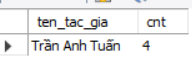

### HAVING: được dùng để lọc kết quả sau khi dữ liệu đã được nhóm bằng GROUP BY.
- Cú pháp
```sql
SELECT column1, column2, aggregate_function(column3)
FROM table_name
GROUP BY column1, column2
HAVING condition;
```
- Vd:
```sql
SELECT ten_tac_gia, count(ma_sach) as cnt 
FROM sach
GROUP BY ten_tac_gia
HAVING cnt < 4
```
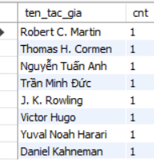
### AGGREGATE FUNCTIONS

- COUNT(): trả về số lượng hàng trong cột
- SUM(): trả về tổng các giá trị trong một cột số.
- AVG(): trả về giá trị trung bình của một cột số.
- MAX(): trả về giá trị lớn nhất của cột đã chọn.
- MIN(): trả về giá trị nhỏ nhất của cột đã chọn

vd:
```sql
SELECT COUNT(*) as so_nxb
FROM  nha_xuat_ban
```
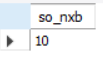
```sql
SELECT MAX(LENGTH(ten_nxb)) as ten_dai_nhat
FROM  nha_xuat_ban
```
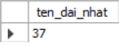

Nếu trong cột có giá trị null thì MAX, MIN, SUM, AVG bỏ qua giá trị null, còn COUNT sẽ coi null là 0.

#  Index
## Index là gì? 
Index( Chỉ mục) là một cấu trúc dữ liệu , lưu bản
sao một phần dữ liệu từ bảng. Nó giống như mục lục của 1 quyển sách, nếu không có mục lục ta phải lật từng trang, còn nếu có mục lục sẽ nhảy thẳng tới trang đó.
## Tại sao cần?
Index là cách tốt nhất để tăng hiệu năng truy vấn và tăng tốc độ tìm kiếm.
## Khi nào nên đánh index, khi nào không nên?
### Nên đánh index khi:
- Khi các cột thường xuyên xuất hiện trong các mệnh đề: where, join, order by, group by.
- Cho các cột có tính chọn lọc cao, có độ phân biệt cao.
- Bảng có tỉ lện đọc nhiều hơn ghi và dữ liệu lớn.
### Không nên đánh index khi:
- Bảng nhỏ và thường xuyên có các thao tác như Insert, update, delete.
- Các cột ít khi được truy vấn.
- Tính phân biệt không cao.
 
## Thực hành: tạo index, so sánh tốc độ query trước và sau khi đánh index.
Dữ liệu:
```sql
Create table SinhVien(
	id int auto_increment primary key,
    msv varchar(20) not null,
    ten varchar(50) not null,
    gioi_tinh Enum('Nam', 'Nu', 'Khac'), 
    que_quan varchar(255)
)
```
Cú pháp:
```sql
CREATE INDEX index_name
ON table_name (column1, column2, ...);
```
vd:
```sql
create index idx_msv
on sinhvien(msv)
```
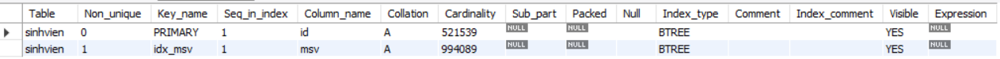

**Chạy không có index**
```sql
select msv
from sinhvien
where msv = 'MSV0654952'

-- Thời gian hoàn thành: 1.922s
```

**Chạy có index**
```sql
select msv
from sinhvien
where msv = 'MSV0654952'

-- Thời gian hoàn thành: 0.016s
```


# Phân trang(Pagination)
## Tại sao cần phân trang?
### Phân trang giúp:
- Nhanh hơn: Thay vì đọc và trả về hàng triệu dòng, database chỉ lấy đúng số dòng cần hiển thị (ví dụ 20 dòng/trang). Thời gian truy vấn và thời gian truyền dữ liệu qua mạng đều giảm đáng kể.
- Tiết kiệm tài nguyên: Server database, ứng dụng backend và trình duyệt của người dùng không phải nạp lượng dữ liệu lớn vào bộ nhớ. Nhờ đó giảm nguy cơ tràn bộ nhớ và tiết kiệm băng thông.
- Giảm tải cho database: Mỗi truy vấn nhẹ hơn nên ít chiếm CPU và I/O hơn, các truy vấn của người dùng khác không bị chậm theo, đặc biệt khi nhiều người truy cập cùng lúc.
- Trải nghiệm người dùng tốt hơn: Trang web hoặc app tải nhanh, người dùng chỉ thấy lượng dữ liệu vừa đủ để đọc và có thể chuyển trang để xem tiếp, thay vì phải cuộn qua hàng nghìn dòng.
- Dễ mở rộng: Khi dữ liệu tăng theo thời gian, truy vấn vẫn chỉ lấy một số dòng cố định nên thời gian phản hồi ổn định hơn, hệ thống chịu tải tốt hơn khi lượng người dùng và dữ liệu lớn dần.

## Offset-based pagination: LIMIT + OFFSET

- LIMIT: Chỉ định số lượng bản ghi cần lấy ở mỗi trang
- OFFSET: Chỉ định số lượng bản ghi cần bỏ qua, xác định vị trí trang.
 
Cách hoạt động:
Trong một lệnh gọi API, giao diện người dùng cung cấp cả giới hạn và độ lệch.
Cơ sở dữ liệu truy xuất các bản ghi bắt đầu từ vị trí offset đã cho và trả về chúng cho đến giới hạn.

Cú pháp:
```sql
SELECT column1,...
FROM table_name
ORDER BY column
LIMIT giới hạn
OFFSET độ lệch
```
vd: Giả sử mỗi trang có giới hạn là 20 bản ghi, trả về trang 3.
```sql
SELECT *
FROM sinhvien
ORDER BY ten
LIMIT 20
OFFSET 40
```
## Cursor-based pagination: WHERE id > last_id LIMIT N

Cách hoạt động:
Trong lần gọi API ban đầu, giao diện người dùng chỉ cung cấp giới hạn (không bao gồm con trỏ).
Trong phản hồi, cơ sở dữ liệu trả về một con trỏ trỏ đến mục cuối cùng trong tập dữ liệu.
Trong các lần gọi API tiếp theo, giao diện người dùng sẽ bao gồm cả giới hạn và giá trị con trỏ (trỏ đến các bản ghi cuối cùng được truy xuất từ ​​yêu cầu trước đó).
Cơ sở dữ liệu cung cấp các bản ghi xuất hiện trước hoặc sau con trỏ, trong phạm vi giới hạn đã được chỉ định.
Cú pháp:
```sql
SELECT column1,...
FROM table_name
WHERE id > last_id 
LIMIT N
```
vd: Giả sử mỗi trang có 20 bản ghi sinh viên cuối cùng ở trang 2 là "Trần Anh Tuấn", trả về trang 3.
```sql
SELECT *
FROM sinhvien
WHERE ten > 'Trần Anh Tuấn'
LIMIT 20
```
## Ưu nhược điểm và trường hợp sử dụng của từng cách

### Offset-based pagination
- Ưu điểm: Có thể cho phép người dùng truy cập 1 trang bất kỳ và dễ cài đặt.

- Nhược điểm: Nếu dữ liệu lớn việc truy vấn những trang cuối sẽ chậm.
- Sư dung trong trường hợp: Khi người dung muốn truy cập đến 1 trang bất kỳ, dữ liệu của bảng không quá lớn và ít thay đổi, những trang cuối ít khi được truy cập.
### Cursor-based pagination
- Ưu điểm: Hiệu suất cực kỳ cao và ổn định, không bị chậm đi dù dữ liệu có hàng triệu bản ghi.

- Nhược điểm: Hiệu suất cao cho những bảng có nhiều bản ghi dùng index nên khó hơn trong việc cài đặt, không cho phép người dùng truy cập 1 trang bất kì.
- Sử dụng trong trường hợp: Các mạng xã hội có kiểu cuộn vô hạn, hệ thông cần hiệu năng cao, thường xuyên thay đổi.

# Locking
## Tại sao cần Lock
Khi nhiều transaction cùng đọc và ghi một dữ liệu tại cùng 1 thời điểm nào đó có thể bị chạy chồng lên nhau khiến cho kết quả có thể bị sai.Để tránh tình trạng ấy thì ta sử dụng lock. Transaction nào giữ lock thì mới được làm việc trên dữ liệu ấy, còn các transaction khác phải chờ đến khi lock được nhả ra.

## Optimistic Locking(Khóa lạc quan): 
Là cơ chế kiểm soát đồng thời trong đó transaction không khóa dữ liệu khi đọc, mà chỉ kiểm tra xem dữ liệu có bị ai thay đổi hay không vào lúc ghi. Nếu dữ liệu đã bị sửa trong khoảng thời gian đó, thao tác ghi bị từ chối và phải đọc lại rồi thử lại(retry), Nếu dữ liệu chưa bị sửa thì thực hiện thao tác và đánh dấu dữ liệu đã bị sửa.
- Ưu điểm: Diễn ra nhanh hơn so với việc các transaction phải đợi nhau.
- Nhược điểm: Khi tranh chấp cao thì retry liên tục.

## Pessimistic Locking(Khóa bi quan):
Là cơ chế kiểm soát đồng thời trong đó transaction khóa dữ liệu ngay khi truy cập, và giữ khóa đến khi kết thúc thao tác.Trong thời gian đó, các transaction khác muốn thao tác trên cùng dữ liệu ấy buộc phải chờ đến khi nhả khóa.
- Ưu điểm: Đảm bảo an toàn dữ liệu.
- Nhược điểm: Chậm do các transaction phải chờ nhau nhả khóa.
## So sánh: khi nào dùng cái nào?
- Áp dụng Optimistic Locking cho các bài toán đồng thời thấp để giảm việc phải retry.
- Áp dụng Pessimistic Locking cho các bài toán đồng thời cao để đảm bảo dữ liệu và giảm thiểu việc phải retry.


# Transaction
## Transaction là gì?
### Transaction là nhóm nhiều thao tác được thưc hiện tuần tự( các thao tác có thể là update, delete, insert, create..) thành một công việc duy nhất. Nó đảm bảo rằng tất cả các thao tác được hoàn thành thành công hoặc không có thao tác nào được áp dụng, bảo toàn tính toàn vẹn của dữ liệu. Transaction có 4 tính chất:
- Atomicity(Tính nguyên tứ): Các thao tác được thực hiện thành công hoặc không có thao tác nào được thực hiện.
- Consistency(Tính nhất quán): Transaction đưa database từ 1 trạng thái đến 1 trạng thái hợp lệ khác phải tuân thủ các nguyên tác và ràng buộc.
- Isolation(Tính độc lập): Các transaction phải được thực hiện độc lặp với nhau, ngay cả khi thực thi cùng một lúc.
- Durability(Tính bền vùng): Một khi transaction được commit, thay đổi sẽ được lưu trữ vĩnh viễn.
## Khi nào cần gom nhiều thao tác vào 1 transaction?
 Khi các thao tác ấy có phụ thuộc đến đến nhau và đảm bảo phải toàn vẹn dữ liệu.

## Dữ liệu chuẩn bị
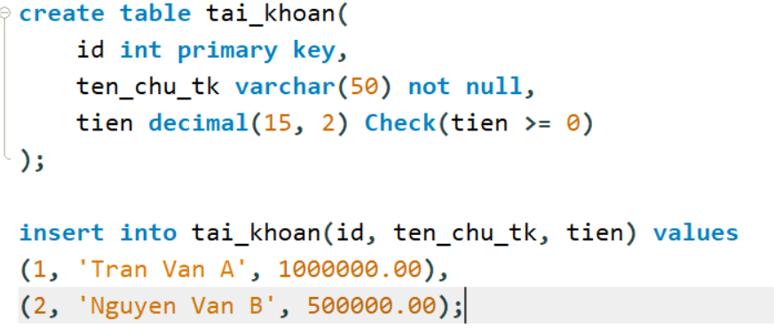

## COMMIT: Cập nhật dữ liệu ở Transaction ở DataBase
Cú pháp:
```sql
COMMIT;
```
VD: B chuyển cho A 500000
```sql
update tai_khoan
set tien = tien - 500000
where id = 2;

update tai_khoan
set tien = tien + 500000
where id = 1;

Commit;
```
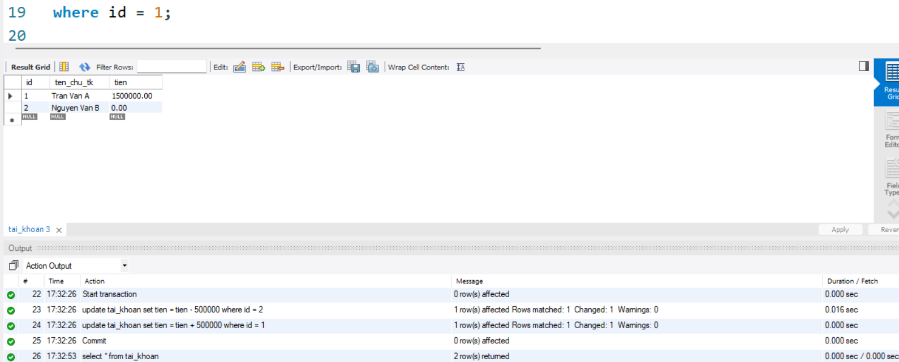
## ROLLBACK: Trả về DataBase ban đầu trước khi Transaction hoạt động, hoặc trả về SAVEPOINT
Cú pháp
```sql
ROLLBACK;
```
VD: Tiếp tục kịch bản trên B chuyển tiếp cho A 500000 và tài khoản B bị âm.
```sql
Start transaction;

Start transaction;
update tai_khoan
set tien = tien - 500000
where id = 2;

update tai_khoan
set tien = tien + 500000
where id = 1;

rollback;
```
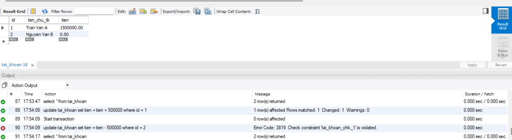


# OOP trong java
## Các tính chất
1. Encapsulation( Đóng gói): Cho phép che dấu sự cài đặt bên trong của phương thức hoặc dữ liệu bên trong của một đối tượng. Các thao tác thông qua gọi phương thức.
2. Inheritance( Kê thừa): Cho phép các lớp con kế thừa các thuộc tình hoặc các phương thức của lớp cha.
3. Polymorphism( Đa hình): Một phương thức có thể thể hiện nhiều cái hành động khác nhau tùy thuộc vào đối tượng gọi nó.
4. Abstraction( Trừu tượng):  Là một tiến trình ẩn các chi tiết trình triển khai và chỉ hiển thị tính năng tới người dùng, cho biết một đối tượng có thể làm gì nhưng không cho biết làm như thế nào.
## Class, Abstract Class, Interface
1. Class( Lớp): Là sự trưu tượng hóa của đối tượng, lớp chứa các thuộc tính hay phương thức của đối tượng. Lớp có thể khởi tạo trực tiếp thành 1 đối tượng cụ thể.
- Được dùng khi muốn trực tiếp tạo ra các đối tượng cụ thể từ lớp.

- Vd: Class Car có thể khởi tạo trực tiếp ``` new Car()```
2. Abstract Class( Lớp trưu tượng): Là một lớp cơ sở dùng định nghĩa các thuộc tính và phương thức chung cho các lớp con kế thừa, nhưng nó không thể khởi tạo một đối tượng cụ thể trức tiếp từ nó.
- Các đặc điểm:
    - Không thể khởi tạo trực tiếp.
    - Có thể chứa các thuộc tính, hàm có thần, hàm không thân, hàm khởi tạo..
    - Class có thể kế thừa một Abstract Class dùng ``` extends```
    - Các hàm không thân bắt buộc lớp con phải ghi đè.

Được dùng khi muốn cung cấp bộ khung cho các lớp con(quan hệ is - a).

VD: Abstract class Car có phương thức là speed() là abstract thì các class như class Honda hay class ToyoTa phải ghi đè lên phương thức ấy

3. Interface( Giao diện): là một bản hợp đồng hoàn toàn trừu tượng, định nghĩa xem một lớp có khả năng làm gì chứ không quan tâm làm thế nào.
- Các đặc điểm:
    - Không thể khởi tạo trực tiếp.
    - Chỉ chứa các hàm không thân, Không có hàm khởi tạo.
    - Class có thể kế thừa Interface dùng ``` Implement```
    - Các Class kế thừa bắt buộc phải ghi đề tất cả các hàm của Interface.
    - 1 Class có thể kế thừa nhiều Interface.
    - Phương thức mặc định là abstract và public.

Được dùng khi định nghĩa một tập hợp khả năng mà các lớp không có họ hàng cũng có thể áp dụng.

VD: Interface Kha_nang_an có hàm an() có thể được kế thừa từ 2 lớp khác nhau là Con_nguoi và Con_meo.

# Dependency Injection (DI) & Inversion of Control (IoC)

## 1. Khái niệm

**IoC (Inversion of Control)** là nguyên lý thiết kế: class không tự quyết định dùng cái gì và tạo như thế nào, quyền đó được chuyển cho thành phần bên ngoài (hàm `main`, framework, container).

**DI (Dependency Injection)** là kỹ thuật hiện thực IoC: dependency được truyền từ bên ngoài vào, thay vì class tự `new`.

- IoC là nguyên lý, DI là cách làm.
- Ngoài DI, IoC còn có Service Locator, Template Method, Callback.

## 2. Ví dụ Java thuần

### Không dùng DI (tight coupling)

```java
public class EmailSender {
    public void send(String to, String content) {
        System.out.println("Gửi email tới " + to + ": " + content);
    }
}

public class OrderService {
    private final EmailSender sender = new EmailSender();

    public void placeOrder(String customerEmail) {
        sender.send(customerEmail, "Đặt hàng thành công!");
    }
}
```

Vấn đề:

- Đổi sang SMS phải sửa `OrderService`.
- Test phải gửi email thật.
- `OrderService` biết quá nhiều về cách tạo `EmailSender`.

### Dùng DI (constructor injection)

**Bước 1: Tách interface**

```java
public interface MessageSender {
    void send(String to, String content);
}

public class EmailSender implements MessageSender {
    @Override
    public void send(String to, String content) {
        System.out.println("[EMAIL] " + to + ": " + content);
    }
}

public class SmsSender implements MessageSender {
    @Override
    public void send(String to, String content) {
        System.out.println("[SMS] " + to + ": " + content);
    }
}
```

**Bước 2: Class phụ thuộc interface, nhận dependency qua constructor**

```java
import java.util.Objects;

public class OrderService {
    private final MessageSender sender;

    public OrderService(MessageSender sender) {
        this.sender = Objects.requireNonNull(sender);
    }

    public void placeOrder(String contact) {
        sender.send(contact, "Đặt hàng thành công!");
    }
}
```

**Bước 3: Lắp ráp ở một nơi duy nhất (Composition Root)**

```java
public class Main {
    public static void main(String[] args) {
        MessageSender sender = new EmailSender();
        OrderService service = new OrderService(sender);
        service.placeOrder("khach@example.com");
    }
}
```

### Mini IoC container

Spring, Guice về bản chất chỉ tự động hóa bước lắp ráp.

```java
import java.util.*;
import java.util.function.Supplier;

public class SimpleContainer {
    private final Map<Class<?>, Supplier<?>> registry = new HashMap<>();

    public <T> void register(Class<T> type, Supplier<? extends T> factory) {
        registry.put(type, factory);
    }

    public <T> T resolve(Class<T> type) {
        Supplier<?> factory = registry.get(type);
        if (factory == null) throw new IllegalStateException("Chưa đăng ký: " + type);
        return type.cast(factory.get());
    }
}
```

```java
SimpleContainer c = new SimpleContainer();
c.register(MessageSender.class, EmailSender::new);
c.register(OrderService.class, () -> new OrderService(c.resolve(MessageSender.class)));

OrderService service = c.resolve(OrderService.class);
```

## 3. Vì sao DI giúp code dễ test

Dependency truyền từ ngoài vào nên có thể thay bằng bản giả (fake/stub/mock) khi test.

```java
class FakeSender implements MessageSender {
    final List<String> sent = new ArrayList<>();

    @Override
    public void send(String to, String content) {
        sent.add(to + "|" + content);
    }
}

class OrderServiceTest {
    @Test
    void placeOrder_shouldSendConfirmation() {
        FakeSender fake = new FakeSender();
        OrderService service = new OrderService(fake);

        service.placeOrder("a@b.com");

        assertEquals(1, fake.sent.size());
        assertEquals("a@b.com|Đặt hàng thành công!", fake.sent.get(0));
    }
}
```

- Unit test độc lập, không gọi mạng, DB, file.
- Nhanh và ổn định.
- Mô phỏng được tình huống khó (ví dụ ném exception để test xử lý lỗi).
- Không bắt buộc dùng Mockito, tự viết fake là đủ.

## 4. Vì sao DI giúp code dễ thay đổi

| Tình huống | Không DI | Có DI |
|---|---|---|
| Đổi Email sang SMS | Sửa trong `OrderService` | Sửa 1 dòng ở `Main` |
| Thêm kênh Push | Sửa `OrderService`, có thể nhiều chỗ | Viết `PushSender`, không đụng code cũ |
| Đổi DB (MySQL sang Mongo) | Sửa mọi chỗ `new MySqlRepo()` | Đổi ở composition root |
| Cấu hình dev/prod | `if/else` rải rác | Lắp ráp khác nhau ở một chỗ |

