# Tuần 1: Kiến thức về Cơ sở dữ liệu và Lập trình hướng đối tượng

---

## Phần 1: Database (CSDL quan hệ)

### 1. SQL cơ bản

#### Mô tả bài toán

Em xây dựng CSDL cho bài toán quản lý CLB đơn giản. Hệ thống lưu trữ dữ liệu phục vụ một số hoạt động của CLB và có nhóm người sử dụng là các thành viên trong CLB.

Các dữ liệu cần lưu gồm:
- Thông tin thành viên
- Thông tin ban chuyên môn
- Thông tin sự kiện
- Thông tin các giao dịch thu chi

CSDL tập trung lưu trữ dữ liệu, liên kết phát sinh trong quá trình hoạt động CLB.

#### 1.1. DDL

DDL bao gồm các lệnh dùng để xây dựng, sửa đổi hoặc xóa cấu trúc các đối tượng trong cơ sở dữ liệu (Database, Table, Index, View,...).

**a. CREATE TABLE**
Dùng để tạo bảng mới cùng cấu trúc các cột, kiểu dữ liệu và ràng buộc

```SQL
CREATE TABLE SuKien(
    MaSK varchar(10) PRIMARY KEY,
    TenSK varchar(150) NOT NULL,
    DiaDiem varchar(150),
    NgayBatDau DATE,
    NgayKetThuc DATE
);
```

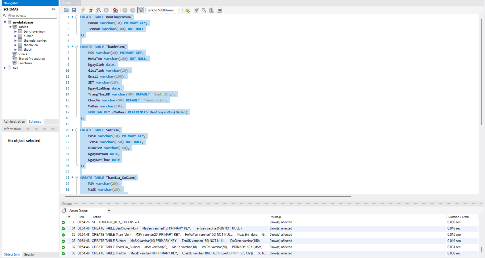

**b. ALTER TABLE**
Dùng để sửa đổi cấu trúc của bảng đã tồn tại (thêm cột, sửa kiểu dữ liệu, xóa cột hoặc thêm/xóa ràng buộc).

```SQL
ALTER TABLE SuKien
ADD COLUMN GhiChu text;

ALTER TABLE SuKien
DROP COLUMN GhiChu;
```

**c. DROP TABLE**
Dùng để xóa hoàn toàn bảng khỏi cơ sở dữ liệu (xóa cả cấu trúc bảng lẫn toàn bộ dữ liệu bên trong).

```SQL
DROP TABLE SuKien;
```

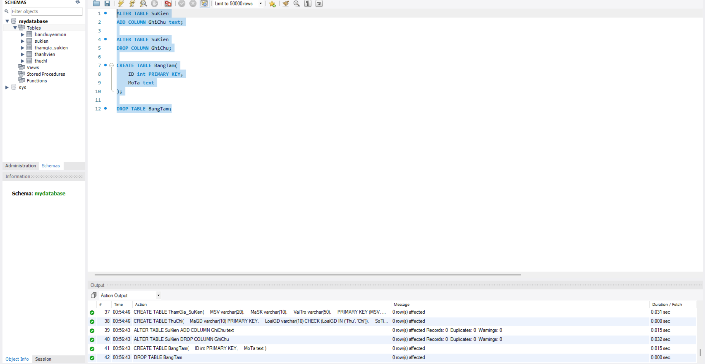

#### 1.2. DML

DML gồm các lệnh dùng để quản lý và tác động trực tiếp lên các bản ghi (dữ liệu) bên trong bảng mà không làm thay đổi cấu trúc bảng.

**a. SELECT**
Dùng để truy vấn, trích xuất dữ liệu từ một hoặc nhiều bảng.

```SQL
SELECT * FROM SuKien;
```

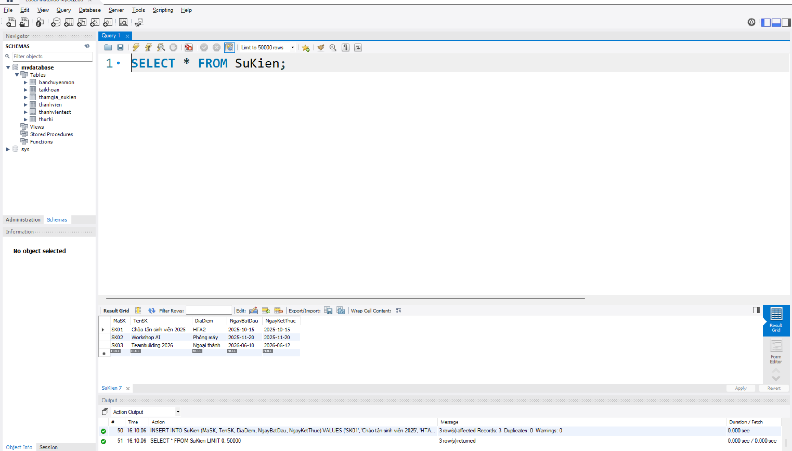

**b. INSERT**
Dùng để chèn thêm một hoặc nhiều hàng dữ liệu mới vào bảng.

```SQL
INSERT INTO SuKien (MaSK, TenSK, DiaDiem, NgayBatDau, NgayKetThuc) VALUES
('SK01', 'Chào tân sinh viên 2025', 'HTA2', '2025-10-15', '2025-10-15'),
('SK02', 'Workshop AI', 'Phòng máy', '2025-11-20', '2025-11-20'),
('SK03', 'Teambuilding 2026', 'Ngoại thành', '2026-06-10', '2026-06-12');
```

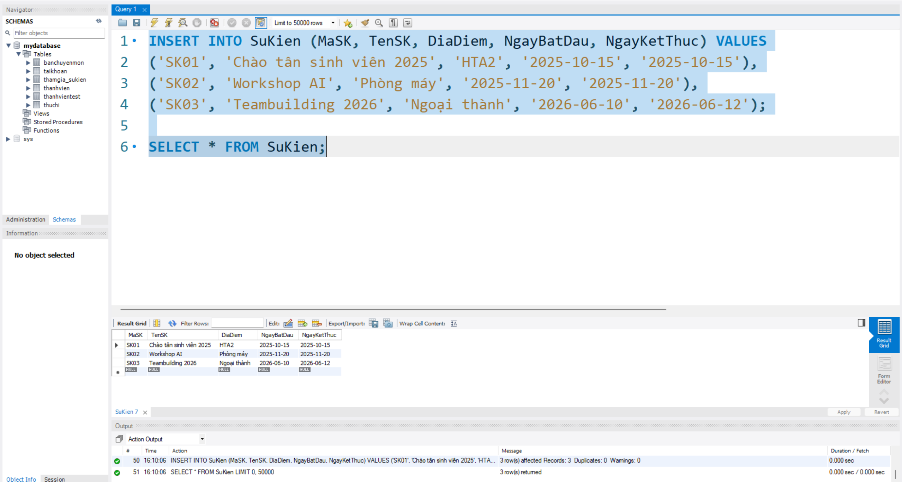

**c. UPDATE**
Dùng để cập nhật dữ liệu của các hàng hiện có. Cần kết hợp điều kiện `WHERE` để tránh sửa toàn bộ bảng.

```SQL
UPDATE SuKien
SET DiaDiem = 'HTA1'
WHERE MaSK = 'SK02';
```

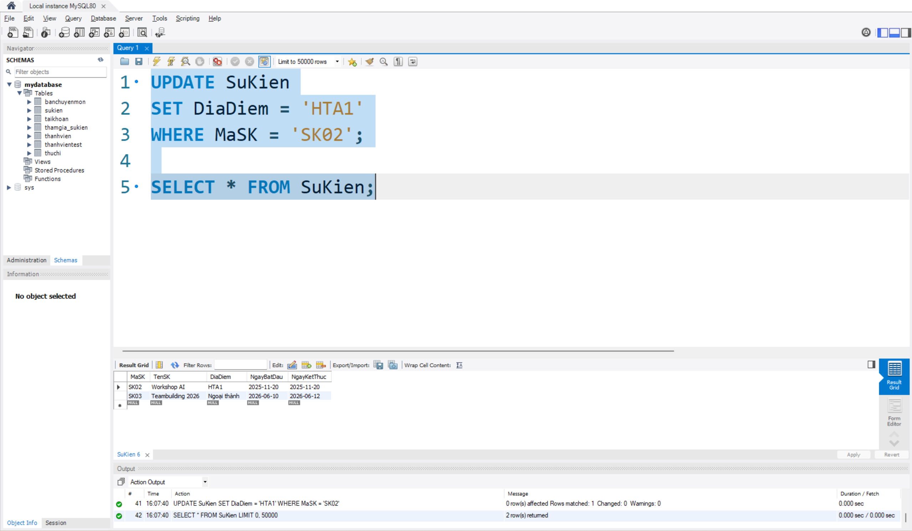

**d. DELETE**
Dùng để xóa một hoặc nhiều hàng dữ liệu dựa trên điều kiện lọc. Nếu bỏ qua `WHERE`, toàn bộ dữ liệu trong bảng sẽ bị xóa.

```SQL
DELETE FROM SuKien 
WHERE NgayBatDau <= '2025-10-20';
```

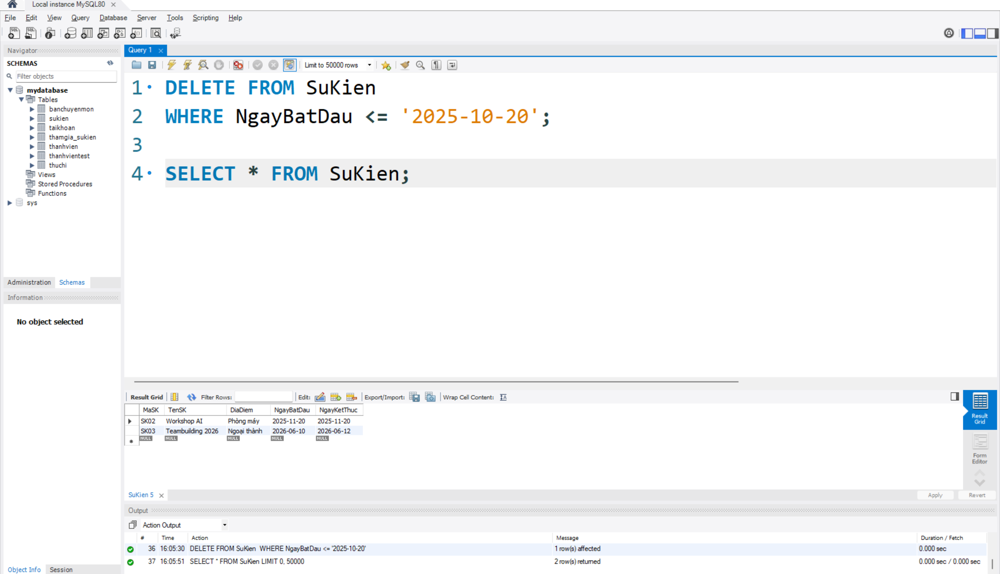

#### 1.3. QUERY

**a. WHERE**
Mệnh đề lọc dữ liệu ở cấp độ từng hàng (row-level) trước khi dữ liệu được nhóm hoặc tổng hợp.

```SQL
SELECT MSV, HoVaTen, ChucVu, NgayGiaNhap
FROM ThanhVien
WHERE TrangThaiHD = 'Hoạt động'
```

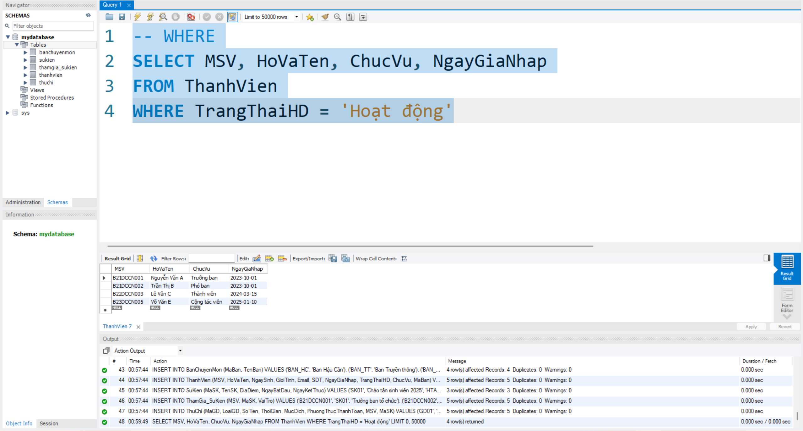

**b. JOIN**
Dùng để kết hợp các hàng từ hai hay nhiều bảng dựa trên một cột chung (thường là Primary Key - Foreign Key).

- `INNER JOIN`: Chỉ trả về các bản ghi thỏa mãn điều kiện khớp ở cả 2 bảng.

    ```SQL
    SELECT ThanhVien.HoVaTen, BanChuyenMon.TenBan
    FROM ThanhVien
    INNER JOIN BanChuyenMon ON ThanhVien.MaBan = BanChuyenMon.MaBan
    ```

    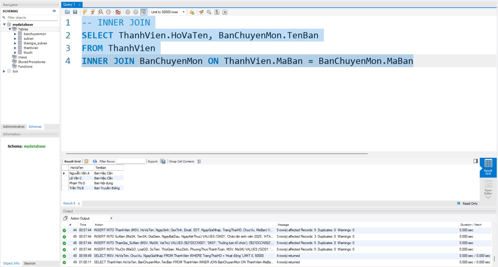

- `LEFT JOIN`: Trả về toàn bộ bản ghi từ bảng bên trái và các bản ghi khớp từ bảng bên phải. Nếu bên phải không có dữ liệu khớp, kết quả sẽ mang giá trị `NULL`.

    ```SQL
    SELECT ThanhVien.HoVaTen, BanChuyenMon.TenBan
    FROM ThanhVien
    LEFT JOIN BanChuyenMon ON ThanhVien.MaBan = BanChuyenMon.MaBan
    ```

    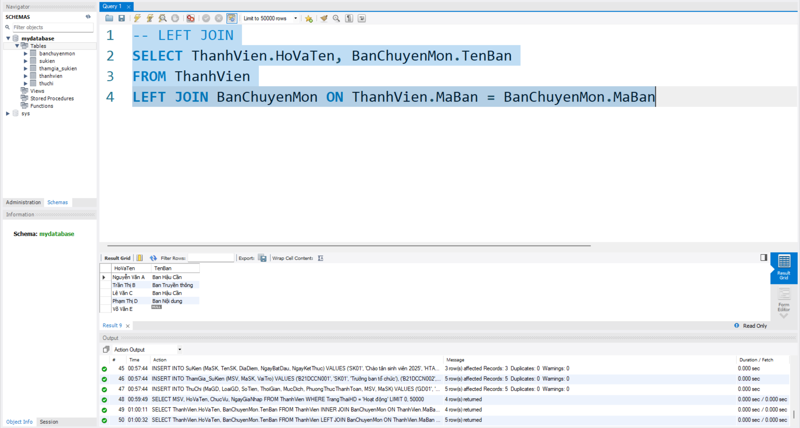

- `RIGHT JOIN`: Trả về toàn bộ bản ghi từ bảng bên phải và các bản ghi khớp từ bảng bên trái. Nếu bên trái không khớp, trả về `NULL`.

    ```SQL
    SELECT ThanhVien.HoVaTen, BanChuyenMon.TenBan
    FROM ThanhVien
    RIGHT JOIN BanChuyenMon ON ThanhVien.MaBan = BanChuyenMon.MaBan
    ```

    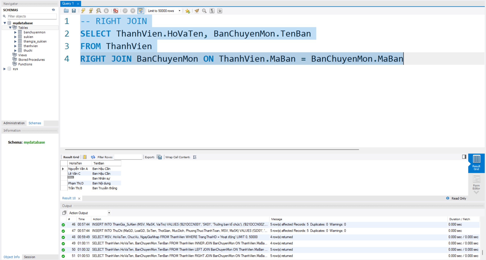

**c. GROUP BY**
Gộp các hàng có cùng giá trị ở một hoặc nhiều cột thành các hàng tóm tắt. Thường đi kèm với các hàm tổng hợp (Aggregate Functions).

```SQL
SELECT MaBan, COUNT(*) AS SoLuongThanhVien
FROM ThanhVien
GROUP BY MaBan;
```

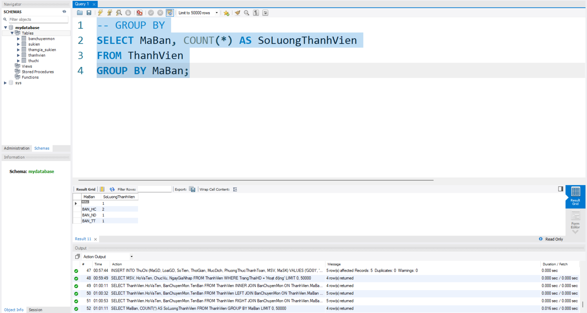

**d. HAVING**
Mệnh đề lọc dữ liệu áp dụng cho các nhóm đã được tạo bởi `GROUP BY` (hoặc sau khi tính toán hàm tổng hợp). `WHERE` không thể dùng trực tiếp trên hàm tổng hợp, trong khi `HAVING` được sinh ra để phục vụ điều đó.

```SQL
SELECT MaBan, COUNT(*) AS SoLuongThanhVien
FROM ThanhVien
GROUP BY MaBan
HAVING SoLuongThanhVien = 2;
```

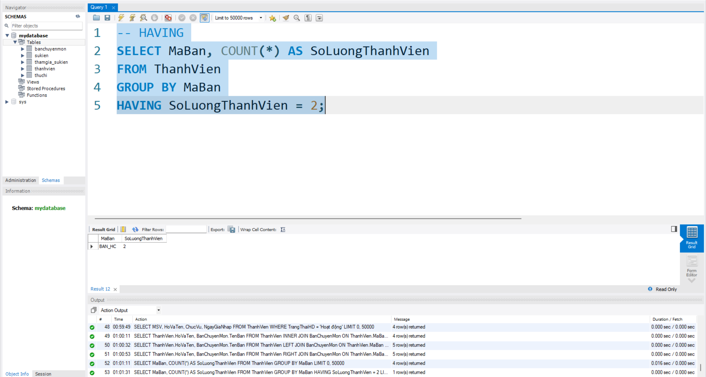

**e. ORDER BY**
Dùng để sắp xếp tập kết quả trả về theo thứ tự tăng dần (`ASC` - mặc định) hoặc giảm dần (`DESC`).

```SQL
SELECT * FROM ThuChi
ORDER BY SoTien DESC, MaGD ASC;
```

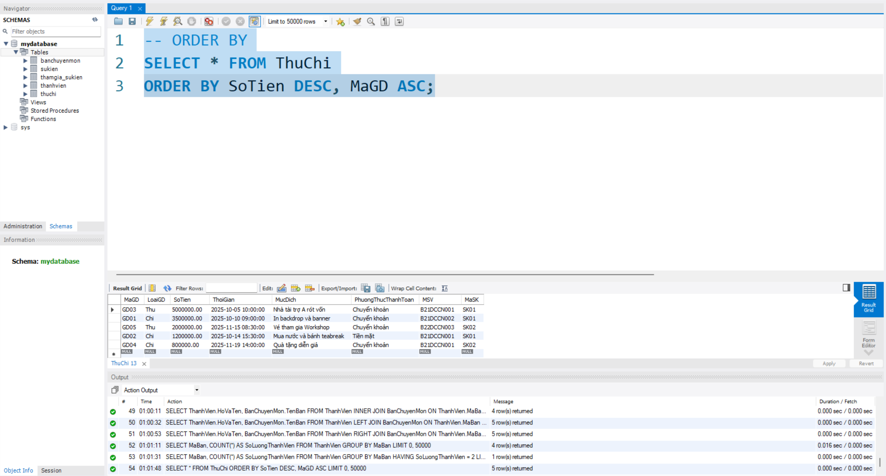

**f. Aggregate Functions**
Các hàm tổng hợp nhận đầu vào là tập hợp nhiều giá trị của một cột và trả về một giá trị duy nhất. Ngoại trừ `COUNT(*)`, hầu hết các hàm tổng hợp đều bỏ qua giá trị `NULL`.

| Hàm | Ý nghĩa | Cú pháp ví dụ |
| :---: | :--- | :--- |
| **COUNT** | Đếm số lượng dòng hoặc số lượng giá trị không `NULL` | `SELECT COUNT(MaGD) FROM ThuChi;` |
| **SUM** | Tính tổng giá trị số của một cột | `SELECT SUM(SoTien) FROM ThuChi;` |
| **AVG** | Tính trung bình cộng của một cột kiểu số | `SELECT AVG(SoTien) FROM ThuChi;` |
| **MIN** | Tìm giá trị nhỏ nhất (số, chuỗi hoặc ngày tháng) | `SELECT MIN(SoTien) FROM ThuChi;` |
| **MAX** | Tìm giá trị lớn nhất (số, chuỗi hoặc ngày tháng) | `SELECT MAX(SoTien) FROM ThuChi;` |

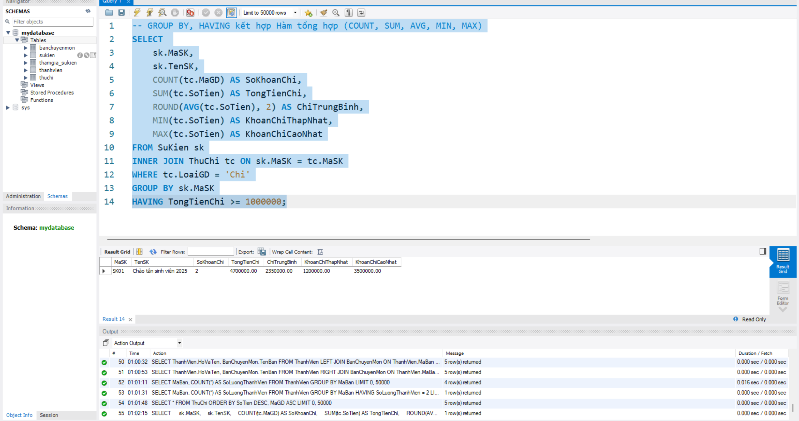

---

### 2. Index

#### 2.1. Index là gì? Tại sao cần?

- **Khái niệm:** **Index** là một cấu trúc dữ liệu bổ trợ (thường dùng dạng cây B-Tree) được lưu trữ riêng biệt, giúp hệ quản trị cơ sở dữ liệu tra cứu và trích xuất dữ liệu nhanh hơn thay vì phải duyệt tuần tự qua từng bản ghi.
- **Hình ảnh thực tế:** Index giống như **mục lục** ở cuối cuốn sách. Thay vì phải lật đọc từ trang 1 đến trang 500 (Table Scan) để tìm một từ khóa, bạn chỉ cần tra mục lục để nhảy ngay tới số trang cần đọc (Index Scan).
- **Tại sao cần?**
  - Tối ưu hóa độ phức tạp thuật toán tìm kiếm từ quét tuyến tính $O(N)$ xuống tra cứu dạng cây $O(\log N)$.
  - Tăng tốc rõ rệt các mệnh đề truy vấn: `WHERE`, `JOIN`, `ORDER BY`, `GROUP BY`.
  - Giảm thiểu đáng kể thao tác đọc/ghi đĩa vật lý (Disk I/O) và giảm tải CPU của máy chủ.

#### 2.2. Khi nào nên và không nên đánh Index?

##### Nên đánh Index khi:
- Các cột thường xuyên xuất hiện trong điều kiện lọc `WHERE`.
- Các cột là Khóa ngoại (Foreign Key) được sử dụng để liên kết bảng trong `JOIN`.
- Các cột thường xuyên xuất hiện ở mệnh đề sắp xếp (`ORDER BY`) hoặc gom nhóm (`GROUP BY`).
- Các cột có độ phân tán dữ liệu cao (High Cardinality) như: `Email`, `Mã sinh viên`, `Số điện thoại`, `CCCD`.

##### Không nên đánh Index khi:
- Bảng dữ liệu có dung lượng quá nhỏ (dưới vài trăm dòng), quét toàn bảng còn nhanh hơn duyệt qua cây chỉ mục.
- Các cột có tính phân tán dữ liệu rất thấp (Low Cardinality) như: Giới tính (`Nam`/`Nữ`), Cờ logic (`0`/`1`, `True`/`False`).
- Bảng có tần suất ghi dữ liệu cực kỳ lớn (`INSERT`, `UPDATE`, `DELETE` liên tục), vì mỗi thao tác ghi đều phải cập nhật lại cấu trúc cây Index.
- Các cột lưu văn bản quá dài mà không cấu hình độ dài tiền tố (Prefix Index).

#### 2.3. So sánh tốc độ trước và sau khi đánh Index

##### Bước 1: Khởi tạo bảng và sinh 2.000.000 dòng dữ liệu mẫu

```SQL
SET SESSION cte_max_recursion_depth = 2000000;

CREATE TABLE ThanhVienTest (
    id INT AUTO_INCREMENT PRIMARY KEY,
    ho_ten VARCHAR(100),
    email VARCHAR(100),
    so_tien DECIMAL(12, 2),
    ngay_tao DATETIME
);

DELIMITER $$

DROP PROCEDURE IF EXISTS TaoDuLieuMau$$
CREATE PROCEDURE TaoDuLieuMau()
BEGIN
    DECLARE i INT DEFAULT 1;

    SET autocommit = 0;
    SET unique_checks = 0;
    SET foreign_key_checks = 0;

    WHILE i <= 2000000 DO
        INSERT INTO ThanhVienTest (ho_ten, so_tien)
        VALUES (
            CONCAT('ThanhVien_', i),
            ROUND(RAND() * 1000000, 2)
        );

        IF MOD(i, 50000) = 0 THEN
            COMMIT;
        END IF;

        SET i = i + 1;
    END WHILE;

    COMMIT;

    SET unique_checks = 1;
    SET foreign_key_checks = 1;
    SET autocommit = 1;
END$$

DELIMITER ;

CALL TaoDuLieuMau();
```

##### Bước 2: Kiểm tra truy vấn khi chưa đánh Index

```SQL
SELECT * FROM ThanhVienTest 
WHERE so_tien < 1;
```

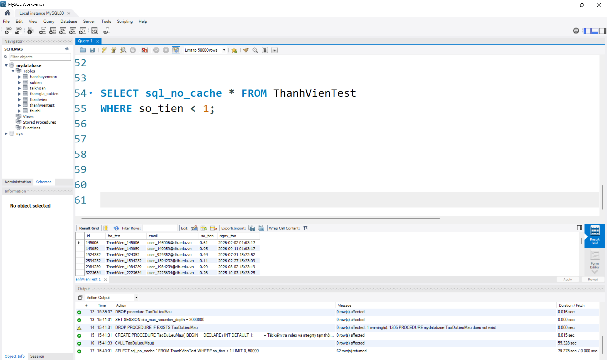

##### Bước 3: Tạo Index trên cột `so_tien`

```SQL
CREATE INDEX idx_so_tien ON ThanhVienTest(so_tien);
```

##### Bước 4: Kiểm tra truy vấn sau khi đánh Index

```SQL
SELECT SQL_NO_CACHE * FROM ThanhVienTest 
WHERE so_tien < 1;
```

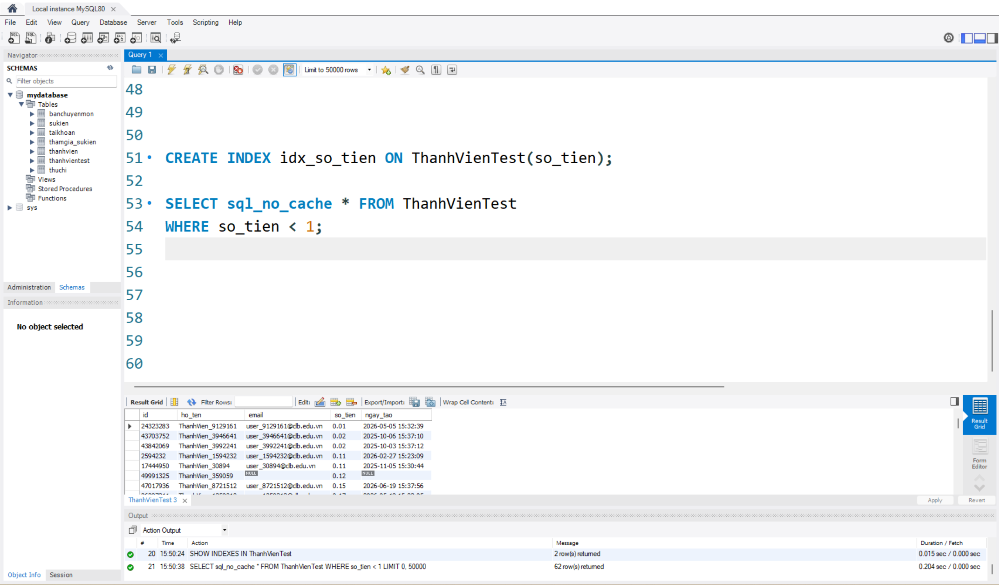

##### Bước 5: So sánh tốc độ trước và sau khi đánh Index

Tốc độ trước khi đánh Index là: `79.735 s`
Tốc độ sau khi đánh Index là: `0.204s`

---

### 3. Phân Trang (Pagination)

#### 3.1. Tại sao cần phân trang?

- **Bảo vệ tài nguyên hệ thống:** Ngăn chặn việc tải hàng trăm nghìn hoặc hàng triệu dòng dữ liệu vào RAM của máy chủ ứng dụng và cơ sở dữ liệu cùng một lúc, tránh lỗi tràn bộ nhớ (Out-Of-Memory).
- **Tối ưu hóa băng thông mạng:** Giảm kích thước gói tin HTTP/JSON truyền tải giữa backend và frontend, giúp ứng dụng phản hồi mượt mà hơn.
- **Cải thiện trải nghiệm người dùng (UX):** Người dùng không thể tiêu thụ hàng triệu bản ghi cùng lúc; việc chia nhỏ dữ liệu thành từng trang hoặc cuộn vô tận (infinite scroll) giúp giao diện tải tức thì.

#### 3.2. Offset-based Pagination (`LIMIT + OFFSET`)

Cách phân trang truyền thống bằng việc chỉ định vị trí bắt đầu (`OFFSET`) và số lượng bản ghi cần lấy (`LIMIT`).

##### Công thức tổng quát:

- **Trang hiện tại:** `page` (bắt đầu từ 1)
- **Số bản ghi mỗi trang:** `page_size`
- $$\text{OFFSET} = (\text{page} - 1) \times \text{page\_size}$$

##### Câu lệnh SQL minh họa:

```SQL
-- Lấy trang 1 (10 bản ghi đầu tiên)
SELECT * FROM ThanhVienTest
ORDER BY id ASC
LIMIT 10 OFFSET 0;

-- Lấy trang 10001 (từ bản ghi thứ 100.001)
SELECT * FROM ThanhVienTest
ORDER BY id ASC
LIMIT 10 OFFSET 100000;
```

#### 3.3. Cursor-based Pagination (`WHERE id > last_id LIMIT N`)

Thay vì đếm số dòng cần bỏ qua, phương pháp này ghi nhớ con trỏ của bản ghi cuối cùng ở trang trước đó (thường dùng cột có Index tăng dần duy nhất như Khóa chính `id` hoặc cặp `(created_at, id)`).

```SQL
-- Lấy trang đầu tiên
SELECT * FROM ThanhVienTest
ORDER BY id ASC
LIMIT 10;
-- Giả sử bản ghi cuối cùng trả về có id = 10

-- Lấy trang kế tiếp (truyền cursor id = 10 vào)
SELECT * FROM ThanhVienTest
WHERE id > 10
ORDER BY id ASC
LIMIT 10;
-- Giả sử bản ghi cuối cùng trả về có id = 20

-- Lấy trang tiếp theo nữa
SELECT * FROM ThanhVienTest
WHERE id > 20
ORDER BY id ASC
LIMIT 10;
```

#### 3.4. So sánh chi tiết: Ưu, Nhược điểm & Trường hợp sử dụng

| Tiêu chí | Offset-based (`LIMIT ... OFFSET`) | Cursor-based (`WHERE id > last id LIMIT N`) |
| :---: | :--- | :--- |
| **Cơ chế hoạt động** | MySQL duyệt qua toàn bộ $\text{OFFSET}$ dòng đầu rồi bỏ qua, sau đó mới lấy $N$ dòng tiếp theo. | Dùng trực tiếp B-Tree Index nhảy thẳng tới vị trí $\text{last\_id}$ ($O(\log N)$) và lấy $N$ dòng. |
| **Hiệu năng khi dữ liệu lớn** | **Rất chậm ở trang sâu.** Ví dụ: `OFFSET 1000000 LIMIT 10` buộc máy chủ duyệt qua $1.000.010$ dòng. | **Tốc độ ổn định tuyệt đối.** Dù ở trang 1 hay trang 1 triệu, thời gian xử lý vẫn dưới $1\text{ ms}$. |
| **Tính ổn định (Data Drift)** | **Dễ trùng hoặc sót dòng:** Thêm bản ghi mới khi đang phân trang sẽ đẩy dòng cũ xuống trang sau. | **Nhất quán:** Dữ liệu mới thêm vào không ảnh hưởng đến vị trí con trỏ phía trước. |
| **Ưu điểm** | • Dễ triển khai.<br>• Nhảy cóc đến trang bất kỳ (ví dụ: chuyển ngay sang trang 15). | • Hiệu năng tối ưu vượt trội.<br>• Không trùng lặp bản ghi khi có ghi dữ liệu thời gian thực. |
| **Nhược điểm** | • Tụt giảm hiệu năng nghiêm trọng ở trang sâu.<br>• Dễ sai lệch dữ liệu khi cập nhật liên tục. | • **Không nhảy cóc được trang:** Bắt buộc duyệt tuần tự từ trang trước sang trang sau.<br>• Yêu cầu cột phân trang có thứ tự duy nhất (Unique) và có Index. |
| **Trường hợp sử dụng** | • Trang quản trị (Admin Dashboard) ít dòng.<br>• Giao diện có thanh chọn trang cố định (Trang 1, 2, 3... 10). | • Cuộn vô tận (Infinite Scroll) trên mạng xã hội.<br>• Lịch sử giao dịch, thông báo số lượng lớn.<br>• API cho ứng dụng di động. |

---

### 4. Locking trong Database

#### 4.1. Tại sao cần Lock?

- **Bảo vệ tính toàn vẹn dữ liệu:** Khi nhiều người dùng hoặc tiến trình cùng đọc/ghi vào một bản ghi tại cùng một thời điểm, nếu không có cơ chế khóa sẽ dẫn đến các lỗi tranh chấp dữ liệu.
- **Ngăn chặn các sự cố kinh điển trong giao dịch:**
  - **Lost Update (Mất cập nhật):** Hai giao dịch cùng đọc một số dư, cùng tính toán và ghi đè, làm mất dữ liệu của giao dịch trước.
  - **Dirty Read (Đọc rác):** Đọc dữ liệu chưa được `COMMIT` của giao dịch khác (và giao dịch đó bị `ROLLBACK`).
  - **Non-repeatable Read (Đọc không lặp lại) & Phantom Read (Đọc bóng ma):** Dữ liệu bị thay đổi hoặc chèn mới giữa 2 lần đọc trong cùng một giao dịch.
- **Đảm bảo tính chất ACID:** Đặc biệt là thuộc tính **I (Isolation - Tính độc lập)** trong cơ sở dữ liệu quan hệ.

#### 4.2. Optimistic Locking

- **Tư tưởng:** Cho rằng xung đột (conflict) rất hiếm khi xảy ra. Không chủ động khóa bản ghi ở tầng database khi đọc.
- **Cơ chế:** Không dùng bất kỳ lệnh khóa nào của CSDL khi đọc. Thay vào đó, sử dụng một cột phiên bản (thường là `version INT` hoặc `updated_at TIMESTAMP`) trong bảng:
  1. Khi đọc bản ghi, lấy kèm theo một trường siêu dữ liệu (metadata), thường là `version` (số nguyên tăng dần) hoặc `updated_at` (timestamp).
  2. Thực hiện tính toán, xử lý logic ở tầng ứng dụng.
  3. Khi cập nhật (`UPDATE`), kiểm tra xem giá trị `version` trong DB có còn khớp với `version` lúc đọc ban đầu hay không.
  4. Nếu khớp: ghi đè thành công và tăng `version = version + 1`.
  5. Nếu không khớp (đã có bên khác ghi đè trước): câu lệnh cập nhật tác động 0 dòng (`rows affected = 0`), ứng dụng sẽ nhận diện xung đột và ném ngoại lệ hoặc thử lại (retry).
- **Ví dụ:**
    ```SQL
    UPDATE TaiKhoan
    SET so_du = 700, version = version + 1
    WHERE id = 1 AND version = 1;
    ```

#### 4.3. Pessimistic Locking

- **Tư tưởng:** Cho rằng khả năng xảy ra xung đột là rất cao. Phải khóa chặt bản ghi ngay từ khi đọc để ngăn người khác can thiệp.
- **Cơ chế:** Khóa cứng dòng dữ liệu ngay từ lúc đọc bằng cơ chế khóa tầng CSDL. Bất kỳ giao dịch nào khác muốn sửa hoặc đọc có khóa đều phải **đứng chờ** cho đến khi giao dịch hiện tại hoàn tất (`COMMIT` hoặc `ROLLBACK`).
- **Cú pháp trong MySQL InnoDB:**
  - `SELECT ... FOR UPDATE` (Khóa độc quyền - Exclusive Lock / X-Lock): Chặn mọi giao dịch khác đọc (có khóa) hoặc sửa.
  - `SELECT ... FOR SHARE` hoặc `LOCK IN SHARE MODE` (Khóa chia sẻ - Shared Lock / S-Lock): Cho phép đọc nhưng chặn sửa.

- **Ví dụ:**
    ```SQL
    SELECT so_du FROM TaiKhoan
    WHERE id = 1 FOR UPDATE;

    UPDATE TaiKhoan
    SET so_du = 1000 - 300
    WHERE id = 1;
    ```

#### 4.4. So sánh: Khi nào dùng cái nào?

| Tiêu chí | Pessimistic Locking | Optimistic Locking |
| :--- | :--- | :--- |
| **Cấp độ xử lý** | Cấp độ Database Engine (InnoDB khóa dòng). | Cấp độ ứng dụng (Application Logic + cột `version`). |
| **Hiệu năng hệ thống** | Thấp hơn khi lưu lượng cao vì các kết nối phải xếp hàng đợi (Connection Holding). | Cao hơn, không chiếm giữ connection chờ đợi trong database. |
| **Nguy cơ Deadlock** | Có thể xảy ra Deadlock nếu các transaction khóa tài nguyên chéo nhau. | Hoàn toàn không bao giờ xảy ra Deadlock do khóa dòng. |
| **Tỉ lệ xung đột (Conflict)** | Hiệu quả khi tỉ lệ xung đột **rất cao**. | Hiệu quả khi tỉ lệ xung đột **thấp hoặc trung bình**. |
| **Hệ quả xung đột** | Giao dịch sau phải đợi | Thất bại ở bước update, cần logic retry |
| **Trường hợp sử dụng phù hợp** | - Xử lý giao dịch tài chính, thanh toán ví điện tử, ngân hàng (nơi tính nhất quán tức thời phải đặt lên hàng đầu.) <br> - Tỷ lệ tranh chấp cực kỳ cao và chi phí rollback/retry quá đắt (ví dụ: flash sale chỉ có 10 sản phẩm nhưng hàng nghìn người click cùng lúc). | - Thời gian xử lý nghiệp vụ giữa đọc và ghi kéo dài (ví dụ: người dùng mở form sửa hồ sơ trên web, 5 phút sau mới ấn "Lưu"). Dùng Pessimistic lock ở đây sẽ làm tê liệt DB.<br>- Hệ thống đọc nhiều hơn ghi (tỷ lệ conflict < 5-10%). |

#### 4.5. Thực hành Demo: 

##### 4.5.1 Chuẩn bị dữ liệu

Tạo bảng `TaiKhoan` và thêm một tài khoản thử nghiệm có số dư ban đầu là **1000.00**:

```SQL
CREATE TABLE TaiKhoan (
    id INT PRIMARY KEY,
    ten_chu_tk VARCHAR(50),
    so_du DECIMAL(12, 2),
    version INT DEFAULT 1 -- Dùng riêng cho Optimistic Locking
);

INSERT INTO TaiKhoan (id, ten_chu_tk, so_du, version) 
VALUES (1, 'Van Chien', 1000.00, 1);
```

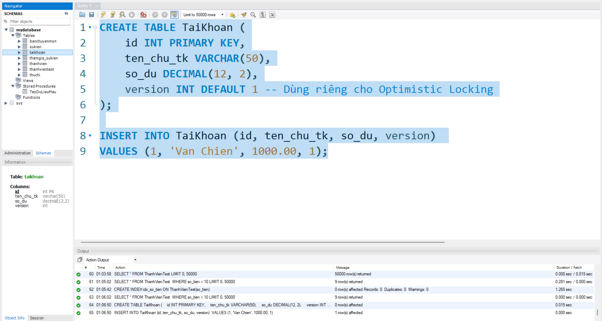

##### 4.5.2 Pessimistic Locking

- **Ý tưởng cốt lõi:** Khóa cứng dòng dữ liệu ở cấp độ Database ngay khi bắt đầu đọc (`SELECT ... FOR UPDATE`). Bất kỳ ai đến sau muốn đọc (có khóa) hoặc cập nhật dòng này đều phải **đứng chờ** cho đến khi Transaction đầu tiên kết thúc.
- **Môi trường chạy:** Mở 2 tab kết nối độc lập trên MySQL Workbench (dùng `Ctrl + Shift + T` để mở tab mới kết nối riêng).

##### Thực thi từng bước:

| Bước | Tab 1 (Người A - Rút 300) | Tab 2 (Người B - Rút 500) | Trạng thái & Cơ chế hệ thống |
| :---: | :--- | :--- | :--- |
| **1** | `START TRANSACTION;` | | Khởi tạo phiên 1. |
| **2** | `SELECT so_du FROM TaiKhoan`<br>`WHERE id = 1 FOR UPDATE;` | | Đọc ra `1000.00`, đồng thời đặt **Exclusive Lock (X-Lock)** lên bản ghi `id = 1`. |
| **3** | | `START TRANSACTION;` | Khởi tạo phiên 2. |
| **4** | | `SELECT so_du FROM TaiKhoan`<br>`WHERE id = 1 FOR UPDATE;` | **Bị chặn (Blocked):** Tab 2 rơi vào trạng thái chờ Tab 1 nhả khóa. |
| **5** | `UPDATE TaiKhoan`<br>`SET so_du = 1000 - 300`<br>`WHERE id = 1;` | | Tab 1 cập nhật số dư còn `700.00`. |
| **6** | `COMMIT;` | | Tab 1 hoàn tất, giải phóng khóa. |
| **7** | | *(Tự động hoàn thành lệnh bước 4)* | Tab 2 thoát trạng thái chờ, nhận được số dư mới là **`700.00`** (không phải 1000 cũ). |
| **8** | | `UPDATE TaiKhoan`<br>`SET so_du = 700 - 500`<br>`WHERE id = 1;` | Tab 2 trừ tiếp 500 từ số dư 700, còn lại `200.00`. |
| **9** | | `COMMIT;` | Tab 2 ghi dữ liệu hoàn tất. Số dư cuối cùng đạt chuẩn: **200.00**. |

```SQL
-- Kiểm tra kết quả cuối cùng:
SELECT so_du FROM TaiKhoan WHERE id = 1;
-- Kết quả chính xác: 1000 - 100 + 200 = 1100.00 (Không bị mất cập nhật)
```

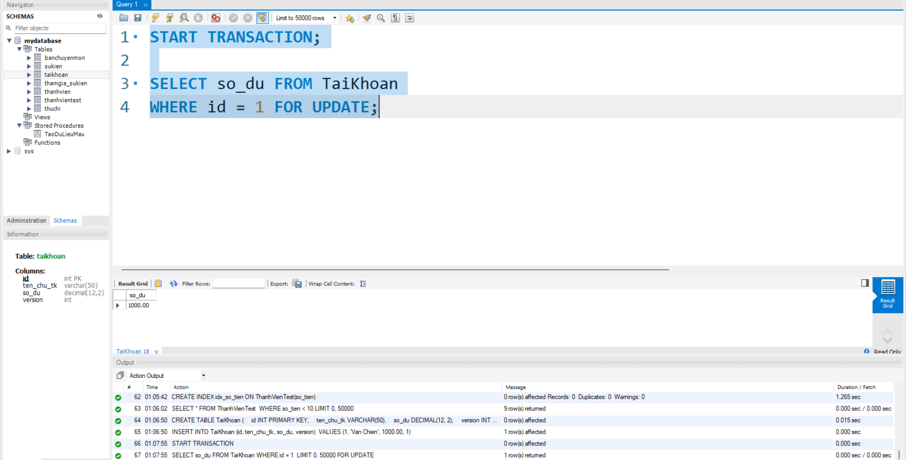
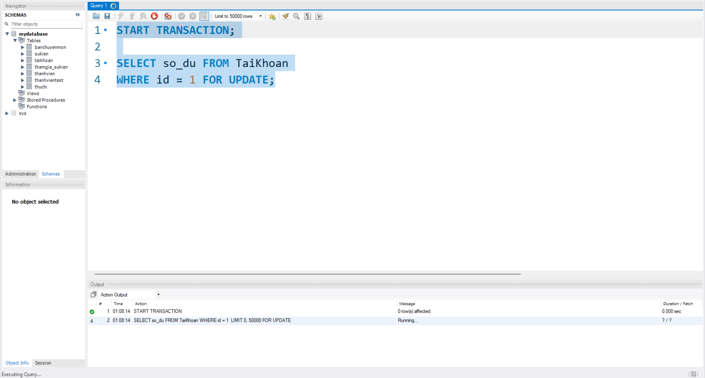
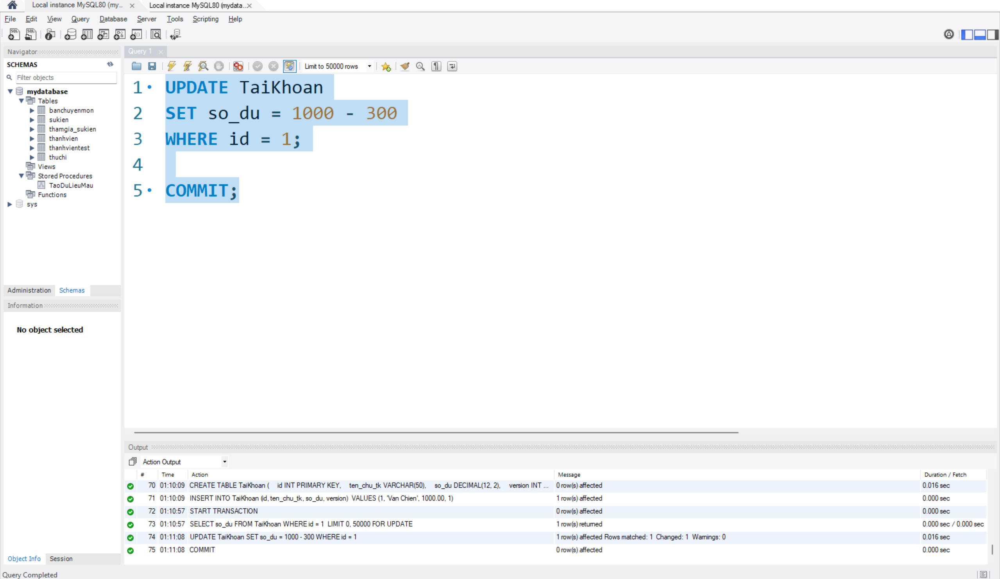
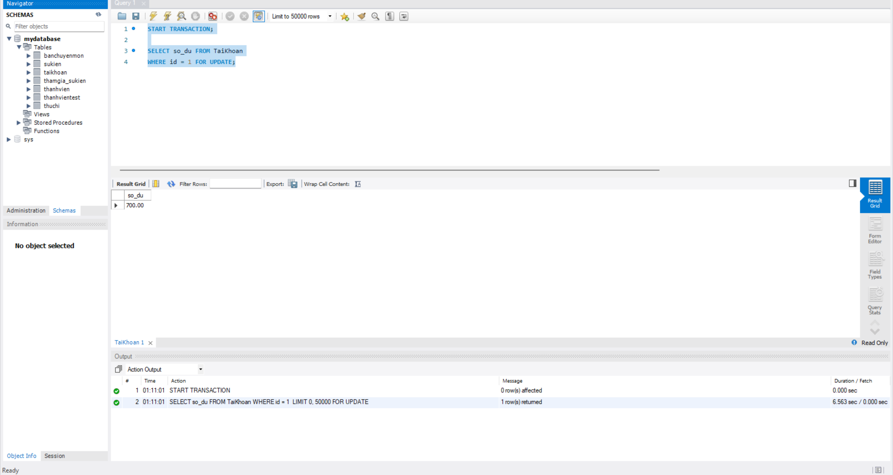

**Thử nghiệm Timeout:** Nếu ở **Bước 4**, bạn không chạy lệnh `COMMIT` ở Tab 1 mà để Tab 2 chờ quá 50 giây (mặc định của `innodb_lock_wait_timeout`), Tab 2 sẽ tự động báo lỗi:
`Error Code: 1205. Lock wait timeout exceeded; try restarting transaction.`

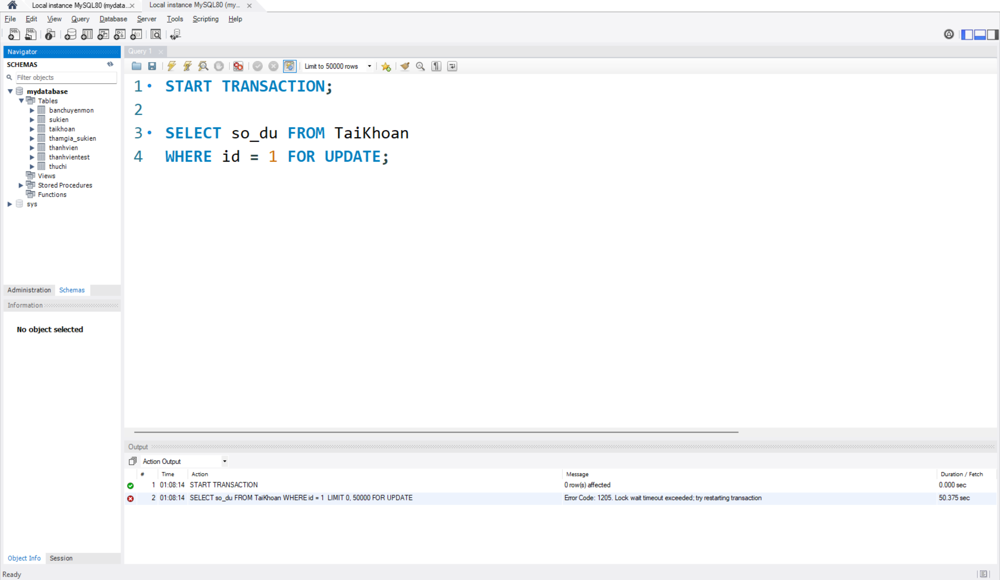

##### 4.3 Optimistic Locking

- **Ý tưởng cốt lõi:** Không dùng bất kỳ lệnh khóa nào của Database khi đọc dữ liệu. Khi cập nhật (`UPDATE`), ứng dụng kiểm tra xem số `version` hiện tại trong DB có còn trùng khớp với số `version` đã đọc trước đó hay không.
- **Chuẩn bị:** Đưa số dư và version về lại mặc định:

```SQL
UPDATE TaiKhoan SET so_du = 1000.00, version = 1 WHERE id = 1;
```

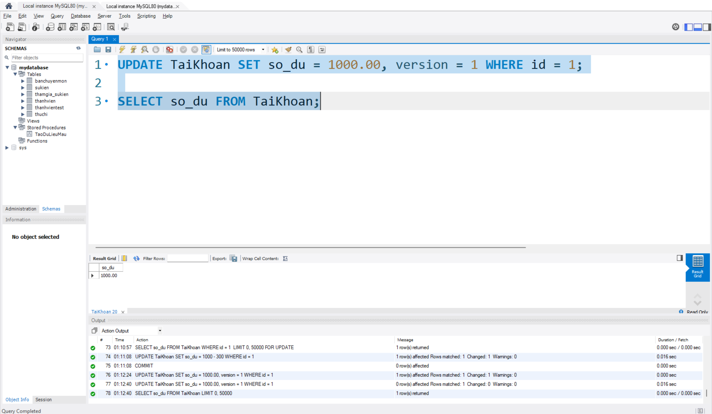

##### Thực thi từng bước:

| Bước | Tab 1 (Người A - Rút 300) | Tab 2 (Người B - Rút 500) | Trạng thái & Cơ chế hệ thống |
| :---: | :--- | :--- | :--- |
| **1** | `SELECT so_du, version`<br>`FROM TaiKhoan WHERE id = 1;` | | Đọc ra: `so_du = 1000`, `version = 1`. Không khóa. |
| **2** | | `SELECT so_du, version`<br>`FROM TaiKhoan WHERE id = 1;` | Cùng đọc ra: `so_du = 1000`, `version = 1`. Đọc tự do, không bị chặn. |
| **3** | *App A tính toán:*<br>`1000 - 300 = 700` | *App B tính toán:*<br>`1000 - 500 = 500` | Xử lý logic tại bộ nhớ của Application Backend. |
| **4** | `UPDATE TaiKhoan`<br>`SET so_du = 700, version = version + 1`<br>`WHERE id = 1 AND version = 1;` | | **Thành công (`1 row affected`):** Số dư cập nhật thành `700.00`, cột `version` tăng lên 2. |
| **5** | | `UPDATE TaiKhoan`<br>`SET so_du = 500, version = version + 1`<br>`WHERE id = 1 AND version = 1;` | **Xung đột (`0 rows affected`):** Lệnh chạy thành công nhưng không cập nhật dòng nào, vì `version` trong DB hiện tại đã là 2 (không khớp với `version = 1`). |

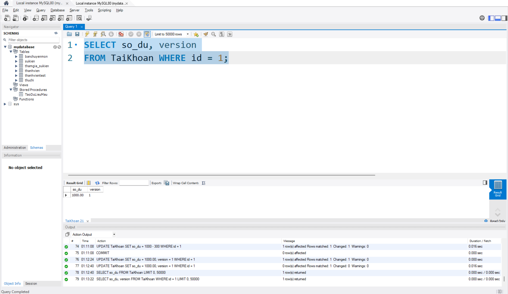
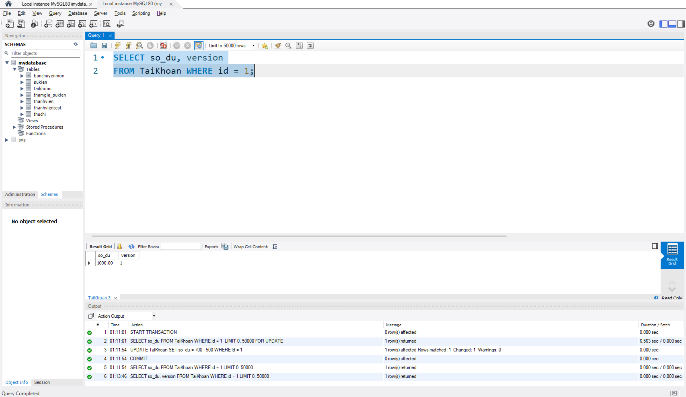
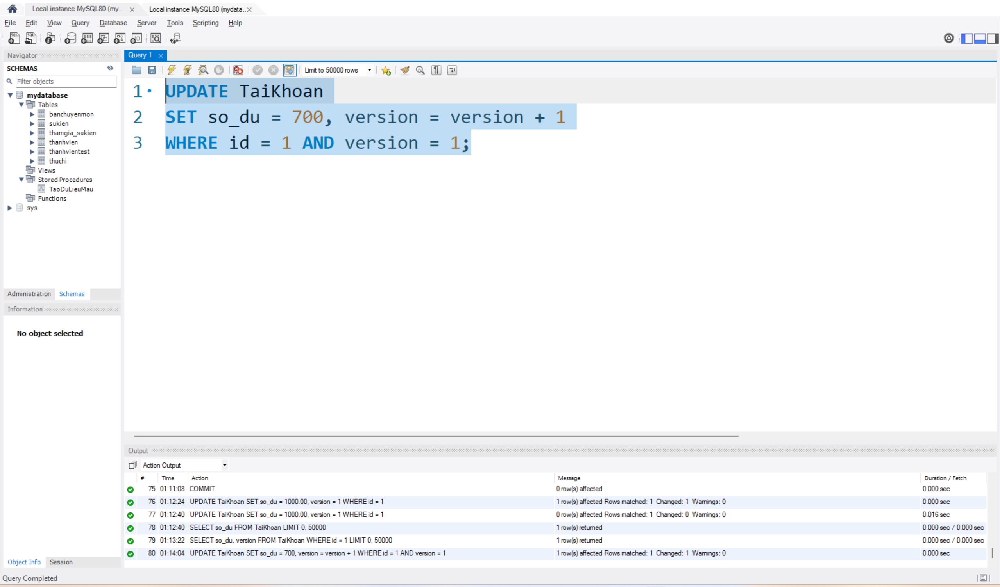
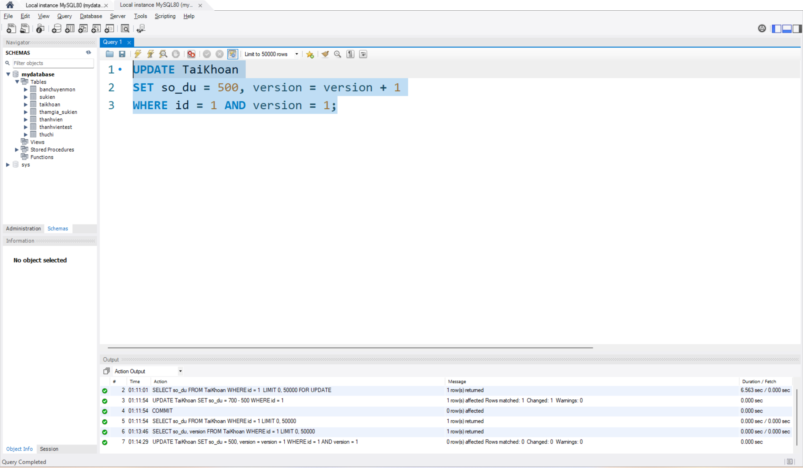

---

### 5. TRANSACTION

#### 5.1. Transaction là gì?

**Transaction (Giao dịch)** là một tập hợp gồm một hoặc nhiều thao tác SQL (như `INSERT`, `UPDATE`, `DELETE`) được thực thi như **một đơn vị công việc duy nhất (All-or-Nothing)**.

Transaction tuân thủ chặt chẽ 4 tính chất **ACID**:
- **A - Atomicity (Tính nguyên tử):** Tất cả các câu lệnh bên trong transaction phải thành công trọn vẹn. Nếu có bất kỳ câu lệnh nào thất bại, toàn bộ các thay đổi trước đó sẽ bị hủy bỏ như chưa từng diễn ra.
- **C - Consistency (Tính nhất quán):** Dữ liệu trước và sau transaction phải luôn đảm bảo đúng các ràng buộc toàn vẹn.
- **I - Isolation (Tính độc lập):** Các transaction thực thi đồng thời không được can thiệp hoặc nhìn thấy dữ liệu trung gian chưa hoàn tất của nhau.
- **D - Durability (Tính bền vững):** Một khi transaction đã xác nhận thành công, dữ liệu được ghi vĩnh viễn vào đĩa cứng và không bị mất ngay cả khi hệ thống sập nguồn.

#### 5.2. Khi nào cần gom nhiều thao tác vào 1 Transaction?

Cần nhóm các truy vấn vào một transaction khi:

1. **Thay đổi dữ liệu có tính ràng buộc trên nhiều bảng:** Khi một hành động nghiệp vụ yêu cầu cập nhật đồng thời nhiều nơi, sự cố ở bất kỳ bước nào cũng sẽ làm sai lệch dữ liệu toàn hệ thống.
2. **Các bước xử lý có tính phụ thuộc nối tiếp:** Khi kết quả của thao tác trước là dữ liệu đầu vào cho thao tác sau. Nếu một mắt xích đứt, toàn bộ chuỗi trước đó trở nên vô nghĩa và cần được xóa sạch.
3. **Ngăn chặn xung đột dữ liệu:** Khi có nhiều người dùng cùng đọc và ghi vào một dữ liệu tại cùng một thời điểm. Transaction kết hợp với cơ chế khóa (locking) đảm bảo tính độc lập (Isolation) cho dữ liệu đang được xử lý.
4. **Tránh trạng thái dữ liệu rác:** Ngăn việc hệ thống ghi nhận một nửa quy trình rồi dừng lại do lỗi mạng, crash server hoặc vi phạm ràng buộc dữ liệu.

#### 5.3. COMMIT và ROLLBACK

* **`COMMIT`:** 
    * Xác nhận kết thúc thành công transaction.
    * Mọi thay đổi dữ liệu được ghi cố định vào đĩa cứng và hiển thị cho các session/kết nối khác.
* **`ROLLBACK`:** 
    * Hủy bỏ toàn bộ transaction.
    * Khôi phục tất cả dữ liệu bị chỉnh sửa trong transaction về trạng thái tại thời điểm transaction bắt đầu

#### 5.4. Ví Dụ Thực Tế

**Bài toán:** Khách hàng **A** chuyển $200.000$ sang cho khách hàng **B**.
* Thao tác 1: Trừ tiền tài khoản A.
* Thao tác 2: Cộng tiền tài khoản B.
* Yêu cầu: Cả 2 thao tác phải cùng thành công. Nếu trừ tiền A xong mà cộng tiền B bị lỗi, hệ thống phải **ROLLBACK** để hoàn lại tiền cho A.

##### 5.4.1. Chuẩn bị dữ liệu mẫu

```SQL
CREATE TABLE TaiKhoanNganHang (
    id INT PRIMARY KEY,
    ten_chu_tk VARCHAR(50),
    so_du DECIMAL(12, 2)
);

INSERT INTO TaiKhoanNganHang VALUES (1, 'Nguyen Van A', 500000.00);
INSERT INTO TaiKhoanNganHang VALUES (2, 'Tran Thi B', 100000.00);
```

##### 5.4.2. Kịch bản 1: Giao dịch thành công trọn vẹn (`COMMIT`)

```SQL
START TRANSACTION;

-- Bước 1: Trừ 200k từ tài khoản A
UPDATE TaiKhoanNganHang 
SET so_du = so_du - 200000 
WHERE id = 1;

-- Bước 2: Cộng 200k vào tài khoản B
UPDATE TaiKhoanNganHang 
SET so_du = so_du + 200000 
WHERE id = 2;

-- Cả 2 lệnh chạy êm đẹp -> Xác nhận lưu dữ liệu vĩnh viễn
COMMIT;

-- Kiểm tra kết quả: A còn 300k, B lên 300k
SELECT * FROM TaiKhoanNganHang;
```

##### 5.4.3. Kịch bản 2: Xảy ra sự cố giữa chừng (`ROLLBACK`)

Giả sử tài khoản A bị trừ tiền thành công, nhưng khi cộng tiền sang B thì câu lệnh gặp lỗi (sai tên bảng, lỗi cú pháp hoặc đứt kết nối mạng):

```SQL
START TRANSACTION;

-- Bước 1: Trừ 200k từ tài khoản A (Thực thi thành công trong Transaction)
UPDATE TaiKhoanNganHang 
SET so_du = so_du - 200000 
WHERE id = 1;

-- Bước 2: Thao tác cộng tiền bị lỗi cú pháp/hỏng hệ thống
UPDATE BangKhongTonTai 
SET so_du = so_du + 200000 
WHERE id = 2;
-- -> MySQL báo lỗi: Table doesn't exist

-- Bước 3: Phát hiện lỗi, lập tức khôi phục lại trạng thái cũ
ROLLBACK;

-- Kiểm tra kết quả: A vẫn còn nguyên 500k, không bị trừ tiền oan
SELECT * FROM TaiKhoanNganHang;
```

---

## Phần 2: OOP

### 1. OOP trong Java

#### 1.1. Bốn tính chất cơ bản của OOP

- **Encapsulation (Đóng gói):** Ẩn giấu trạng thái bên trong của đối tượng và yêu cầu mọi tương tác phải thông qua các phương thức được cho phép.

- **Inheritance (Kế thừa):** Cho phép một lớp mới (subclass) thừa hưởng các thuộc tính và phương thức từ một lớp đã có (superclass).

- **Polymorphism (Đa hình):** Khả năng một hành động có thể được thực hiện theo nhiều cách khác nhau tùy thuộc vào đối tượng gọi nó.

- **Abstraction (Trừu tượng):** Chỉ phơi bày những tính năng thiết yếu của đối tượng ra bên ngoài và che giấu toàn bộ chi tiết cài đặt phức tạp bên trong.

#### 1.2. Class, Abstract Class, Interface - khi nào dùng cái nào?

**a. Class (Lớp cụ thể)**

- **Đặc điểm:** Bản thiết kế hoàn chỉnh, mọi phương thức đều đã được viết code thực thi chi tiết.

- **Khi nào dùng:** Khi bạn có một thực thể rõ ràng, đầy đủ và cần tạo đối tượng (instance) trực tiếp để sử dụng trong chương trình.

- **Ví dụ:** `User`, `Product`, `ShoppingCart`. Bạn có thể trực tiếp gọi `new User()`.

**b. Abstract Class (Lớp trừu tượng)**
- **Khái niệm:** Được dùng để làm lớp cơ sở và không thể tạo đối tượng trực tiếp từ lớp đó. Lớp này thường chứa cả phương thức trừu tượng (method không có phần thân, chỉ khai báo) và phương thức cụ thể (method đã có sẵn phần xử lý), buộc các lớp con phải override những phương thức trừu tượng khi kế thừa.

- **Đặc điểm:**
    - Không thể khởi tạo trực tiếp bằng toán tử `new`.
    - Có thể chứa cả abstract method và concrete method.
    - Lớp con phải triển khai các abstract method.
    - Có thể có constructor, thuộc tính, static và final method.
    - Thường dùng làm lớp cơ sở trong hệ phân cấp.

- **Khi nào dùng**: Khi các đối tượng có mối quan hệ "is-a" (là một) chặt chẽ cùng chung một hệ sinh thái, và bạn muốn chia sẻ trạng thái (fields) hoặc code dùng chung cho các lớp con.

- **Ví dụ:** abstract class Animal có hàm `sleep()` đã viết code chung cho mọi con vật, nhưng hàm `makeSound()` được đánh dấu abstract bắt buộc Dog và Cat tự cài đặt tiếng kêu riêng.

**c. Interface (Phương thức trừu tượng)**

- **Khái niệm:** Có thể hiểu đơn giản là một bản hợp đồng (contract) hoặc khuôn mẫu (blueprint) quy định những hành vi (các phương thức) mà bất kỳ lớp (Class) nào muốn “ký hợp đồng” với nó (triển khai Interface) đều phải thực hiện đầy đủ. Nó chỉ định nghĩa những gì cần làm, chứ không phải làm như thế nào.

- **Đặc điểm:**
    - Chỉ chứa khai báo phương thức.
    - Không thể khởi tạo trực tiếp bằng toán tử `new`.
    - Không có thuộc tính trạng thái.
    - Các thành viên mặc định là Public và Abstract.
    - Yêu cầu lớp triển khai phải cài đặt.
    - Interface có khả năng kế thừa từ một hoặc nhiều Interface khác bằng từ khóa `extends`

- **Khi nào dùng:** Dùng khi cần một bộ hành vi chuẩn để nhiều lớp cùng tuân theo, kể cả lớp không cùng nhánh kế thừa.

- **Ví dụ:** interface Flyable có hàm fly(). Cả Bird (Chim - thuộc Animal) và Airplane (Máy bay - thuộc Machine) đều có thể implements Flyable, dù chúng chả liên quan gì đến nhau.

---

### 2. Dependency Injection (DI) & Inversion of Control (IoC)

#### 2.1. Khái niệm, ví dụ bằng Java thuần (không dùng framework)

**a. Khái niệm:**
- **Inversion of Control (IoC - Đảo ngược điều khiển):** Là một nguyên lý thiết kế phần mềm. Thay vì để bản thân class tự chủ động khởi tạo và kiểm soát vòng đời các đối tượng nó cần (dependencies), quyền kiểm soát đó được chuyển giao (đảo ngược) cho một thành phần bên ngoài (như caller hoặc framework/container).

- **Dependency Injection (DI - Tiêm phụ thuộc):** Là mẫu thiết kế (design pattern) triển khai cụ thể của nguyên lý IoC. Dependency (đối tượng phụ thuộc) được "tiêm" từ bên ngoài vào class thông qua Constructor, Setter hoặc Interface, thay vì class tự dùng toán tử `new`.

**b. Ví dụ bằng Java thuần (không dùng framework)**
- **Cách tiếp cận truyền thống (Tight Coupling - Chưa dùng DI)**

    Một class NotificationService muốn gửi email sẽ tự khởi tạo EmailSender.

    ```JAVA
    class EmailSender {
        public void send(String message) {
            System.out.println("Gửi email: " + message);
        }
    }

    class NotificationService {
        private EmailSender emailSender;

        public NotificationService() {
            // Tự tạo dependency bên trong -> Dính chặt (tight coupling) với EmailSender
            this.emailSender = new EmailSender();
        }

        public void notifyUser(String msg) {
            emailSender.send(msg);
        }
    }
    ```

    **Vấn đề:** Nếu muốn đổi sang SmsSender, bạn buộc phải sửa code bên trong NotificationService.

- **Áp dụng DI & IoC (Loose Coupling)**
    Tạo abstraction bằng interface và tiêm implementation từ bên ngoài vào qua Constructor Injection.

    **Bước 1:** Khởi tạo Interface & Implementations

    ```JAVA
    // Khai báo contract
    interface MessageSender {
        void send(String message);
    }

    class EmailSender implements MessageSender {
        @Override
        public void send(String message) {
            System.out.println("Gửi email: " + message);
        }
    }

    class SmsSender implements MessageSender {
        @Override
        public void send(String message) {
            System.out.println("Gửi SMS: " + message);
        }
    }
    ```

    **Bước 2:** Sử dụng Constructor Injection trong Service

    ```JAVA
    class NotificationService {
        private final MessageSender messageSender;

        // Dependency được "tiêm" vào từ bên ngoài (Constructor Injection)
        public NotificationService(MessageSender messageSender) {
            this.messageSender = messageSender;
        }

        public void notifyUser(String msg) {
            messageSender.send(msg);
        }
    }
    ```

    **Bước 3:** Thành phần bên ngoài (Main/Container) đóng vai trò đảo ngược điều khiển

    ```JAVA
    public class Main {
        public static void main(String[] args) {
            // Bên ngoài quyết định đưa dependency nào vào (IoC)
            MessageSender emailSender = new EmailSender();
            NotificationService emailNotification = new NotificationService(emailSender);
            emailNotification.notifyUser("Đăng ký thành công!");

            // Thay đổi sang SMS mà không cần đụng vào class NotificationService
            MessageSender smsSender = new SmsSender();
            NotificationService smsNotification = new NotificationService(smsSender);
            smsNotification.notifyUser("Mã OTP: 123456");
        }
    }
    ```

#### 2.2. Tại sao DI giúp code dễ test và dễ thay đổi?

- **Dễ viết Unit Test (Testability):**

    - Khi viết test cho `NotificationService`, bạn không muốn gửi email thật qua mạng.
    - Vì dependency được tiêm qua constructor, bạn dễ dàng truyền một đối tượng giả lập (Mock/Stub) bằng Mockito:

    ```JAVA
    MessageSender mockSender = mock(MessageSender.class);
    NotificationService service = new NotificationService(mockSender);
    service.notifyUser("Hello");
    verify(mockSender).send("Hello"); // Kiểm thử độc lập hoàn toàn
    ```

- **Dễ thay đổi và mở rộng (Maintainability & Extensibility):**

    - Tuân thủ nguyên lý **Open/Closed Principle (OCP)** trong SOLID: Mở rộng tính năng (thêm `TelegramSender`, `SlackSender`) chỉ cần tạo class mới implement `MessageSender`, không làm sửa đổi logic của `NotificationService`.

- **Giảm bớt sự phụ thuộc (Loose Coupling):** Các class chỉ phụ thuộc vào abstraction (interface), không biết chi tiết triển khai cụ thể của nhau.

#### 2.3. DI & IoC được ứng dụng thế nào trong Spring Framework?

Trong Java thuần ở ví dụ trên, hàm `main` đóng vai trò là nơi khởi tạo và ghép nối các đối tượng. Trong Spring, nhiệm vụ này được tự động hóa hoàn toàn bởi **Spring IoC Container** (`ApplicationContext`).

**Cơ chế hoạt động của Spring:**

1. **Quản lý Bean:** Mọi class được cấu hình (qua `@Component`, `@Service`, `@Repository`, hoặc `@Bean`) được Spring Container khởi tạo, cấu hình và quản lý vòng đời. Chúng được gọi là các Spring Beans.

2. **Metadata cấu hình:** Spring quét (component scanning) codebase để tìm các metadata thông qua annotations hoặc file cấu hình Java/XML.

3. **Tự động tiêm (Wiring):** Khi một Bean yêu cầu dependency, Spring Container tìm Bean phù hợp và tự động tiêm vào:

    - **Constructor Injection** (Được khuyến nghị nhất):

    ```SQL
    @Service
    public class NotificationService {
        private final MessageSender messageSender;

        @Autowired // Từ Spring 4.3+, nếu class chỉ có 1 constructor thì không cần viết @Autowired
        public NotificationService(MessageSender messageSender) {
            this.messageSender = messageSender;
        }
    }
    ```

    - **Field Injection:** Dùng trực tiếp `@Autowired` trên thuộc tính (nhanh nhưng khó unit test nếu không dùng reflection).

    - **Setter Injection:** Dùng `@Autowired` trên hàm setter (phù hợp cho các dependency tùy chọn).

4. **Giải quyết xung đột:** Nếu có nhiều implementation của cùng một interface (ví dụ cả `EmailSender` và `SmsSender` đều là bean), Spring dùng `@Primary` hoặc `@Qualifier("beanName")` để chỉ định chính xác bean cần tiêm.