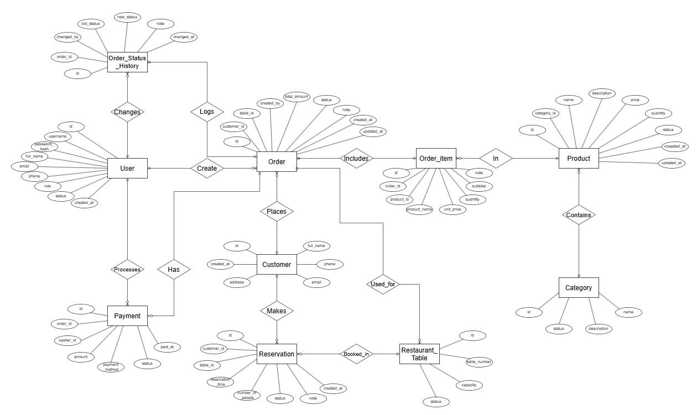

# Phần I: Database (Cơ sở dữ liệu)

## I. SQL cơ bản

### 1. Mô tả bài toán

Em xây dựng cơ sở dữ liệu cho bài toán quản lý nhà hàng. Hệ thống lưu trữ dữ liệu phục vụ các hoạt động chính của nhà hàng và các nhóm người sử dụng như quản trị viên, quản lý, thu ngân, nhân viên bếp, nhân viên phục vụ và khách hàng.

Các dữ liệu chính cần lưu trữ gồm:

- Thông tin tài khoản nhân viên và vai trò của người dùng.
- Thông tin khách hàng.
- Thông tin danh mục món ăn.
- Thông tin món ăn và tình trạng còn/hết món.
- Thông tin bàn trong nhà hàng.
- Thông tin đặt bàn.
- Thông tin đơn hàng và các món trong từng đơn hàng.
- Thông tin thanh toán.
- Lịch sử thay đổi trạng thái đơn hàng.

Cơ sở dữ liệu tập trung vào việc lưu trữ và liên kết các dữ liệu phát sinh trong quá trình hoạt động hàng ngày của nhà hàng.

---

### 2. Các nhóm người sử dụng và dữ liệu liên quan

#### 2.1 Quản trị viên – Admin

Admin là người có quyền quản lý cao nhất đối với dữ liệu nhân viên trong hệ thống.

Các dữ liệu liên quan đến Admin gồm:

- Thông tin tài khoản.
- Vai trò của người dùng.
- Trạng thái tài khoản.
- Thông tin các nhân viên.
- Thông tin đơn hàng.
- Thông tin thanh toán.
- Thông tin món ăn và tình trạng món.
- Thông tin bàn.

Admin có thể cấp hoặc thay đổi vai trò cho các tài khoản nhân viên.

Các vai trò được lưu trực tiếp trong thuộc tính `role` của thực thể `User`, gồm:

- `admin`
- `manager`
- `cashier`
- `kitchen`
- `waiter`

---

#### 2.2 Quản lý – Manager

Manager là người quản lý các hoạt động của nhà hàng.

Các dữ liệu liên quan gồm:

- Thông tin món ăn.
- Danh mục món ăn.
- Tình trạng còn/hết của món ăn.
- Thông tin bàn.
- Thông tin đặt bàn.
- Thông tin đơn hàng.
- Thông tin thanh toán.
- Doanh thu của nhà hàng.

Manager không có quyền thay đổi vai trò của người dùng.

---

#### 2.3 Thu ngân – Cashier

Cashier là người thực hiện các hoạt động liên quan đến thanh toán.

Các dữ liệu liên quan gồm:

- Thông tin đơn hàng.
- Chi tiết đơn hàng.
- Tổng tiền của đơn hàng.
- Phương thức thanh toán.
- Trạng thái thanh toán.
- Thời điểm thanh toán.

---

#### 2.4 Nhân viên bếp – Kitchen

Kitchen là người tiếp nhận và xử lý các món ăn trong đơn hàng.

Các dữ liệu liên quan gồm:

- Thông tin đơn hàng.
- Các món ăn trong đơn hàng.
- Số lượng món.
- Trạng thái đơn hàng.
- Lịch sử thay đổi trạng thái đơn hàng.

Nhân viên bếp có thể cập nhật trạng thái đơn hàng trong quá trình chế biến, ví dụ từ `CONFIRMED` sang `COOKING` và sau đó sang `READY`.

---

#### 2.5 Nhân viên phục vụ – Waiter

Waiter là người phục vụ khách hàng và xử lý các hoạt động liên quan đến bàn và đơn hàng.

Các dữ liệu liên quan gồm:

- Thông tin bàn.
- Trạng thái bàn.
- Thông tin đặt bàn.
- Thông tin khách hàng.
- Thông tin đơn hàng.
- Chi tiết đơn hàng.
- Trạng thái đơn hàng.

---

#### 2.6 Khách hàng – Customer

Khách hàng là người sử dụng dịch vụ của nhà hàng.

Các dữ liệu liên quan gồm:

- Thông tin khách hàng.
- Thông tin đặt bàn.
- Thông tin bàn được đặt.
- Các đơn hàng đã tạo.
- Các món ăn trong đơn hàng.
- Thông tin thanh toán.

---

### 3. MÔ HÌNH THỰC THỂ - LIÊN KẾT (E-R)

#### 3.1 Phân tích các quy tắc dữ liệu

Các quy tắc sau được sử dụng làm cơ sở để xác định các thực thể và mối quan hệ trong cơ sở dữ liệu:

- Một người dùng có một vai trò trong hệ thống. Vai trò có thể là `admin`, `manager`, `cashier`, `kitchen` hoặc `waiter`.
- Một người dùng có thể tạo nhiều đơn hàng, nhưng mỗi đơn hàng được tạo bởi một nhân viên cụ thể.
- Một khách hàng có thể có nhiều đơn hàng, nhưng mỗi đơn hàng thuộc về một khách hàng.
- Một danh mục có thể có nhiều món ăn, nhưng mỗi món ăn thuộc về một danh mục.
- Một món ăn có số lượng tồn tại để xác định món còn hay hết.
- Một bàn có thể xuất hiện trong nhiều lần đặt bàn theo thời gian.
- Một khách hàng có thể đặt nhiều lần, mỗi lần đặt gắn với một bàn cụ thể.
- Một đơn hàng có thể bao gồm nhiều món ăn và một món ăn có thể xuất hiện trong nhiều đơn hàng. Quan hệ này được thể hiện thông qua `Order_Item`.
- Một đơn hàng có thể có một thông tin thanh toán.
- Một đơn hàng có thể có nhiều bản ghi lịch sử trạng thái.
- Mỗi bản ghi lịch sử trạng thái thuộc về một đơn hàng và được thực hiện bởi một nhân viên.
- Một nhân viên thu ngân có thể thực hiện nhiều lần thanh toán.
- Một bàn tại một thời điểm chỉ có một trạng thái như `available`, `occupied`, `reserved` hoặc `maintenance`.

---

#### 3.2 Xác định thực thể và thuộc tính

**Thực thể 1: User - Người dùng**

Lưu thông tin tài khoản của các nhân viên sử dụng hệ thống.

Các thuộc tính:

- `id`: Khóa chính.
- `username`: Tên đăng nhập.
- `password_hash`: Mật khẩu đã mã hóa.
- `full_name`: Họ và tên.
- `email`: Email.
- `phone`: Số điện thoại.
- `role`: Vai trò người dùng.
- `status`: Trạng thái tài khoản.
- `created_at`: Thời điểm tạo.

`role` xác định nhóm người dùng trong hệ thống:

```text
admin
manager
cashier
kitchen
waiter
```

`email` được đặt `UNIQUE` để tránh trùng dữ liệu.

---

**Thực thể 2: Customer - Khách hàng**

Lưu thông tin khách hàng sử dụng dịch vụ của nhà hàng.

Các thuộc tính:

- `id`: Khóa chính.
- `full_name`: Họ và tên.
- `phone`: Số điện thoại.
- `email`: Email.
- `address`: Địa chỉ.
- `created_at`: Thời điểm tạo.

Thông tin khách hàng được sử dụng để liên kết với các lần đặt bàn và đơn hàng.

---

**Thực thể 3: Category - Danh mục món ăn**

Lưu thông tin các nhóm món ăn trong nhà hàng.

Các thuộc tính:

- `id`: Khóa chính.
- `name`: Tên danh mục.
- `description`: Mô tả danh mục.
- `status`: Trạng thái danh mục.

Ví dụ các danh mục:

```text
Món chính
Khai vị
Đồ uống
Tráng miệng
```

Một danh mục có thể chứa nhiều món ăn.

---

**Thực thể 4: Product - Món ăn**

Lưu thông tin các món ăn được phục vụ trong nhà hàng.

Các thuộc tính:

- `id`: Khóa chính.
- `category_id`: ID danh mục.
- `name`: Tên món ăn.
- `description`: Mô tả món ăn.
- `price`: Giá món ăn.
- `quantity`: Số lượng món còn lại.
- `status`: Trạng thái món ăn.
- `created_at`: Thời điểm tạo.
- `updated_at`: Thời điểm cập nhật.

`category_id` là khóa ngoại tham chiếu đến `Category.id`.

`quantity` được sử dụng để theo dõi số lượng món còn lại.

`status` có thể nhận các giá trị:

```text
available
unavailable
```

Khi số lượng món bằng 0, món có thể được chuyển sang trạng thái `unavailable`.

---

**Thực thể 5: Restaurant_Table - Bàn**

Lưu thông tin các bàn trong nhà hàng.

Các thuộc tính:

- `id`: Khóa chính.
- `table_number`: Số bàn.
- `capacity`: Số người tối đa.
- `status`: Trạng thái bàn.

Các trạng thái của bàn:

```text
available
occupied
reserved
maintenance
```

Bảng này giúp nhân viên biết bàn nào đang trống, đang được sử dụng hoặc đã được đặt trước.

---

**Thực thể 6: Reservation - Đặt bàn**

Lưu thông tin các lần đặt bàn của khách hàng.

Các thuộc tính:

- `id`: Khóa chính.
- `customer_id`: ID khách hàng.
- `table_id`: ID bàn.
- `reservation_time`: Thời gian đặt bàn.
- `number_of_people`: Số người.
- `status`: Trạng thái đặt bàn.
- `note`: Ghi chú.
- `created_at`: Thời điểm tạo.

`customer_id` là khóa ngoại tham chiếu đến `Customer.id`.

`table_id` là khóa ngoại tham chiếu đến `Restaurant_Table.id`.

Các trạng thái đặt bàn có thể gồm:

```text
pending
confirmed
cancelled
completed
```

---

**Thực thể 7: Order - Đơn hàng**

Lưu thông tin các đơn hàng phát sinh trong nhà hàng.

Các thuộc tính:

- `id`: Khóa chính.
- `customer_id`: ID khách hàng.
- `table_id`: ID bàn.
- `created_by`: ID nhân viên tạo đơn.
- `total_amount`: Tổng tiền đơn hàng.
- `status`: Trạng thái đơn hàng.
- `note`: Ghi chú.
- `created_at`: Thời điểm tạo.
- `updated_at`: Thời điểm cập nhật.

`customer_id` là khóa ngoại tham chiếu đến `Customer.id`.

`table_id` là khóa ngoại tham chiếu đến `Restaurant_Table.id`.

`created_by` là khóa ngoại tham chiếu đến `User.id`.

Các trạng thái của đơn hàng:

```text
pending
confirmed
cooking
ready
served
completed
cancelled
```

---

**Thực thể 8: Order_Item - Chi tiết đơn hàng**

Lưu các món ăn cụ thể thuộc một đơn hàng.

Các thuộc tính:

- `id`: Khóa chính.
- `order_id`: ID đơn hàng.
- `product_id`: ID món ăn.
- `product_name`: Tên món tại thời điểm đặt.
- `unit_price`: Giá món tại thời điểm đặt.
- `quantity`: Số lượng.
- `subtotal`: Thành tiền.
- `note`: Ghi chú.

`order_id` là khóa ngoại tham chiếu đến `Order.id`.

`product_id` là khóa ngoại tham chiếu đến `Product.id`.

`product_name` và `unit_price` có thể được lưu lại để giữ thông tin món tại thời điểm đơn hàng được tạo, tránh việc thay đổi thông tin món sau này làm ảnh hưởng đến dữ liệu lịch sử đơn hàng.

---

**Thực thể 9: Payment - Thanh toán**

Lưu thông tin thanh toán của đơn hàng.

Các thuộc tính:

- `id`: Khóa chính.
- `order_id`: ID đơn hàng.
- `cashier_id`: ID nhân viên thu ngân.
- `amount`: Số tiền thanh toán.
- `payment_method`: Phương thức thanh toán.
- `status`: Trạng thái thanh toán.
- `paid_at`: Thời điểm thanh toán.

`order_id` là khóa ngoại tham chiếu đến `Order.id`.

`cashier_id` là khóa ngoại tham chiếu đến `User.id`.

Các phương thức thanh toán:

```text
cash
banking
card
e_wallet
```

Các trạng thái thanh toán:

```text
pending
paid
failed
refunded
```

---

**Thực thể 10: Order_Status_History - Lịch sử trạng thái đơn hàng**

Lưu lại quá trình thay đổi trạng thái của đơn hàng.

Các thuộc tính:

- `id`: Khóa chính.
- `order_id`: ID đơn hàng.
- `changed_by`: ID nhân viên thực hiện thay đổi.
- `old_status`: Trạng thái cũ.
- `new_status`: Trạng thái mới.
- `note`: Ghi chú.
- `changed_at`: Thời điểm thay đổi.

`order_id` là khóa ngoại tham chiếu đến `Order.id`.

`changed_by` là khóa ngoại tham chiếu đến `User.id`.

Ví dụ một đơn hàng có thể thay đổi trạng thái:

```text
pending
   ↓
confirmed
   ↓
cooking
   ↓
ready
   ↓
served
   ↓
completed
```

Mỗi lần trạng thái thay đổi, một bản ghi mới được lưu vào `Order_Status_History`.

---

#### 3.3 Phân tích các mối quan hệ

**Quan hệ Many-to-Many**

*Order – Product*

- Một đơn hàng có thể chứa nhiều món ăn.
- Một món ăn có thể xuất hiện trong nhiều đơn hàng.
- Quan hệ M-N được thể hiện thông qua `Order_Item`.

---

**Quan hệ One-to-Many**

*Category – Product*

- Một danh mục có thể có nhiều món ăn.
- Mỗi món ăn thuộc một danh mục.

*Customer – Reservation*

- Một khách hàng có thể có nhiều lần đặt bàn.
- Mỗi lần đặt bàn thuộc về một khách hàng.

*Restaurant_Table – Reservation*

- Một bàn có thể xuất hiện trong nhiều lần đặt bàn theo thời gian.
- Mỗi lần đặt bàn gắn với một bàn.

*Customer – Order*

- Một khách hàng có thể tạo nhiều đơn hàng.
- Mỗi đơn hàng thuộc về một khách hàng.

*Restaurant_Table – Order*

- Một bàn có thể được sử dụng cho nhiều đơn hàng theo các thời điểm khác nhau.
- Mỗi đơn hàng gắn với một bàn.

*User – Order*

- Một nhân viên có thể tạo nhiều đơn hàng.
- Mỗi đơn hàng được tạo bởi một nhân viên.

*Order – Order_Item*

- Một đơn hàng có nhiều chi tiết món ăn.
- Mỗi `Order_Item` thuộc về một đơn hàng.

*Product – Order_Item*

- Một món ăn có thể xuất hiện trong nhiều chi tiết đơn hàng.
- Mỗi `Order_Item` tham chiếu đến một món ăn.

*Order – Payment*

- Một đơn hàng có một thông tin thanh toán.
- Mỗi thông tin thanh toán thuộc về một đơn hàng.

*User – Payment*

- Một nhân viên thu ngân có thể thực hiện nhiều lần thanh toán.
- Mỗi lần thanh toán được thực hiện bởi một nhân viên thu ngân.

*Order – Order_Status_History*

- Một đơn hàng có thể có nhiều bản ghi lịch sử trạng thái.
- Mỗi bản ghi lịch sử thuộc về một đơn hàng.

*User – Order_Status_History*

- Một nhân viên có thể thực hiện nhiều lần thay đổi trạng thái.
- Mỗi bản ghi lịch sử được thực hiện bởi một nhân viên.

---

**Quan hệ One-to-One**

*Order – Payment*

Trong phạm vi bài toán, mỗi đơn hàng có tối đa một thông tin thanh toán.

Quan hệ này có thể được hỗ trợ bằng ràng buộc `UNIQUE` trên `Payment.order_id`.


#### 3.5 Sơ đồ ERD



[Link Driver](https://drive.google.com/file/d/14k4r7XEHlkNbukv-UksB2kLl-8umPpfY/view?usp=sharing)

# Data mẫu

[Data mẫu](database_mau.sql)

### 4 DDL – Data Definition Language

**DDL (Data Definition Language – Ngôn ngữ định nghĩa dữ liệu)** là nhóm các câu lệnh SQL dùng để tạo, thay đổi và xóa cấu trúc của cơ sở dữ liệu

DDL chủ yếu thao tác với các đối tượng như:
- Database
- Table
- Column
- Constraint
- View
- Index

DDL gồm 3 lệnh cơ bản:
- CREATE TABLE
- ALTER TABLE
- DROP TABLE

#### 4.1 CREATE TABLE

`CREATE TABLE` dùng để tạo một bảng mới trong cơ sở dữ liệu
Khi tạo bảng phải xác định:
- Tên bảng
- Tên các cột
- Kiểu dữ liệu của từng cột
- Khóa chính (Primary KEY)
- Khóa ngoại (Foreign KEY)
- Các ràng buộc cho dữ liệu như `NOT NULL`, `UNIQUE`,...
```sql
CREATE TABLE ten_bang (
    ten_cot_1 kieu_du_lieu [rang_buoc],
    ten_cot_2 kieu_du_lieu [rang_buoc],
    ...
);
```
Ví dụ tạo bảng món ăn:
```sql
CREATE TABLE products (
    id SERIAL PRIMARY KEY,
    category_id INT NOT NULL REFERENCES categories(id),
    name VARCHAR(100) NOT NULL,
    description TEXT,
    price DECIMAL(12, 2) NOT NULL CHECK (price >= 0),
    quantity INT DEFAULT 0 CHECK (quantity >= 0),
    status VARCHAR(20) DEFAULT 'available',
    created_at TIMESTAMP DEFAULT CURRENT_TIMESTAMP,
    updated_at TIMESTAMP DEFAULT CURRENT_TIMESTAMP
);
```
Trong đó:
- id là khóa chính
- category_id là khóa ngoại REFERENCE đến bảng Category
- product_name là tên món, với kiểu dữ liệu là chuỗi, có không quá 100 ký tự và không được NULL
- description là mô tả của món ăn, với kiểu dữ liệu là text
- price là giá của món ăn, với kiểu dữ liệu số thực có tổng tối đa 12 chữ số và 2 chữ số sau dấu phẩy
- quantity là số lượng món ăn, với kiểu dữ liệu số nguyên và có giá trị mặc định là 0 nếu mình không khai báo số lượng
- status là trạng thái của món ăn, với kiểu dữ liệu chuỗi và có tối đa 20 ký tự, trạng thái mặc định là `AVAILABLE`
- Hàm CHECK để kiểm tra price và quantity luôn >=0, tránh tình trạng dữ liệu không hợp lệ được đưa vào bảng

#### 4.2 ALTER TABLE

`ALTER TABLE` dùng để thay đổi cấu trúc của 1 bảng đã tồn tại

Có thể sử dụng để:
- Thêm cột
- Xóa cột
- Đổi tên cột
- Đổi tên bảng
- Thêm ràng buộc
- Xóa ràng buộc
- Thay đổi kiểu dữ liệu của cột

**Thêm cột**

Ví dụ ban đầu bảng products chưa có description

```sql
ALTER TABLE products
ADD COLUMN description TEXT;
```

Bảng product sẽ có thêm cột description

**Xóa cột**

```sql
ALTER TABLE products
DROP COLUMN description;
```

Cột description sẽ bị xóa khỏi bảng products

**Đổi tên cột**

```sql
ALTER TABLE products
RENAME COLUMN product_name TO name;
```

Cột product_name sẽ bị đổi tên thành name

**Đổi tên bảng**

```sql
ALTER TABLE products
RENAME TO menu_items;
```

Bảng product sẽ bị đổi thành bảng menu_items

**Thêm ràng buộc**

```sql
ALTER TABLE users
ADD CONSTRAINT unique_user_email
UNIQUE (email);
```

Cột email trong bảng users sẽ thêm ràng buộc UNIQUE

**Thay đổi kiểu dữ liệu**

```sql
ALTER TABLE users
ALTER COLUMN phone TYPE VARCHAR(20);
```

Cột phone đổi kiểu dữ liệu thành chuỗi có tối đa 20 ký tự

#### 4.3 DROP TABLE

`DROP TABLE` dùng để xóa hoàn toàn một bảng khỏi Cơ sở dữ liệu

```sql
DROP TABLE products;
```

Khi thực hiện câu lệnh, bảng products bị xóa, toàn bộ dữ liệu trong bảng bị xóa, cấu trúc và các ràng buộc cũng bị xóa

### 5. DML - Data Manipulation Language

**DML (Data Manipulation Language – Ngôn ngữ thao tác dữ liệu)** là nhóm câu lệnh SQL dùng để thêm, truy vấn, sửa và xóa dữ liệu bên trong các bảng.

#### INSERT - Thêm dữ liệu

`INSERT` dùng để thêm một hoặc nhiều bản ghi vào bảng

Cú pháp:

```sql
INSERT INTO ten_bang (cot1, cot2, cot3)
VALUES (gia_tri1, gia_tri2, gia_tri3);
```

Ví dụ thêm 1 món ăn vào products

```sql
INSERT INTO products (category_id, product_name, price, quantity, status)
VALUES (1, 'Phở bò', 60000, 20, 'AVAILABLE');
```

#### SELECT - Truy vấn dữ liệu

`SELECT` dùng để lấy dữ liệu từ một hoặc nhiều bảng

Cú pháp:

```sql
SELECT cot1, cot2
FROM ten_bang;
```

Lưu ý: Dùng * để lấy toàn bộ dữ liệu

Ví dụ lấy email của tất cả nhân viên

```sql
SELECT email
FROM users
```

#### UPDATE - Cập nhật dữ liệu

`UPDATE` dùng để thay đổi dữ liệu đã tồn tại trong bảng

Cú pháp:

```sql
UPDATE ten_bang
SET cot1 = gia_tri_moi,
    cot2 = gia_tri_moi
WHERE dieu_kien;
```
Ví dụ thay đổi giá của món ăn:

```sql
UPDATE products
SET price = 65000
WHERE product_id = 1;
```

Lưu ý: nếu không có where thì sẽ tự động cập nhật tất cả giá trị của cột thành giá trị mới

#### DELETE - Xóa dữ liệu

`DELETE` dùng để xóa một hoặc nhiều bản ghi khỏi bảng.

Cú pháp:
```sql
DELETE FROM ten_bang
WHERE dieu_kien;
```

Ví dụ xóa món có id = 7:
```sql
DELETE FROM products
WHERE product_id = 7;
```

Lưu ý: nếu không có where thì sẽ tự động xóa tất cả giá trị của cột

### 6. Query

Query là các câu lệnh dùng để truy vấn, lọc, kết hợp và sắp xếp dữ liệu trong cơ sở dữ liệu.

#### WHERE

`WHERE` dùng để lọc các bản ghi theo điều kiện.

Cú pháp:
```sql
SELECT column1, column2
FROM table_name
WHERE condition;
```

Ví dụ: lấy ra các món ăn có giá hơn 10000
```sql
SELECT name, price
FROM products
WHERE price > 10000;
```

Kết quả:
[Kết quả Where](images/kqua_Where.png)

#### JOIN

**JOIN** dùng để kết hợp dữ liệu từ nhiều bảng dựa trên mối quan hệ giữa chúng

**INNER JOIN**

`INNER JOIN` chỉ lấy những bản ghi có dữ liệu khớp ở cả 2 bảng

Cú pháp:
```sql
SELECT ...
FROM table1
INNER JOIN table2
   ON table1.column = table2.column;
```

VD:
```sql
SELECT 
   p.name,
   c.name
FROM products p
INNER JOIN categories c
   ON p.category_id = c.id;
```

Kết quả:

[Kết quả Inner Join](images/kqua_InnerJoin.png)

**LEFT JOIN**

`LEFT JOIN` lấy tất cả bản ghi của bảng bên trái, kể cả khi không có dữ liệu tương ứng ở bảng bên phải.

Cú pháp:
```sql
SELECT 
    c.id AS ma_khach_hang, 
    c.full_name AS ten_khach_hang, 
    o.id AS ma_don_hang, 
    o.total_amount AS tong_tien
FROM customers c
LEFT JOIN orders o ON c.id = o.customer_id
ORDER BY c.id;
```
VD:
```sql
SELECT 
   p.name,
   c.name
FROM products p
LEFT JOIN categories c
   ON p.category_id = c.id;
```
Kết quả
[Kết quả LeftJoin](images/kqua_LeftJoin.png)

**RIGHT JOIN**

`RIGHT JOIN` ngược lại với `LEFT JOIN`. Nó lấy tất cả bản ghi của bảng bên phải, kể cả khi không có dữ liệu tương ứng ở bảng bên trái.

VD:

```sql
SELECT 
    o.id AS ma_don_hang, 
    o.total_amount AS tong_tien,
    c.id AS ma_khach_hang, 
    c.full_name AS ten_khach_hang 
FROM customers c
RIGHT JOIN orders o ON c.id = o.customer_id
ORDER BY o.id;
```

Kết quả:
[Kết quả Right Join](images/kqua_RightJoin.png)

#### GROUP BY

`GROUP BY` dùng để nhóm các bản ghi có cùng giá trị.
Ví dụ:

```sql
SELECT 
    c.name AS ten_danh_muc, 
    COUNT(p.id) AS so_luong_mon_an
FROM categories c
JOIN products p ON c.id = p.category_id
GROUP BY c.id, c.name
ORDER BY so_luong_mon_an DESC;
```
[Kết quả](images/kqua_group.png)
Nó sẽ gộp các product có cùng category_id thành 1 nhóm

**Lưu ý**: người ta thường dùng `GROUP BY` kết hợp cùng với các `Aggregate functions`

`HAVING`

Dùng để lọc các nhóm dữ liệu sau khi đã thực hiện `GROUP BY` (khác với WHERE dùng để lọc từng dòng trước khi gom nhóm).

Ví dụ:
```sql
SELECT 
    product_name AS ten_mon_an,
    SUM(quantity) AS tong_so_luong_ban,
    SUM(subtotal) AS tong_doanh_thu
FROM order_items
GROUP BY product_name
HAVING SUM(subtotal) > 500000
ORDER BY tong_doanh_thu DESC;
```
Kết quả sẽ trả ra những món ăn thuộc nhóm "đem lại doanh thu cao" (trên 500k)

[Ket qua](images/kqua_Having.png)

`ORDER BY`

Dùng để sắp xếp tập kết quả trả về theo chiều tăng dần (ASC) hoặc giảm dần (DESC).
Ví dụ: Lấy danh sách món ăn, sắp xếp theo giá giảm dần.

```sql
SELECT 
    name AS ten_mon_an, 
    price AS gia_tien, 
    quantity AS ton_kho
FROM products
ORDER BY price DESC;
```

Kết quả:
[Ket qua](images/kqua_order.png)

### 7. Aggregate functions

**Aggregate Functions (hàm tổng hợp)** là các hàm dùng để tính toán trên một tập hợp nhiều bản ghi và trả về một giá trị tổng hợp.

#### COUNT()
`COUNT()` dùng để đếm số lượng bản ghi

Ví dụ:

```sql
SELECT COUNT(*) AS total_products
FROM products;
```

Kết quả: 
[Kết quả](images/kqua_count.png)

Trong trường hợp khác, Count cũng có thể đếm số lượng bản ghi trong 1 nhóm nếu kết hợp cùng với `GROUP BY`

#### SUM()

`SUM()` dùng để tính tổng giá trị của 1 cột số

VD: TÍnh tổng doanh thu từ các khoản thanh toán:

```sql
SELECT SUM(amount) AS tong_doanh_thu
FROM payments
WHERE status = 'paid';
```
Kết quả:
[Kết quả](images/kqua_sum.png)
#### AVG()

`AVG()` dùng để tính giá trị trung bình.

VD:
```sql
SELECT ROUND(AVG(total_amount), 2) AS gia_tri_don_trung_binh
FROM orders
WHERE status = 'completed';
```

Kết quả sẽ trả về số tiền trung bình của mỗi hóa đơn

[kqua](images/kqua_avg.png)

#### MIN()

`MIN()` dùng để tìm giá trị nhỏ nhất

VD:
```sql
SELECT MIN(unit_price) AS lowest_price
FROM order_items
WHERE order_id = 1;
```

Kết quả sẽ trả về giá tiền của món ăn có giá thấp nhất

[](images/kqua_min.png)

#### MAX()

`MAX()` dùng để tìm giá trị nhỏ nhất

VD:
```sql
SELECT MIN(unit_price) AS max_price
FROM order_items
WHERE order_id = 1;
```

Kết quả sẽ trả về giá tiền của món ăn có giá cao nhất

## II. INDEX

### 1. Tổng quan về INDEX

#### 1.1 Khái niệm

**Index (chỉ mục)** là một cấu trúc dữ liệu vật lý được hệ quản trị cơ sở dữ liệu (RDBMS) tự động quản lý, dùng để cải thiện tốc độ truy xuất dữ liệu từ các bảng. Index lưu trữ một phần dữ liệu của bảng (các cột được chỉ định) cùng với con trỏ (pointer) trỏ trực tiếp đến vị trí vật lý của bản ghi đó trên ổ cứng.

#### 1.2 Cách Index hoạt động

Hệ thống Index phổ biến nhất hiện nay sử dụng cấu trúc cây B-Tree (Balanced Tree). Thay vì quét toàn bộ bảng dữ liệu với độ phức tạp O(n) (Sequential Scan), cơ sở dữ liệu sẽ duyệt qua cấu trúc B-Tree để tìm kiếm bản ghi với độ phức tạp O(log n) (Index Scan)

#### 1.3 Vai trò của Index

- **Tối ưu hóa truy xuất:** Chuyển đổi phương thức quét toàn bộ (Full Table Scan) sang tìm kiếm nhị phân thông qua cây chỉ mục.

- **Giảm thiểu chi phí I/O:** Chỉ nạp lên bộ nhớ (RAM) các node (nhánh) của Index thay vì nạp toàn bộ các block dữ liệu của bảng, giúp tiết kiệm băng thông ổ cứng.

- **Tối ưu hóa sắp xếp và gom nhóm:** Hỗ trợ trực tiếp cho các tác vụ `ORDER BY` và `GROUP BY` vì dữ liệu trong nhánh lá (leaf nodes) của B-Tree đã được sắp xếp có thứ tự từ trước.

### 2. Trường hợp nên sử dụng Index

```text
Tiêu chí         | Nên sử dụng Index      | Không nên sử dụng Index   |
-----------------+------------------------+---------------------------+
Đặc tính của cột | Thường xuyên xuất hiện | Cột ít khi được dùng làm  |
                 | trong mệnh đề `WHERE`, | điều kiện lọc dữ liệu     |
                 | `JOIN`, `ORDER BY`,    | hoặc chỉ dùng để hiển thị |
                 | `GROUP BY`             |                           |
-----------------+------------------------+---------------------------+
Độ chọn lọc      | Cao: Dữ liệu có tính   | Thấp: Dữ liệu lặp lại     |
                 | duy nhất               | nhiều. Index ở đây không  |
                 |                        | giúp thu hẹp đáng kể      |
-----------------+------------------------+---------------------------+
Quy mô dữ liệu   | Bảng dữ liệu có kích   | Bảng quá nhỏ. Việc quét   |
                 | thước lớn, dữ liệu phân| tuần tự sẽ nhanh hơn việc |
                 | mảnh                   | đọc Index rồi tham chiếu  |
                 |                        | lại bảng gốc              |
-----------------+------------------------+---------------------------+
Tần suất cập nhật| Bảng dữ liệu tĩnh hoặc | Bảng có tần suất `INSERT`,|
                 | thiên về đọc           | `UPDATE`, `DELETE` liên   |
                 |                        | tục. Mỗi thay đổi dữ liệu |
                 |                        | yêu cầu CSDL phải tính    | 
                 |                        | toán và cập nhật lại cấu  |
                 |                        | trúc cây Index, gây quá   |
                 |                        | tải I/O                   |
-----------------+------------------------+---------------------------+
```

### 3. Demo Index

Tạo bảng mẫu có 1 triệu user
```sql
CREATE TABLE demo_index (
    id SERIAL PRIMARY KEY,
    email VARCHAR(100)
);
INSERT INTO demo_index (email)
SELECT 'user' || i || '@gmail.com' FROM generate_series(1, 1000000) AS i;
```

Đo tốc độ trước khi đánh index
```sql
EXPLAIN ANALYZE SELECT * FROM demo_index WHERE email = 'user900000@gmail.com';
```

[Kết quả](images/phantich_index.png)

Tạo index

```sql
CREATE INDEX idx_demo_email ON demo_index(email);
```

Đo tốc độ sau khi đánh index

```sql
EXPLAIN ANALYZE SELECT * FROM demo_index WHERE email = 'user900000@gmail.com';
```

[Kết quả](images/ptich_indexsau.png)

**So sánh**
- Trước: 39.919ms
- Sau: 0.067

Tốc độ nhanh hơn gần `600 lần`

## III. Phân trang (Pagination)
### 1. Khái niệm

Trong các hệ thống thực tế, một bảng dữ liệu có thể chứa từ hàng trăm nghìn đến hàng tỷ bản ghi. Phân trang là kỹ thuật bắt buộc phải có nhằm giải quyết các vấn đề sau:
- **Chống tràn bộ nhớ (OOM - Out of Memory):** Truy vấn SELECT * trên toàn bộ bảng sẽ kéo toàn bộ dữ liệu vào RAM của Database server và Application server, gây sập hệ thống ngay lập tức.
- **Tối ưu băng thông mạng:** Giảm thiểu lượng payload truyền tải qua môi trường mạng (từ DB đến Server, và từ Server đến Client).
- **Cải thiện trải nghiệm người dùng (UX):** Người dùng không thể xử lý hàng nghìn dữ liệu cùng lúc. Việc trả về từng khối nhỏ (chunk) từ 10-50 kết quả giúp giao diện (UI) hiển thị tức thì.

### 2. Offset-based Pagination (Limit + Offset)

Đây là phương pháp phân trang truyền thống và phổ biến nhất, dựa trên việc bỏ qua một số lượng bản ghi nhất định (Offset) và lấy một số lượng bản ghi tiếp theo (Limit).

Cú pháp:

```sql
SELECT * FROM ten_bang LIMIT n OFFSET m;
```

**Cơ chế hoạt động:** Khi nhận lệnh `OFFSET m`, CSDL sẽ truy xuất `m+n` bản ghi, duyệt qua chúng và bỏ m trang đầu tiên chỉ trả về n trang cuối

**Vấn đề Deep Pagination (phân trang sâu):**

Ví dụ khi người dùng chuyển đến trang thứ 10.000, mỗi trang có 20 bản ghi thì OFFSET = 200000, DB phải nạp lên bộ nhớ 200.020 bản ghi chỉ để lấy 20 bản ghi cuối. Thời gian phản hồi sẽ tăng theo cấp số nhân khi số trang càng lớn, gây lãng phí tài nguyên I/O khổng lồ.

Ngoài ra, dữ liệu có thể bị trùng lặp hoặc thiếu hụt nếu có bản ghi mới được INSERT hoặc DELETE trong lúc người dùng đang chuyển trang.

### 3. Cursor-based Pagination 

Phương pháp này khắc phục nhược điểm của Offset bằng cách sử dụng một **"con trỏ" (Cursor)** — thường là một giá trị duy nhất, tuần tự đã được đánh Index (như id hoặc created_at) của bản ghi cuối cùng ở trang trước, làm mốc để truy vấn trang tiếp theo.

Cú pháp:
```sql
SELECT * FROM message 
WHERE id > n
ORDER BY id ASC 
LIMIT m;
```

**Cơ chế hoạt động:** Thay vì đếm và bỏ qua dữ liệu, DB sử dụng Index Scan để nhảy trực tiếp đến vị trí của id = n trên cây B-Tree, sau đó quét lấy đúng m bản ghi tiếp theo. Độ phức tạp tính toán luôn duy trì ở mức ổn định O(log n) bất kể người dùng đang ở trang 1 hay trang 1 triệu.

### 3. So sánh Offset-based Pagination và Cursor-based Pagination

```text
Tiêu chí     | Offset-based               | Cursor-based               |
-------------+----------------------------+----------------------------+
Hiệu năng ở  | Rất nhanh                  | Rất nhanh                  |
trang đầu    |                            |                            |
-------------+----------------------------+----------------------------+
Hiệu năng ở  | Rất chậm                   | Rất nhanh                  |
trang cuối   |                            |                            | 
-------------+----------------------------+----------------------------+
Nhảy đến     | Có thể                     | Không thể                  |
trang bất kỳ |                            |                            | 
-------------+----------------------------+----------------------------+
Độ ổn định   | Có thể hiển thị trùng/thiếu| Ổn định cao, không bị ảnh  |
             | nếu có thao tác Insert/    | hưởng bởi dữ liệu mới thêm |
             | Delete song song           | vào                        |
-------------+----------------------------+----------------------------+
Độ khó triển | Dễ                         | Phức tạp hơn               |
khai         |                            |                            |
-------------+----------------------------+----------------------------+
Trường hợp   | Bảng quản trị nội trị, dữ  | Ứng dụng chat (lấy lịch sử |
sử dụng      | liệu tĩnh, các trang web   | tin nhắn), Infinite Scroll |
             | phân trang truyền thống    | (Bảng tin Facebook,...)    | 
-------------+----------------------------+----------------------------+      
```

## IV. Transaction

### 1. Khái niệm

**Transaction (Giao dịch)** là một đơn vị logic xử lý dữ liệu, bao gồm một hoặc nhiều câu lệnh SQL (như `INSERT`, `UPDATE`, `DELETE`) được thực thi như một khối thống nhất và không thể chia nhỏ. 

Nguyên tắc cốt lõi của một Transaction là **"All or Nothing"**:

- Nếu tất cả các câu lệnh trong khối thực thi thành công, toàn bộ thay đổi sẽ được lưu vĩnh viễn vào cơ sở dữ liệu.
- Nếu có bất kỳ một câu lệnh nào thất bại, toàn bộ khối lệnh sẽ bị hủy bỏ, dữ liệu sẽ được khôi phục về trạng thái y hệt như trước khi Transaction bắt đầu.

### 2. Tính chất của Transaction (ACID)

- **Atomicity (Tính nguyên tử):** Một Transaction là một khối lệnh không thể chia nhỏ. Toàn bộ các thao tác bên trong phải cùng thành công, hoặc toàn bộ phải bị hủy bỏ. Không tồn tại trạng thái "thành công một nửa".
- **Consistency (Tính nhất quán):** Dữ liệu phải được duy trì nhất quán trước và sau mỗi transaction. Ví dụ, khi chuyển tiền giữa hai tài khoản, số tiền bị trừ ở tài khoản gửi phải đúng bằng số tiền được cộng vào tài khoản nhận, do đó tổng tiền của hai tài khoản không thay đổi.
- **Isolation (Tính cô lập):** Các Transaction chạy đồng thời phải độc lập với nhau. Quá trình thực thi của Transaction này không được nhìn thấy hoặc bị ảnh hưởng bởi dữ liệu đang "tạm bợ" (chưa lưu) của Transaction khác.
- **Durability (Tính bền vững):** Một khi Transaction đã được lưu thành công, các thay đổi dữ liệu phải được lưu trữ vĩnh viễn vào đĩa cứng vật lý (Disk). Dữ liệu tuyệt đối không bị mất ngay cả khi máy chủ mất điện hoặc gặp sự cố phần cứng

### 3. Các trường hợp cần gom nhiều thao tác vào 1 Transaction

Việc sử dụng Transaction là bắt buộc khi hệ thống thực hiện một chuỗi các hành động phụ thuộc lẫn nhau, nhằm đảm bảo tính toàn vẹn của dữ liệu và tránh tình trạng dữ liệu rác khi hệ thống gặp sự cố.

Các trường hợp cần có thể là: 
- **Hệ thống tài chính (Chuyển tiền):** Trừ 500k ở tài khoản A và cộng 500k vào tài khoản B. Nếu server sập giữa chừng, số tiền sẽ bị thất thoát nếu không có Transaction bảo vệ.
- **Hệ thống Thương mại điện tử (Đặt hàng):** Khi thanh toán, hệ thống cần: (1) Tạo bản ghi orders, (2) Tạo các bản ghi order_items, (3) Trừ tồn kho trong products. Cả 3 bước này phải cùng thành công hoặc cùng thất bại.
- **Hệ thống quản lý nội dung:** Khi xóa một bài đăng (Post), hệ thống đồng thời phải xóa tất cả bình luận (Comments) và lượt thích (Likes) thuộc về bài đăng đó

### 4. COMMIT và ROLLBACK

Để kiểm soát một Transaction, cơ sở dữ liệu sử dụng các lệnh sau:

- **BEGIN** : Đánh dấu điểm bắt đầu của một giao dịch.
- **COMMIT (Xác nhận lưu):** Được gọi khi tất cả các câu lệnh bên trong Transaction đã thực thi trót lọt. Lệnh này báo cho cơ sở dữ liệu ghi các thay đổi từ bộ nhớ tạm xuống ổ cứng vĩnh viễn.
- **ROLLBACK (Hoàn tác):** Được gọi khi có lỗi (Exception) xảy ra ở bất kỳ câu lệnh nào, hoặc vi phạm logic nghiệp vụ. Lệnh này xóa bỏ mọi thay đổi đã thực hiện từ lúc gọi BEGIN, giữ nguyên trạng thái dữ liệu ban đầu.

## V. Locking trong Database

### 1. Lý do cần sử dụng

Trong môi trường đa luồng (multi-thread) hoặc hệ thống có lượng truy cập lớn, nhiều người dùng (hoặc tiến trình) có thể cố gắng đọc và ghi vào cùng một dòng dữ liệu cùng một lúc. Nếu không có cơ chế kiểm soát, hệ thống sẽ gặp phải tình trạng **Race Condition (Xung đột dữ liệu)**, cụ thể là lỗi **Lost Update (Mất bản cập nhật)**.

VD: Tài khoản có 100.000. Giao dịch A (mua hàng) đọc số dư là 100.000, trừ 50.000. Giao dịch B (trả phí) diễn ra cùng lúc m/s, cũng đọc số dư là 100.000, trừ 30.000. Giao dịch A lưu kết quả 50.000 xuống DB. Giao dịch B lưu kết quả 70.000 xuống DB đè lên kết quả của A. Số dư cuối cùng là 70.000, trong khi thực tế phải là 20.000.

Locking là cơ chế hệ quản trị cơ sở dữ liệu (DBMS) dùng để kiểm soát quyền truy cập đồng thời, đảm bảo tính toàn vẹn và nhất quán của dữ liệu.

### 2. Pessimistic Locking

**Ý tưởng:** Pessimistic Locking cho rằng xung đột chắc chắn sẽ xảy ra. Do đó, ngay khi một giao dịch bắt đầu đọc dữ liệu để chuẩn bị cập nhật, nó sẽ khóa (lock) dữ liệu đó lại ở cấp độ dòng (Row-level lock).

**Cơ chế:** Sử dụng câu lệnh `SELECT ... FOR UPDATE`. Khi bản ghi bị khóa, bất kỳ giao dịch nào khác cố gắng đọc (với FOR UPDATE) hoặc ghi vào bản ghi này sẽ bị đưa vào trạng thái chờ (Blocking/Waiting) cho đến khi giao dịch đầu tiên kết thúc bằng lệnh COMMIT hoặc ROLLBACK.

### 3. Optimistic Locking

**Ý tưởng:** Optimistic Locking cho rằng xung đột rất hiếm khi xảy ra. Thay vì khóa dữ liệu ở cấp độ DB, hệ thống sẽ để các giao dịch thoải mái đọc và chỉnh sửa ở bộ nhớ ứng dụng. Xung đột chỉ được kiểm tra vào khoảnh khắc cuối cùng (lúc thực hiện câu lệnh UPDATE).

**Cơ chế:**
Thêm một cột version (hoặc updated_at) vào bảng dữ liệu.

- Bước 1: Đọc dữ liệu và lấy version hiện tại (VD: version = 1).

- Bước 2: Khi cập nhật, yêu cầu điều kiện WHERE version = 1 và tăng version lên version = 2.

Nếu một giao dịch khác đã cập nhật trước đó, version trong DB đã đổi thành 2. Câu lệnh UPDATE của giao dịch hiện tại sẽ không tìm thấy bản ghi thỏa mãn điều kiện version = 1 (số dòng bị ảnh hưởng = 0). Ứng dụng sẽ phát hiện lỗi và có thể ném ra OptimisticLockException để yêu cầu người dùng thử lại.
### 4. So sánh Optimistic Locking và Pessimistic Locking

```text
Tiêu chí     | Pessimistic Locking      | Optimistic Locking       |
-------------+--------------------------+--------------------------+
Cơ chế hoạt  | Khóa vật lý trực tiếp    | Kiểm tra logic thông qua |
động         | trên Database            | cột version hoặc timestap|
-------------+--------------------------+--------------------------+
Trạng thái   | Các giao dịch đến sau    | Giao dịch đến sau bị từ  |
xung đột     | phải chờ (Blocking)      | chối cập nhật (Báo lỗi)  |
-------------+--------------------------+--------------------------+
Hiệu năng &  | Tiêu tốn nhiều tài nguyên| Nhẹ, không tốn tài nguyên|
Tài nguyên   | DB, có nguy cơ gây ra    | giữ Lock của DB          |
             | Deadlock                 |                          |
-------------+--------------------------+--------------------------+
Trường hợp   | Môi trường có độ xung đột| Môi trường có độ xung đột|
dùng         | cực cao (Hệ thống chuyển | thấp (Hệ thống thiên về  |
             | tiền, đặt vé...)         | đọc)                     |
-------------+--------------------------+--------------------------+
```

### 5. Demo

Bước 1: Chạy Transaction 1

[Kết quả](images/B1_demo_locking.png)

Bước 2: Chạy Transaction 2 cố gắng truy cập dữ liệu transaction 1 đang truy cập

[Kết quả](images/B2_demo_locking.png)

Transaction 2 sẽ bị treo

Bước 3: Kết thúc Transaction 1

[Kết quả](images/B3.png)

Transaction 2 sẽ trở thành trạng thái complete

# Phần II: OOP (Lập trình hướng đối tượng)

## 1. OOP trong Java

### 1.1 Các tính chất

#### 1.1.1 Encapsulation (Tính đóng gói)

**Khái niệm:** Tính đóng gói là cơ chế ràng buộc dữ liệu (thuộc tính) và các đoạn mã thao tác trên dữ liệu đó (phương thức) thành một khối thống nhất (Class). Đồng thời, nó thực hiện nguyên tắc Che giấu thông tin (Data Hiding), ngăn chặn việc truy cập và sửa đổi dữ liệu tùy tiện từ bên ngoài.

**Mục đích:**

- Bảo vệ
- Hạn chế sửa dữ liệu sai
- Dễ bảo trì

```java
public class MonAn {
    private String tenMon;
    private double giaTien;

    public void setGiaTien(double giaTien) {
        if (giaTien > 0) {
            this.giaTien = giaTien;
        } else {
            System.out.println("Lỗi: Giá tiền không hợp lệ!");
        }
    }
}
```

**Phạm vi truy cập:**

- Public: có thể truy cập từ mọi nơi
```java
public class Student {
  public String name;
}
Student st = new Student();
st.name = "An";
```
- Private
```java
class Student {
  private int age;

  public int getAge() {
    return age;
  }

  public void setAge(int age) {
    this.age = age;
  }
}
Student st = new Student();
st.age = 20; // lỗi
```
- Protected
```java
class User {
  protected String name;
}

class Waiter extends User {
  void show() {
    System.out.println(name);
  }
}
```

#### 1.1.2 Inheritance (Tính kế thừa)

**Khái niệm:** Kế thừa là cơ sở lý thuyết cho phép xây dựng một lớp mới (Lớp con - Subclass) dựa trên đặc tả của một lớp đã tồn tại (Lớp cha - Superclass). Lớp con sẽ tự động thụ hưởng toàn bộ các thuộc tính và phương thức (không mang quyền private) của lớp cha.

**Lợi ích:**

- Tái sử dụng code
- Dễ mở rộng
- Giảm trùng lặp

```java
public class NhanVien {
    protected String maNV;
    protected String hoTen;
    
    public void chamCong() {
        System.out.println("Đã ghi nhận ca làm việc.");
    }
}

public class DauBep extends NhanVien {
    private String chuyenMon; 
}
```

#### 1.1.3 Polymorphism (Tính đa hình)

**Khái niệm:** Đa hình là khả năng một đối tượng, một biến, hoặc một lời gọi hàm có thể mang nhiều hình thái khác nhau.

**Method Overloading**

Nhiều hàm cùng tên nhưng:

- Khác tham số
- Khác kiểu dữ liệu

```java
public class HeThongDatBan {
    public void datBan(int soNguoi) {
        System.out.println("Đã đặt 1 bàn cho " + soNguoi + " người vào lúc hiện tại.");
    }

    public void datBan(int soNguoi, String thoiGian) {
        System.out.println("Đã đặt 1 bàn cho " + soNguoi + " người vào lúc " + thoiGian);
    }

    public void datBan(int soNguoi, String thoiGian, String ghiChu) {
        System.out.println("Đã đặt bàn cho " + soNguoi + " người (" + thoiGian + "). Lưu ý: " + ghiChu);
    }
}
```

**Method Overridding**

Class con ghi đè phương thức của class cha

```java
public class NhanVien {
    protected double luongCoBan = 5000000;

    public double tinhLuong() {
        return luongCoBan; 
    }
}

public class PhucVu extends NhanVien {
    private double tienTip;

    public PhucVu(double tienTip) {
        this.tienTip = tienTip;
    }

    @Override
    public double tinhLuong() {
        return luongCoBan + tienTip;
    }
}

public class DauBep extends NhanVien {
    private double thuongKPI;

    public DauBep(double thuongKPI) {
        this.thuongKPI = thuongKPI;
    }

    @Override
    public double tinhLuong() {
        return luongCoBan + thuongKPI;
    }
}
```

#### 1.1.4 Abstraction (Tính trừu tượng)

**Khái niệm:** Tính trừu tượng là tiến trình loại bỏ các chi tiết triển khai phức tạp ở mức thấp, chỉ hiển thị những đặc điểm, chức năng cốt lõi và quan trọng nhất của một thực thể ra bên ngoài.

**Triển khai trong Java:** Sử dụng `abstract class (Lớp trừu tượng)` và `interface (Giao diện)`.

**Abstract class**

Là phương thức chỉ khai báo, không có phần thân

**Đặc điểm:** không thể tạo object trực tiếp

Lớp có thể chứa:

- Phương thức thường
- Phương thức abstract

Dùng Abstract khi:

- Có nhiều class có chung đặc điểm.
- Muốn định nghĩa một "bộ khung" chung.
- Muốn ép class con phải cài đặt một số phương thức.

```java
public abstract class NhanVien {
    protected String maNV;
    protected String hoTen;

    public NhanVien(String maNV, String hoTen) {
        this.maNV = maNV;
        this.hoTen = hoTen;
    }

    public void chamCong() {
        System.out.println("Nhân viên " + hoTen + " đã chấm công thành công.");
    }

    public abstract double tinhLuong();
}

public class DauBep extends NhanVien {
    private double luongCung;

    public DauBep(String maNV, String hoTen, double luongCung) {
        super(maNV, hoTen);
        this.luongCung = luongCung;
    }

    @Override
    public double tinhLuong() {
        return luongCung; 
    }
}
```

**Interface**

Dùng Interface khi chỉ muốn định nghĩa hành vi mà các lớp phải có.
```java
public interface IThanhToan {
    boolean xuLyGiaoDich(double soTien);
    void inBienLai();
}

public class DonHangTaiBan implements IThanhToan {
    private int soBan;

    public DonHangTaiBan(int soBan) {
        this.soBan = soBan;
    }

    @Override
    public boolean xuLyGiaoDich(double soTien) {
        System.out.println("Thu tiền mặt/Quẹt thẻ máy POS tại bàn số " + soBan + ": " + soTien + " VND");
        return true;
    }

    @Override
    public void inBienLai() {
        System.out.println("Đang in biên lai giấy từ máy in nhiệt tại quầy thu ngân...");
    }
}

public class DonHangQuaApp implements IThanhToan {
    private String maDonApp;

    public DonHangQuaApp(String maDonApp) {
        this.maDonApp = maDonApp;
    }

    @Override
    public boolean xuLyGiaoDich(double soTien) {
        System.out.println("Gửi request trừ tiền qua API của App cho mã đơn " + maDonApp + ": " + soTien + " VND");
        return true;
    }

    @Override
    public void inBienLai() {
        System.out.println("Gửi biên lai điện tử (E-receipt) qua ứng dụng cho khách hàng, không in giấy.");
    }
}
```

### 1.2 Trường hợp dùng Class, Abstract Class và Interface

#### 1.2.1 Class
Sử dụng khi thực thể có ranh giới rõ ràng, có trạng thái (thuộc tính) và hành vi (phương thức) đầy đủ. Class là điểm cuối cùng của quá trình thiết kế, là nơi logic thực sự được thực thi.

#### 1.2.2 Abstract Class
Sử dụng khi phân tích hệ thống phát hiện ra mối quan hệ IS-A (Là một phần của họ hàng) và muốn tái sử dụng mã nguồn. Nó chia sẻ trạng thái chung (fields) và logic chung cho các lớp có cùng bản chất.

#### 1.2.3 Interface
Sử dụng khi phân tích hệ thống cần tạo ra một cam kết về hành vi (HAS-BEHAVIOR / CAN-DO) cho các lớp hoàn toàn không có quan hệ họ hàng phân cấp.

## 2. Dependency Injection (DI) & Inversion of Control (IoC)

### 2.1 Khái niệm
**Inversion of Control (IoC)** là một nguyên lý thiết kế phần mềm trong đó quyền kiểm soát quá trình tạo đối tượng, quản lý đối tượng hoặc cung cấp các dependency được chuyển từ chính lớp sử dụng đối tượng sang một thành phần bên ngoài.
Trong cách lập trình thông thường, một lớp có thể tự quyết định dependency mà nó sử dụng bằng cách trực tiếp khởi tạo đối tượng thông qua new.
```java
class EmailService {
    public void sendEmail(String message) {
        System.out.println("Sending: " + message);
    }
}

class UserService {
    private EmailService emailService;

    public UserService() {
        this.emailService = new EmailService();
    }

    public void registerUser(String username) {
        System.out.println("Register user: " + username);
        emailService.sendEmail("Welcome " + username);
    }
}
```

**Dependency Injection (DI)** là kỹ thuật trong đó một đối tượng nhận các dependency cần thiết từ bên ngoài thay vì tự tạo chúng.
Trong đó:
- Dependency: đối tượng mà một lớp cần sử dụng để thực hiện công việc.
- Injection: quá trình đưa dependency từ bên ngoài vào đối tượng.
- Client: lớp sử dụng dependency.
- Dependency Provider: thành phần tạo và cung cấp dependency.

```java
class UserService {
    private EmailService emailService;

    public UserService(EmailService emailService) {
        this.emailService = emailService;
    }
}
```

### 2.2 DI giúp dễ test hơn

Một trong những lợi ích quan trọng của DI là **giảm sự phụ thuộc cứng giữa các lớp**, từ đó tạo điều kiện thuận lợi cho việc kiểm thử.

Ví dụ:
```java
class UserService {

    private EmailService emailService;

    public UserService() {
        emailService = new EmailService();
    }
}
```
Khi test User Service thì bắt buộc phải dùng EmailService thật, khó thể dẫn đến việc gửi email thật và khó kiểm soát. Với DI, có thể tạo 1 inplementation giả để test:
```java
interface NotificationService {
    void send(String message);
}

class FakeNotificationService
        implements NotificationService {

    @Override
    public void send(String message) {
        System.out.println("Fake notification: " + message);
    }
}

class UserService {

    private NotificationService notificationService;

    public UserService(NotificationService notificationService) {
        this.notificationService = notificationService;
    }

    public void register(String username) {
        System.out.println("Đăng ký tài khoản: " + username);

        notificationService.send(
            "Chào mừng " + username
        );
    }
}

public class Main {

    public static void main(String[] args) {

        NotificationService fake =
                new FakeNotificationService();

        UserService userService =
                new UserService(fake);

        userService.register("MTD");
    }
}
```

Với DI, có thể tạo một implementation giả phục vụ test. DI giúp kiểm thử dễ hơn vì có thể:
- Thay thế dependency thật bằng dependency giả;
- Kiểm soát dữ liệu đầu vào;
- Kiểm soát kết quả trả về;
- Tránh phụ thuộc vào hệ thống bên ngoài;
- Kiểm thử từng lớp độc lập.

### 2.3 DI giúp code dễ thay đổi

DI giúp giảm tight coupling giữa các lớp.

Ví dụ:
```java
private EmailService emailService;

public UserService() {
    emailService = new EmailService();
}
```
UserService luôn phải phụ thuộc vào EmailService. Nếu hệ thống đổi sang thành phương thức gửi tin nhắn khác như SMSService thì sẽ phải sửa code của UserService. Thay vào đó nếu dùng DI

```java
interface NotificationService {

    void send(String message);
}

class EmailService implements NotificationService {

    @Override
    public void send(String message) {
        System.out.println("Gửi Email: " + message);
    }
}

class SmsService implements NotificationService {

    @Override
    public void send(String message) {
        System.out.println("Gửi SMS: " + message);
    }
}

class UserService {

    private NotificationService notificationService;

    public UserService(NotificationService notificationService) {
        this.notificationService = notificationService;
    }

    public void register(String username) {

        System.out.println(
            "Đăng ký tài khoản: " + username
        );

        notificationService.send(
            "Chào mừng " + username
        );
    }
}

public class Main {

    public static void main(String[] args) {

        NotificationService service =
                new EmailService();

        UserService userService =
                new UserService(service);

        userService.register("MTD");
    }
}
```

Nếu muốn đổi sang 1 phương thức thông báo khác thì chỉ cần thay đổi tham số truyền vào ở UserService chứ không cần sửa code.

### 2.4 DI và IoC trong Spring Framework

Spring Framework sử dụng IoC Container để quản lý các object trong ứng dụng. Các object được Spring quản lý được gọi là Spring Bean.

**Cơ chế hoạt động của IoC/DI trong Spring:**
- *Đăng ký Bean:* đánh dấu các class bằng các Annotation (chú thích) như @Component, @Service, @Repository, @Controller. Spring khi khởi động sẽ quét (Component Scan) các class này, tự động gọi new để tạo ra các đối tượng và đưa chúng vào một bộ nhớ quản lý gọi là "Bean Container".

- Tiêm phụ thuộc tự động: Khi một Bean cần sử dụng một Bean khác, bạn sử dụng @Autowired hoặc đơn giản là khai báo Constructor. Spring sẽ tự động tìm kiếm đối tượng phù hợp trong Container và "tiêm" nó vào.