# Phần 1: Lý Thuyết Cơ Sở Dữ Liệu Quan Hệ (RDBMS)

---

## 2. SQL Cơ Bản (DDL, DML & Truy Vấn)

### 2.1 Phân loại ngôn ngữ SQL
* **DDL (Data Definition Language - Ngôn ngữ định nghĩa dữ liệu):**
  * `CREATE TABLE`: Định nghĩa cấu trúc bảng mới cùng các kiểu dữ liệu và ràng buộc (Constraints: `PRIMARY KEY`, `FOREIGN KEY`, `NOT NULL`, `UNIQUE`, `CHECK`, `DEFAULT`).
```sql
  create table faculty (
    id int auto_increment primary key,
    name varchar(100) not null
  );
  ```
```sql
  create table subjects (
    id int auto_increment primary key,
    name varchar(100) not null,
    credit tinyint not null check (credit > 0)
  );
  ```
```sql
  create table students (
      id int auto_increment primary key,
      faculty_id int,
      name varchar(50) not null,
      gpa float,
      email varchar(255) unique,
      date_of_birth date,
      gender varchar(10) default 'nam',
      constraint fk_students_faculty foreign key (faculty_id) references faculty(id) on delete set null,
      constraint chk_student_valid check (gpa is null or (gpa >= 0 and gpa <= 4.0))
  );
  ```
```sql
  create table registrations (
      id int auto_increment primary key,
      student_id int not null,
      subject_id int not null,
      register_time datetime default current_timestamp,
      constraint fk_reg_student foreign key (student_id) references students(id) on delete cascade,
      constraint fk_reg_subject foreign key (subject_id) references subjects(id) on delete cascade
  );
  ```
```sql
  create table grades (
      id int auto_increment primary key,
      student_id int not null,
      subject_id int not null,
      score float check (score >= 0 and score <= 10),
      constraint fk_grades_student foreign key (student_id) references students(id) on delete cascade,
      constraint fk_grades_subject foreign key (subject_id) references subjects(id) on delete cascade
  );
  ```
```sql
  create table student_accounts (
      student_id int primary key,
      balance decimal(12, 2) default 0.00,
      tuition_fee decimal(12, 2) default 0.00,
      constraint fk_acc_student foreign key (student_id) references students(id) on delete cascade
  );
```
  * `ALTER TABLE`: Thay đổi cấu trúc bảng hiện có (thêm cột, sửa kiểu dữ liệu, đổi tên, xóa cột hoặc thêm/xóa ràng buộc).
  * `DROP TABLE`: Xóa vĩnh viễn bảng cùng toàn bộ dữ liệu và định nghĩa cấu trúc khỏi database.
```sql
  alter table students add column phone_number varchar(15);
  alter table students drop column phone_number;
```

* **DML (Data Manipulation Language - Ngôn ngữ thao tác dữ liệu):**
  * `INSERT INTO`: Thêm một hoặc nhiều bản ghi mới vào bảng.
```sql
  insert into faculty (name) values 
  ('cong nghe thong tin'), 
  ('quan tri kinh doanh'), 
  ('an toan thong tin'),
  ('dien tu vien thong');
```
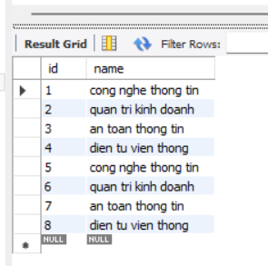
```sql
  insert into subjects (name, credit) values 
  ('co so du lieu', 3),
  ('lap trinh java', 4),
  ('cau truc du lieu va giai thuat', 3),
  ('kien truc may tinh', 3),
  ('mang may tinh', 3);
```
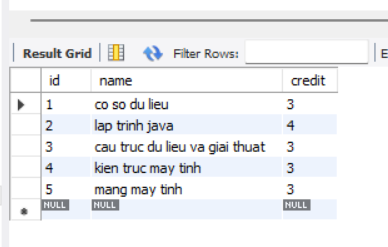
```sql
  insert into students (faculty_id, name, email, gpa, date_of_birth, gender) values 
  (1, 'do huy vu', 'huyvudz@gmail.com', 3.8, '2006-03-23', 'nam'),
  (1, 'tran van cuong', 'cuong@gmail.com', 3.2, '2006-05-15', 'nam'),
  (2, 'le van tuan', 'tuan@gmail.com', 3.7, '2006-10-08', 'nam'),
  (3, 'nguyen van chien', 'chien@gmail.com', 2.8, '2006-03-10', 'nam'),
  (1, 'nguyen minh phuong', 'phuong@gmail.com', 3.6, '2006-11-20', 'nu'),
  (2, 'hoang quang minh', 'minh@gmail.com', 2.9, '2006-07-12', 'nam'),
  (null, 'nguyen van an', 'an@gmail.com', 3.1, '2006-01-01', 'nam');
```
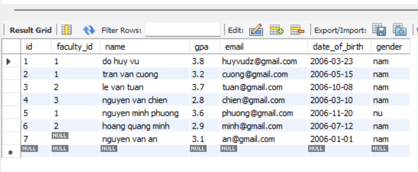
```sql
  insert into registrations (student_id, subject_id, register_time) values 
  (1, 1, '2026-09-01 08:00:00'),
  (1, 2, '2026-09-01 08:05:00'),
  (1, 3, '2026-09-01 08:10:00'),
  (2, 1, '2026-09-01 09:00:00'),
  (3, 2, '2026-09-02 10:00:00'),
  (5, 1, '2026-09-02 14:00:00'),
  (5, 2, '2026-09-02 14:05:00');
```
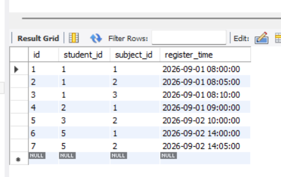
```sql
  insert into grades (student_id, subject_id, score) values 
  (1, 1, 9.5),
  (1, 2, 8.8),
  (1, 3, 9.0),
  (2, 1, 7.0),
  (3, 2, 8.0),
  (5, 1, 8.5);
```
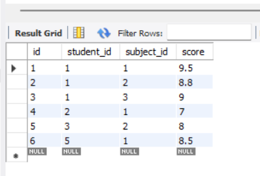
```sql
  insert into student_accounts (student_id, balance, tuition_fee) values 
  (1, 15000000.00, 7500000.00),
  (2, 8000000.00, 7500000.00),
  (3, 2000000.00, 5000000.00);
  ```
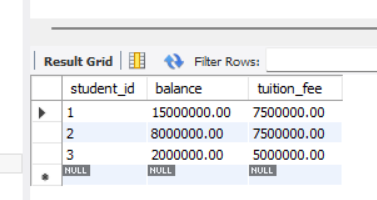
  * `UPDATE`: Cập nhật giá trị các trường dữ liệu của các bản ghi thỏa mãn điều kiện.
  * `DELETE`: Xóa các bản ghi thỏa mãn điều kiện khỏi bảng (vẫn giữ nguyên cấu trúc bảng).
  ```sql
  update students set gpa = gpa + 0.1 where gpa < 3.0;
  delete from students where email is null;
  ```
  * `SELECT`: Trích xuất và hiển thị dữ liệu từ một hoặc nhiều bảng.
  ```sql
  select * from students;
  ```

 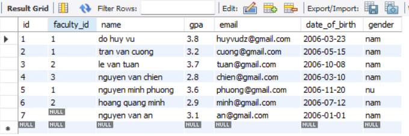
### 2.2 Các mệnh đề truy vấn (Query Clauses)
* **`WHERE`:** Lọc các bản ghi ở cấp độ từng dòng đơn lẻ **trước** khi dữ liệu được gom nhóm.
* **`JOIN`:** Kết hợp dữ liệu từ 2 hoặc nhiều bảng dựa trên mối quan hệ giữa các cột:
  * `INNER JOIN`: Chỉ trả về các bản ghi có giá trị khớp ở cả hai bảng.
  * `LEFT JOIN` (Left Outer Join): Trả về toàn bộ bản ghi từ bảng bên trái; nếu bảng bên phải không có bản ghi khớp, các cột tương ứng nhận giá trị `NULL`.
  * `RIGHT JOIN` (Right Outer Join): Trả về toàn bộ bản ghi từ bảng bên phải và các bản ghi khớp từ bảng bên trái.
* **`GROUP BY`:** Gom các dòng dữ liệu có cùng giá trị trên các cột được chỉ định lại thành các nhóm tổng hợp.
* **`HAVING`:** Lọc các nhóm dữ liệu **sau** khi đã thực hiện gom nhóm và tính toán hàm tổng hợp (Aggregate Functions). Điểm khác biệt mấu chốt: `WHERE` không dùng được với hàm tổng hợp, còn `HAVING` sinh ra để lọc theo hàm tổng hợp.
* **`ORDER BY`:** Sắp xếp tập kết quả trả về theo chiều tăng dần (`ASC` - mặc định) hoặc giảm dần (`DESC`).

### 2.3 Các hàm tổng hợp (Aggregate Functions)
* `COUNT()`: Đếm số lượng bản ghi thỏa mãn điều kiện.
* `SUM()`: Tính tổng giá trị của một cột số.
* `AVG()`: Tính giá trị trung bình cộng của một cột số.
* `MIN()`: Tìm giá trị nhỏ nhất trong tập dữ liệu.
* `MAX()`: Tìm giá trị lớn nhất trong tập dữ liệu.

```sql
  -- inner join
  select s.id, s.name as student_name, s.gpa, f.name as faculty_name
  from students s
  inner join faculty f on s.faculty_id = f.id;
```
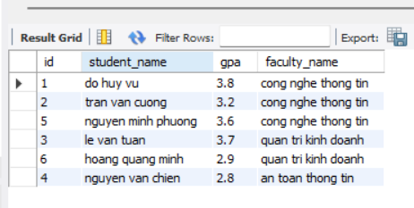
```sql
  -- left join
  select f.name as faculty_name, s.name as student_name
  from faculty f
  left join students s on f.id = s.faculty_id;
```
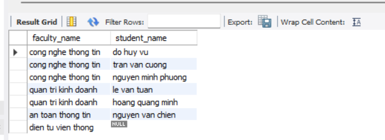
```sql
  -- right join
  select f.name as faculty_name, s.name as student_name
  from faculty f
  right join students s on f.id = s.faculty_id;
```
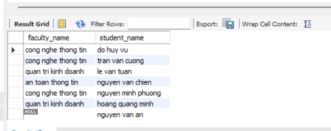
```sql
  -- aggregate functions, group by, having, order by
  select 
      f.name as faculty_name,
      count(s.id) as total_students,
      round(avg(s.gpa), 2) as avg_gpa,
      max(s.gpa) as max_gpa,
      min(s.gpa) as min_gpa
  from faculty f
  inner join students s on f.id = s.faculty_id
  group by f.id, f.name
  having total_students >= 2
  order by avg_gpa desc;
```
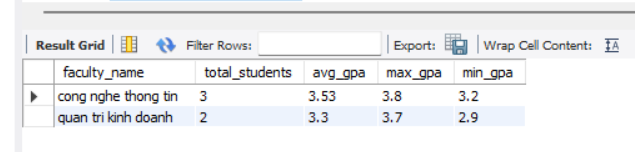

---

## 3. Index

### 3.1 Index là gì? Tại sao cần Index?
* **Khái niệm:** Index là một cấu trúc dữ liệu bổ trợ (thông dụng nhất là **B-Tree** hoặc B+Tree, ngoài ra còn có **Hash**, **GIN**, **GiST**) lưu trữ các giá trị của một hoặc nhiều cột cùng con trỏ trỏ đến vị trí vật lý của dòng dữ liệu trên đĩa (Disk Block Pointer).
* **Mục đích:** Thay vì phải duyệt tuần tự từ đầu đến cuối toàn bộ bảng (**Full Table Scan**) với độ phức tạp $O(N)$, Index cho phép hệ quản trị CSDL tìm kiếm nhị phân trên cây với độ phức tạp $O(\log N)$, giảm đột biến số lần đọc I/O trên ổ đĩa.

### 3.2 Khi nào nên và không nên đánh Index?

| Khi NÊN đánh Index | Khi KHÔNG NÊN đánh Index |
| :--- | :--- |
| Cột xuất hiện thường xuyên trong mệnh đề `WHERE`, `JOIN ... ON`, `ORDER BY`, `GROUP BY`. | Bảng có kích thước quá nhỏ (vài chục đến vài trăm dòng), chi phí đọc toàn bộ bảng nhanh hơn đọc cây Index. |
| Cột có độ chọn lọc cao (**High Cardinality** - giá trị ít trùng lặp như `id`, `email`, `code`, `uuid`). | Cột có độ chọn lọc thấp (**Low Cardinality** - giá trị bị trùng lặp quá nhiều như `gender`, `is_active`, `status`). |
| Cột khóa ngoại (Foreign Key) để tối ưu hóa hiệu năng khi thực hiện kết bảng `JOIN`. | Bảng có tần suất thao tác ghi (**Insert, Update, Delete**) cực cao, vì mỗi lần ghi đều phải tái cân bằng và cập nhật lại cây Index, gây nghẽn hiệu năng. |

```sql
  create table big_students (
      id int auto_increment primary key,
      student_code varchar(50),
      email varchar(100),
      admission_year int
  );

  delimiter //
  create procedure seedbigstudents()
  begin
      declare i int default 1;
      while i <= 100000 do
          insert into big_students (student_code, email, admission_year)
          values (
              concat('b24dccn', lpad(i, 4, '0')),
              concat('student_', i, '@ptit.edu.vn'),
              2020 + (i % 6)
          );
          set i = i + 1;
      end while;
  end //
  delimiter ;

  call seedbigstudents();

  -- truoc khi co index
  explain select * from big_students where email = 'student_88888@ptit.edu.vn';

  -- tao index
  create index idx_big_students_email on big_students(email);

  -- sau khi co index
  explain select * from big_students where email = 'student_88888@ptit.edu.vn';
```

---

## 4. Phân Trang (Pagination)

### 4.1 Tại sao cần phân trang?
* Tránh rủi ro tràn bộ nhớ (**Out Of Memory - OOM**) ở cả phía máy chủ ứng dụng lẫn trình duyệt client khi cố tải hàng chục ngàn hoặc hàng triệu bản ghi cùng lúc.
* Tối ưu hóa băng thông mạng và giảm đáng kể thời gian phản hồi (Latency/Response Time) của hệ thống.

### 4.2 Hai kỹ thuật phân trang chính

#### 1. Offset-based Pagination (`LIMIT ... OFFSET ...`)
* **Cơ chế:** Bỏ qua ($N$) bản ghi đầu tiên và lấy ($M$) bản ghi tiếp theo:
  $$\text{Query: } \text{SELECT * FROM table ORDER BY id LIMIT } M \text{ OFFSET } N$$
* **Ưu điểm:**
  * Cực kỳ dễ triển khai và trực quan.
  * Hỗ trợ nhảy cóc tới một trang bất kỳ (ví dụ: bấm nhảy ngay đến Trang 15).
* **Nhược điểm:**
  * **Vấn đề Deep Paging:** Khi `OFFSET` lớn (ví dụ: `OFFSET 1000000 LIMIT 20`), DBMS vẫn phải đọc và duyệt qua 1.000.020 bản ghi trên đĩa rồi loại bỏ 1.000.000 bản ghi đầu, gây nghẽn I/O nghiêm trọng.
  * **Hiện tượng trôi dữ liệu (Data Drift):** Nếu người dùng đang xem trang 1 mà có bản ghi mới được thêm/xóa vào bảng, khi chuyển sang trang 2 sẽ bị trùng lặp hoặc bỏ sót dữ liệu.
```sql
  select * from big_students
  order by id asc
  limit 10 offset 40;
```
#### 2. Cursor-based / Keyset Pagination (`WHERE id > last_seen_id LIMIT N`)
* **Cơ chế:** Sử dụng một cột tuần tự duy nhất có đánh index (thường là `id` tăng dần hoặc `created_at`) làm mốc định vị (Cursor).
  $$\text{Query: } \text{SELECT * FROM table WHERE id > } \text{last\_id} \text{ ORDER BY id ASC LIMIT } N$$
* **Ưu điểm:**
  * Hiệu năng ổn định tuyệt đối: Tận dụng B-Tree Index để nhảy thẳng tới vị trí `last_id` với độ phức tạp $O(1)$ hoặc $O(\log N)$, tốc độ trang 1 và trang 1.000.000 là tương đương nhau.
  * Không bao giờ bị trùng hay sót dữ liệu khi có bản ghi mới chèn vào.
* **Nhược điểm:**
  * Không thể nhảy cóc đến một số trang bất kỳ (chỉ hỗ trợ thao tác Next / Previous).
  * Thích hợp nhất cho giao diện cuộn vô tận (Infinite Scroll) hoặc nạp theo luồng tin (Feed).
```sql
  select * from big_students
  where id > 40
  order by id asc
  limit 10;
```
---

## 5. Locking trong Database (Khóa Dữ Liệu)

### 5.1 Tại sao cần Lock?
Khi nhiều giao dịch (Transactions) đồng thời đọc và ghi cùng một dòng dữ liệu, nếu không kiểm soát sẽ xảy ra các bất thường về tính nhất quán:
* **Lost Update (Mất cập nhật):** Hai giao dịch cùng đọc một giá trị, cả hai cùng ghi đè khiến một giao dịch bị mất hoàn toàn kết quả.
* **Dirty Read (Đọc rác):** Giao dịch B đọc dữ liệu chưa được commit của giao dịch A, sau đó giao dịch A rollback.
* **Non-repeatable Read (Đọc không lặp lại):** Giao dịch A đọc một dòng dữ liệu hai lần nhưng ra kết quả khác nhau do giao dịch B đã sửa và commit ở giữa.

### 5.2 Optimistic Locking (Khóa Lạc Quan)
* **Tư tưởng:** Giả định rằng sự xung đột dữ liệu rất hiếm khi xảy ra. Không hề khóa bản ghi trong CSDL khi đọc.
* **Cách thức:** Thêm một cột phiên bản (ví dụ: `version INT DEFAULT 0`) vào bảng.
  1. Khi đọc: Lấy dữ liệu kèm theo `version = V`.
  2. Khi ghi: Kiểm tra và tăng version:
     $$\text{UPDATE table SET value = new\_val, version = version + 1 WHERE id = X AND version = } V$$
  3. Nếu số dòng bị ảnh hưởng trả về bằng 0 (nghĩa là đã có tiến trình khác sửa trước và đổi version), ứng dụng sẽ ném lỗi ngoại lệ để người dùng thử lại.

### 5.3 Pessimistic Locking (Khóa Bi Quan)
* **Tư tưởng:** Giả định rằng xung đột dữ liệu chắc chắn sẽ xảy ra. Do đó, ngay khi giao dịch đọc dữ liệu, nó sẽ khóa chặt dòng đó lại để ngăn các tiến trình khác can thiệp.
* **Cú pháp:** `SELECT * FROM table WHERE id = X FOR UPDATE;` (Khóa độc quyền - Exclusive Lock). Các giao dịch khác muốn sửa hoặc đọc `FOR UPDATE` dòng này đều phải xếp hàng đợi cho đến khi giao dịch ban đầu `COMMIT` hoặc `ROLLBACK`.
```sql

  drop table if exists tickets;
  create table tickets (
      id int primary key,
      match_name varchar(100),
      available_seats int,
      version int default 1
  );

  -- khoi tao 1 tran dau con dung 1 ve duy nhat
  insert into tickets (id, match_name, available_seats, version) 
  values (1, 'chung ket itis cup', 1, 1);

  select * from tickets;


  -- 
  -- truong hop 1: pessimistic locking (khoa bi quan - dung for update)
  -- cach thuc hien: mo 2 tab query khac nhau tren workbench de quan sat

  -- [buoc 1.1] tai tab 1: nguoi a bat dau giao dich va khoa chat ban ghi id = 1
  start transaction;
  select * from tickets where id = 1 for update;
  -- (sau khi chay xong dong tren, khong commit voi ma chuyen sang tab 2 ngay)

  -- [buoc 1.2] tai tab 2: nguoi b co gang sua ban ghi dang bi tab 1 giu khoa
  -- ket qua: tab 2 se bi treo / dung cho (waiting for lock)
  start transaction;
  update tickets set available_seats = available_seats - 1 where id = 1;

  -- [buoc 1.3] quay lai tab 1: nguoi a cap nhat va commit de giai phong khoa
  -- ngay khi tab 1 commit, lenh update o tab 2 se duoc mo khoa va chay tiep
  update tickets set available_seats = available_seats - 1 where id = 1;
  commit;

  -- [buoc 1.4] tai tab 2: tiep tuc hoan tat hoac rollback neu kiem tra thay het ve
  commit;


  =======================================================
  -- truong hop 2: optimistic locking (khoa lac quan - dung cot version)
  -- co che: khong khoa database, phat hien xung dot bang cach kiem tra version


  -- dat lai du lieu ve ban dau de thu nghiem
  update tickets set available_seats = 1, version = 1 where id = 1;

  -- [buoc 2.1] ca nguoi a va nguoi b cung doc du lieu ra giao dien
  -- ca 2 deu lay duoc: available_seats = 1, version = 1
  select * from tickets where id = 1;

  -- [buoc 2.2] nguoi a bam mua truoc (version hien tai van la 1 -> thanh cong)
  -- ket qua: 1 row affected, gia tri version trong bang duoc nang len 2
  update tickets 
  set available_seats = available_seats - 1, version = version + 1 
  where id = 1 and version = 1;

  -- [buoc 2.3] nguoi b bam mua sau (luc nay mang theo version = 1 cu)
  -- ket qua: 0 rows affected (that bai vi version trong bang gio da la 2)
  -- he thong phat hien da co nguoi sua truoc ma khong can he thong phai cho khoa
  update tickets 
  set available_seats = available_seats - 1, version = version + 1 
  where id = 1 and version = 1;

  -- kiem tra lai ket qua cuoi cung
  select * from tickets;
```
### 5.4 So sánh & Trường hợp ứng dụng
* **Chọn Optimistic Locking khi:** Hệ thống có tỷ lệ đọc áp đảo tỷ lệ ghi (Read-heavy), mức độ tranh chấp tài nguyên thấp (ví dụ: cập nhật hồ sơ cá nhân, chỉnh sửa bài viết blog).
* **Chọn Pessimistic Locking khi:** Mức độ tranh chấp tài nguyên cực kỳ cao và đòi hỏi tính toàn vẹn tuyệt đối về mặt tài chính (ví dụ: giao dịch số dư ví điện tử, ngân hàng, trừ kho sản phẩm khi chạy Flash Sale, đặt vé giữ chỗ rạp chiếu phim).

---

## 6. Transaction (Giao Dịch CSDL)

### 6.1 Transaction là gì?
Transaction là một tập hợp tuần tự gồm một hoặc nhiều thao tác CSDL được thực thi như một **đơn vị công việc logic nguyên vẹn (Atomic Unit)**. Hoặc toàn bộ các thao tác đều được áp dụng thành công vào hệ thống, hoặc không một thao tác nào được lưu lại.

### 6.2 Bốn thuộc tính ACID của Transaction
1. **Atomicity (Tính nguyên tố - Tất cả hoặc không gì cả):** Đảm bảo rằng nếu một phần của giao dịch thất bại, toàn bộ giao dịch sẽ bị hủy bỏ và trạng thái CSDL quay về như trước khi bắt đầu.
2. **Consistency (Tính nhất quán):** Dữ liệu phải luôn thỏa mãn mọi quy tắc nghiệp vụ, ràng buộc toàn vẹn (khóa chính, khóa ngoại, check constraints) trước và sau khi transaction hoàn thành.
3. **Isolation (Tính cô lập):** Các giao dịch thực thi đồng thời không được can thiệp lẫn nhau. Mức độ cô lập được kiểm soát qua các cấp độ: *Read Uncommitted, Read Committed, Repeatable Read, Serializable*.
4. **Durability (Tính bền vững):** Khi transaction đã được xác nhận hoàn tất thành công (`COMMIT`), dữ liệu sẽ được lưu vĩnh viễn vào bộ nhớ không biến đổi (đĩa cứng/WAL log) và không bị mất ngay cả khi hệ điều hành hoặc máy chủ bị sập đột ngột.

### 6.3 Khi nào cần gom nhiều thao tác vào 1 Transaction?
Cần gom vào Transaction khi nghiệp vụ yêu cầu **nhiều câu lệnh ghi dữ liệu phụ thuộc lẫn nhau**:
* Thao tác này thành công nhưng thao tác kia thất bại sẽ làm hỏng tính toàn vẹn dữ liệu.
* **Lệnh điều khiển:**
  * `START TRANSACTION` / `BEGIN`: Đánh dấu điểm bắt đầu của giao dịch.
  * `COMMIT`: Lưu vĩnh viễn tất cả các thay đổi trong giao dịch vào CSDL.
  * `ROLLBACK`: Hủy bỏ toàn bộ các thay đổi phát sinh từ thời điểm bắt đầu giao dịch, khôi phục lại trạng thái ban đầu.
* **Ví dụ kinh điển (Chuyển khoản ngân hàng):**
  * Bước 1: Trừ 1.000.000 VNĐ từ Tài khoản A.
  * Bước 2: Cộng 1.000.000 VNĐ vào Tài khoản B.
  * *Rủi ro:* Nếu Bước 1 thành công mà mạng đứt ở Bước 2, tiền của A mất nhưng B không nhận được. Do đó, hai thao tác này bắt buộc phải nằm trong 1 Transaction để nếu Bước 2 fail, hệ thống tự động `ROLLBACK` trả lại tiền cho A.
```sql
  -- transaction thanh cong
  start transaction;
      update student_accounts 
      set balance = balance - 7500000.00 
      where student_id = 1;

      update student_accounts 
      set tuition_fee = tuition_fee - 7500000.00 
      where student_id = 1;
  commit;

  -- transaction rollback
  start transaction;
      update student_accounts 
      set balance = balance - 5000000.00 
      where student_id = 3;
      rollback;
```